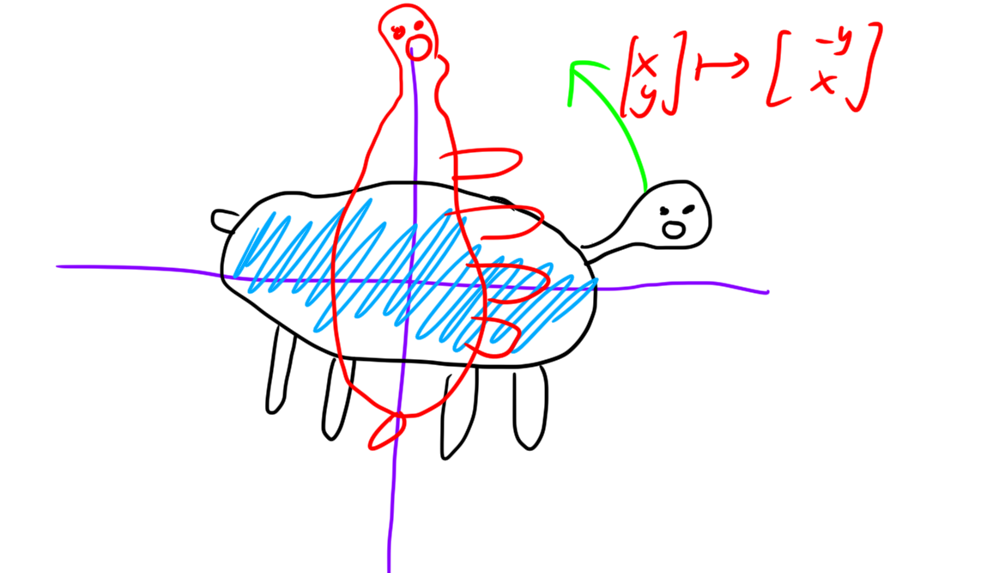
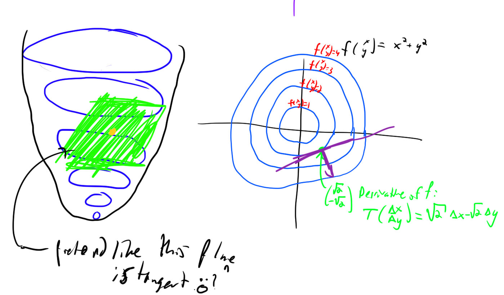
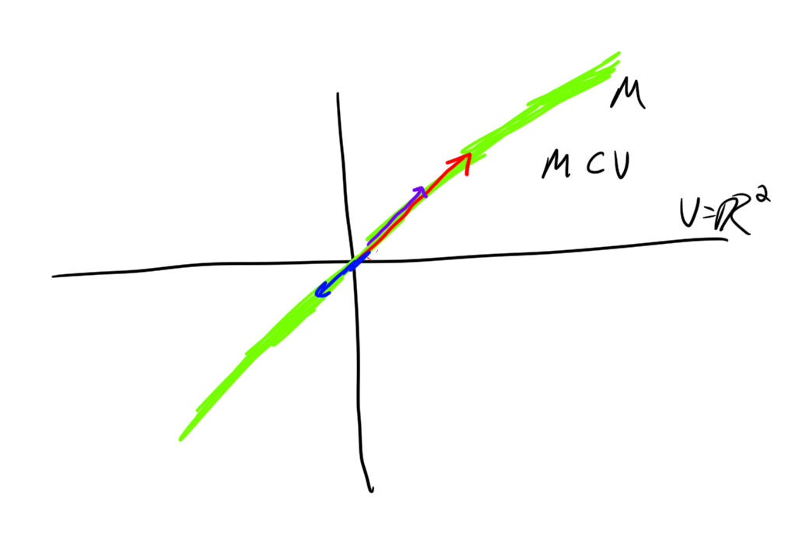
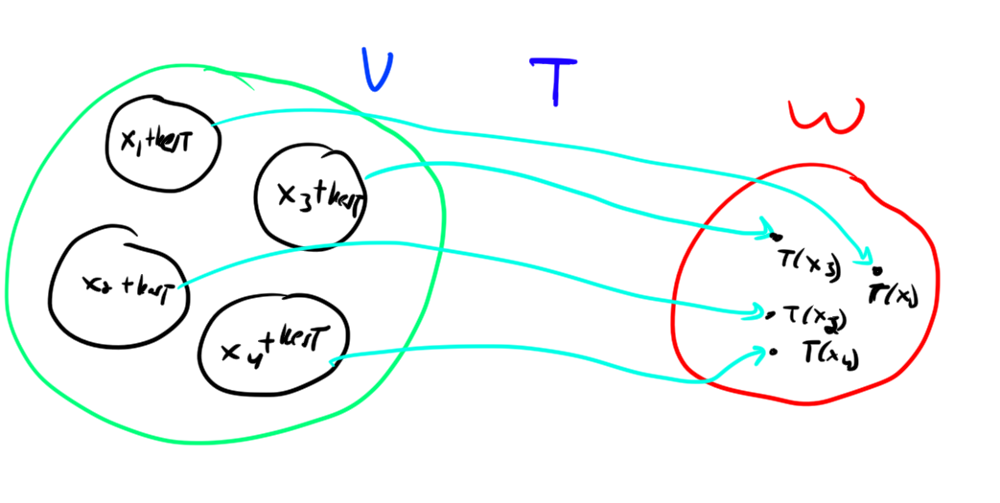

# An Introduction to Linear Algebra

I hope that this little introduction to linear algebra helps you appreciate
what it really **is**. I think the first time I saw linear algebra someone was
like, "here's a sysmtem of equations, let's write it all these coefficients
down in a box. Let's call this box a matrix. yay now we can solve linear
equations by just manipulating this box! wooo."
I think this isn't the best way to go about it. So, while representing linear
transformations in terms of matrices is nice, and solving systems of equations
is also nice, I am not going to write down **any** matrices today. 
Rather, I'm going to come at this topic from a different angle. I think that this angle 
will be a little bit different than other stuff out there, although maybe not.
Anyways, I hope you enjoy it regardless!

# Vector Space

Well let's get right to it:

begin defn
Roughly speaking, A vector space is a set of objects called **vectors** along
with a set of objects called **scalars**, where the notion of addition of
vectors and multiplication of vectors by scalars makes sense. Furthermore
addition and scaling of vectors play nicely, in particular playing nicely with
scalars being added and multiplied.
end defn

Before I make this a bit more precise (e.g. defining nice) I think it's better
that I provide some examples of vector spaces to illustrate what is similar between them.

begin ex
The most classic of all examples: the set of vectors is $\mathbb{R}^n$, and the set of scalars is $\mathbb{R}$. 
$\mathbb{R}^n$ refers to the set of $n$-element lists of real numbers.
Consider $\mathbb{R}^2$. Some vectors in $\mathbb{R}^2$ are 

- $(0, 1)$
- $(1, 0)$
- $(1, 1)$
- $(0, -1)$
- $(5, 6)$
- $(-\pi, e)$

We can add vectors via the rule: $(x_1,x_2)+(y_1, y_2) = (x_1+y_1, x_2+y_2)$. 
We can scale vectors via the rule: $k(x_1,x_2) = (kx_1, kx_2)$. 

This vector space very easily permits visualization, by placing the vectors in the plane.

Vector addition is accomplished gemoetrically by placing vectors "tip to tail"
and going from the tip of start of the first vector to the end of the last
vector.

Scalar multiplication is accomplished by shrinking/growing the vectors. 

Some important properties to note about this vector space (these generalize):

Adding $(0,0)$ to vectors doesn't change them: $(x,y)+(0,0) = (x,y)$.
Multiplying vectors by $0$ gives to $(0,0)$.

For every vector $(a,b)$, there is another vector, namely $(-a,-b)$, such that $(a,b)+(-a,-b) = (0,0)$.

Let $x, y, z$ be vectors, let $c, k$ be scalars. 
$$x+y = y+x.$$

$$(x+y)+z = x+(y+z).$$

$$c(k(x)) = (ck)x.$$

$$(c+k)x = cx + kx.$$

$$c(x+y) = cx + cy.$$

Another thing that is implicit in this all is the idea of "closure". $x+y$
needs to be a vector for any vectors $x,y$, and also $kx$ needs to be a vector
for any vector $x$ and any scalar $k$.

Also, if you don't know what a field is, don't worry about it. A field is just a set with multiplication and addition that play really nicely with it. Usually this will be $\mathbb{R}$ for us, although there are some other cool fields (e.g. finite fields, complex numbers).
end ex

begin defn
Now we formally define a vector space. A vector space $V$ over a field
$\mathbb{K}$ is a set of vectors $V$ and scalars $\mathbb{K}$ satisfying the
following axioms: 

Let $0\in V$ denote the **zero-vector** (it's properties are defined in the
axioms below).
Let $x,y,z \in V$ let $c,k \in \mathbb{K}$.

- "Additive axioms":
  - $x+y=y+x$ (commutativity of addition)
  - $(x+y)+z = x+(y+z)$ (associativity of addition)
  - $0+x = x+0 = x$ 
  - There is an inverse element $-x$ such that $(-x) + x = 0$
- "Multplicative axioms":
  - $0x = 0$
  - $1x = 1$
  - $(ck)x = c(k(x))$
- "Distributive axioms" 
  - $c(x+y) = cx + cy$
  - $(c+k)x = cx + kx$
end defn

OK. So probably none of these definitions were very surprising. I'll give some
more examples of vector spaces now, and then we'll start talking about
functions between vector spaces!

begin ex
The vector space (over the reals) of polynomials with real coefficients $\mathbb{R}[x]$.
Addition and multiplication is defined component-wise, i.e.

$$k (p_n x^n + p_{n-1} x^{n-1} + \cdots + p_0) = kp_n x^n + kp_{n-1}x^{n-1} + \cdots + kp_0$$

$$\sum a_n x^n + \sum b_n x^n = \sum (a_n + b_n) x^n.$$

You can say things like
$$(3x^2 + x + 2) + 5x = 3x^2 + 6x + 2.$$
And 
$$4(x+1) = 4x+4.$$

The $0$-polynomial satisfies the required conditions, additive inverses are
achieved by negating polynomial's coefficients i.e. $x+1 + (-x-1) = 0$.

end ex

begin ex 
Functions $f: \mathbb{N} \to \mathbb{R}$ (vector space over the reals). 

Addition is defined point-wise, i.e. 

$f + g$ is a function such that $(f+g)(x) = f(x) + g(x)$ for all $x\in\mathbb{N}$.
$kf$ is a function with $(kf)(x) = kf(x)$.

Some examples are:

- $f(x) = \sqrt{x}.$
- $f(x) = x$.
- $f(x) = \sqrt{2} x.$
- $f(x) = x^2$.
- $f(x) = 0.$
- $f(x) = $ the number of numbers less than $x$ that are relatively prime to $x$ (i.e.the number of $y<x$ such that $gcd(x,y) = 1$).
-

end ex

begin ex
$\mathbb{R}^\mathbb{N}$ (over the reals). This is the space of infinite sequences. Elements include vectors like 

$$(1, 1/2, 1/3, 1/4, \ldots)$$
and 
$$(0,0,0,\ldots).$$

Addition and multiplication is defined point-wise:

$$(a_1,\ldots) + (b_1, \ldots) = (a_1+b_1, \ldots)$$
$$k(a_1,\ldots) = (ka_1, \ldots).$$

This vector space might be starting to look familiar. Could it be, this is "the
same" vector space as the space of functions from the natural numbers to the
real numbers? (yes!, more on this later)

end ex

OK I'll do a couple more quick examples and then start talking about linear transformations. I'm getting there, I promise!

begin ex
$\mathbb{C}$ over $\mathbb{C}$. Enough said.
end ex

begin ex
The space of continuous functions on $[0,1]$.
end ex

begin ex
$(\mathbb{Z}/2\mathbb{Z})^n$ the space of binary strings of length $n$.

I'll just comment on addition in $\mathbb{Z}/2\mathbb{Z}$ for a second. 

$1+1 = 0$, $1+0= 1$, $0+0 = 0.$ Sound crazy? It's not. You could interpret $1,0$ as true, false, and then this is NAND (i.e. NOT AND). You could also just think of it as addition mod 2.

Anyways, there are a lot of reasons why you might want the set of binary strings of length $n$. High quality vector space right there.
end ex

OK, I'm far from being done, but it's 1:01 (am). wow that rhymed. Anyways, I'm trying to get to bed earlier than normal today, so we're gonna move on.

# Linear Transformations

begin defn
A linear transformation between vector spaces $V, W$ is a function $T: V\to W$ that plays nicely with vector addition and scaling. In particular $T$ must satisfy:

$$T(x+y) = T(x) + T(y)$$
and
$$T(kx) = kT(x)$$
end defn

I would probably define linear algebra as 
"the study of vector spaces and linear maps between them". but whatever.

Anyways, here's some examples:

begin ex
Consider a map $T : \mathbb{R}^2 \to \mathbb{R}^2$ that does
$$(x, y) \mapsto (-y, x) $$

This map is linear. It does rotation by 90 degrees counter-clockwise. 

Here is a visualization of this map acting on a set of points:

end ex

begin ex
Consider a map $T : \mathbb{R}^2 \to \mathbb{R}^2$ that does
$$(x, y) \mapsto (2x, 2y) $$

This map is linear. It scales vectors up. 
end ex

begin ex
Consider a map $T : \mathbb{R}^2 \to \mathbb{R}^2$ that does
$$(x, y) \mapsto \left(\frac{3}{5} x + \frac{4}{5} y\right)(3/5, 4/5).$$

This map does projection onto the line $y=\frac{4}{3}x.$

end ex

begin ex
Let $P_n$ be the space of polynomials of degree at most $n$.
The map $T: P_n \to P_n$ 
$$T(p) = p'$$ (the derivative) is linear. 
end ex

begin ex
Let $P_n$ be the space of polynomials of degree at most $n$.
The map $T: P_n \to \mathbb{R}^3$ 
$$T(p) = (p(1), p(2), p(3))$$ is linear. 
end ex

begin rmk
Sometimes we care about non-linear maps between vector spaces. But these are
pretty hard to understand. So instead, it is really useful often to use linear
approximations of non-linear maps to try to understand them. 

The **derivative** of a function is defined to be the best linear approximation to it.

For example, the derivative of the function $f(x,y) = x^2 + y^2$ at the point
$(a,b)$ is the function $T(\Delta x,\Delta y) = 2a\Delta x + 2b\Delta y.$ 
Note that $T$ does not take in the actual values $x,y$ but rather $\Delta x$
and $\Delta y$, which are defined as $x-a, y-b$. And $T$ outputs the difference
from $f(a,b)$. Thus the approxmiation to $f$
is really $$f(x,y) \approx T(x-a, y-b) + f(a,b).$$ However of course, this function is
not linear in $x,y$! But $T$ is linear in $\Delta x, \Delta y$.

Note: if you were taught in some single-variable calculus course that the
derivative of a function is a number **abandon this notion right now!!!!** The
derivative is the best linear approximation to a function. In $\mathbb{R}$
there happens to be an easy way to associate linear functions with numbers (the
slope of the function). This doesn't generalize. It's way better to think of
derrivatives as linear functions that do the best job at approximating the
function.

end rmk

Invertible linear maps are a very important type of linear map. For instance, they can be used to define what it means for two vector spaces to be "the same":

begin defn
Two vector spaces are said to be **isomorphic**, written $V \cong W$ if there exists an invertible linear map $\phi : V\to W$ that is onto $W$ (i.e. hits all of $W$).
end defn

begin ex
The vector space of polynomials wtih real coefficients of degree $2$ or less,
denote $P_2$, is isomprphic to $\mathbb{R}^3$. In particular, we can associate
the polynomial $ax^2 + bx + c \in P_2$ with, for instance, $(a,b,c) \in\mathbb{R}^3.$
This map is clearly an isomorphism.
end ex

# Bases

Given a set, an interesting question to ask is "how big is this set". For
almost all of the vector spaces we've discussed though, the set of vectors is
infinite (in fact often uncountably infinite!) so this wouldn't be a very
satisfying thing. However, we can define a notion of largeness of a vector
space, **dimension** based on the minimal number of vectors required to be able
to reach all the vectors in a space. Now I'll define this more formally.

begin defn
A linear combination of a set of vectors $v_1,\ldots, v_n$ is a vector of the form 
$$\sum_{i=1}^n \alpha_i v_i$$
for some scalars $\alpha_i$.
end defn

begin defn
A set of vectors $v_1, \ldots, v_n$ is said to **span** a vector space $V$ if
any vector $v \in V$ can be expressed as some linear combination of
$v_1,\ldots, v_n$. i.e. there must exist $\alpha_i$ such that 
$$v = \sum_{i} \alpha_i v_i.$$
end defn

However, we are interested in a **minimal spanning set**.

begin defn 
A **minimal spanning set** for a vector space $V$ is a finite set of vectors $v_i$
that spans the space, such that if you remove any vector $v_i$ from the set,
the resulting set of vectors no longer spans $V$.

A minimal spanning set is also called a basis.
end defn

begin rmk
A basis for a vector space need not exist. If a vector space does not admit a basis then it is called an **infinite dimensional vector space**. 
end rmk
begin ex
The vector space of polynomials is infinite dimensional; it clearly admits no basis: imagine it did, then take a polynomial with degree more than the highest degree of the basis elements, this yields a contradiction.
end ex

begin clm
We claim that the number of elements in a basis for $V$ is unique.
end defn
begin pf
Let $V$ have two bases $v_1,\ldots, v_m$ and $w_1,\ldots, w_n$. We aim to show that $m=n$.

As $v_i$ spans $V$ we can express each $w_j$ as a linear combination of $v_i$'s.
On the other hand, we can express each $w_j$ as a linear combination of $v_j$'s.

Assume for contradiction that $m \neq n$. Without loss of generality $m < n$. 

We inductively create a series of spanning sets:

- $v_1,\ldots, v_m$
- $w_1, v_2, \ldots, v_m$ this is possible as the previous set was spanning, hence $w_1$ can be written as a linear combination of $v_i$'s, and it must have a non-zero coefficient, which is on $v_1$ without loss of generality
- $w_1, w_2, v_3, \ldots, v_m$ by the same logic
- $\cdots$
- $w_1,w_2,\ldots, w_m$

But this can't be spanning! It contradicts the minimality of the set $w_1,\ldots, w_n$, because we shouldn't be able to remove $w_{m+1},\ldots, w_n$ and still get a spanning set! 
Hence it is impossible for $m \neq n$.

And thus the number of elements in a basis is well defined. 
end pf

begin defn
We call the dimension of a vector space the number of elements in a basis for it. 
end defn

begin defn
A set $v_1,\ldots, v_n$ of vectors is said to be linearly independent if no vector can be made as a linear combination of the other vectors. Equivalently, 
$$\sum_i \alpha_i v_i = 0 \,\,\,\, \implies \alpha_i = 0.$$
end defn

begin clm
An equivalent definition of a basis is **maximal linear independent set of vectors**
end clm
begin pf
left as an exercise to the reader
end pf

# Image and Kernel
OK, now you're ready to see a very cool result, the **Rank Nullity Theorem**. It is a relationship between two very important sets that give a lot of information about a linear transformation: the image and kernel of the linear transformation.

begin defn
A subspace of a vector space $V$ over $\mathbb{K}$ is a subset $M \subset V$ of the vectors that is closed under addition and multiplication.

That is, 
For any $x,y\in M$ we have $x+y \in M$, and for any $c \in\mathbb{K}$ we have $cx \in M$.
end defn

begin ex
A line through the origin in $\mathbb{R}^2$ or $\mathbb{R}^3$ is a subspace. 

end ex

begin ex
Polynomials of degree at most $2$ that have a zero at $4$ are a subspace of the space of polynomials. 
end ex

begin rmk
Note that any subspace contains the $0$-vector as this is necessary to be closed under multiplication.
end rmk

Now, as promised, I define some really imporant subspaces.

begin defn
The image of a linear transformation $T : V\to W$ is the set $\mathrm{im}(T) =
\{T(x) | x\in V\}.$ That is, the set of all vectors "hit" by $T$; the set of
all vectors $y \in W$ so that there exists $x \in V$ with $T(x) = y$.
end defn

begin defn 
The kernel of a linear transformation $T: V \to W$ is the set $\ker(T) = \{x \in V | T(x)= 0\}.$ That is, the set of vectors sent to the zero vector.
end defn

I really like the following picture, showing graphically these spaces:

begin thm
Let $T: V\to W$.
$\mathrm{im}(T)$ is a subspace of $W$ and $\ker(T)$ is a subspace of $V$.
end thm
begin pf
Take $x,y \in \mathrm{im}(T)\subset W$, $c$ a scalar. 
Then there must be $a,b \in V$ with $T(a) = x, T(b) = y$. Then 
$$T(a+cb) = T(a)+cT(b) = x+cy.$$
So $x+cy \in \mathrm{im}(T).$
Hence $\im(T)$ is a subspace of $W$, as it is closed under both scaling and addition. 

Now take $x, y\in \ker(T) \subset V$, $c$ a scalar.

$$T(x+cy) = T(x) + cT(y) = 0+ c0 = 0+0 = 0.$$
Hence $\ker(T)$ is a subspace of $V$, as it is closed under both scaling and addition.
end pf

The Rank Nullity Theorem is a relationhsip between these subspaces, which I believe is **"deep stuff"**. I'll state it now, but we'll need one more idea before the proof.

begin thm
Let $T: V \to W$ be a linear map. Then 
$$\dim\mathrm{im}(T) + \dim \img T = \dim V.$$
end thm

begin rmk
$\dim \img T$ is called the "rank" of $T$, and $\dim \ker T$ is called the
"nullity" of $T$.
end rmk

Before proving this, we need a really cool idea: Quotient Spaces!!! 

begin defn 
Let $V$ be a vector space, and let $M \subset V$ be a subspace of $V$. Then the
quotient space $V/W$ (pronounced "$V$ mod $W$") is defined as 
$$V/W = \{W+x | x \in V\}.$$
end defn

Now we prove the following key fact:

begin thm
(First Isomorphism Theorem) 

Let $T: V\to W$, then
$$V/\ker T \cong \mathrm{im} T$$
end thm
begin pf
Consider $x \in V/\ker T$. Let $x = z+\ker T$ for arbitrary $z\in x$. Note that
for any $y \in x $, $T(y) = T(z).$ Hence it makes sense to say $T(x) = T(z)$.
We claim that $\phi(z+\ker T) = T(z)$ is an isomorphism between $V/\ker T$ and
$\mathrm{im}(T)$.
First note that $\phi$ is well defined because regardless of the chosen
representative $z \in x$, $T(z)$ is the same.

To show that $\phi$ is invertible we must show that it is one-to-one (doesn't
map different values to the same output) and also that it is onto (maps to each
element of the codomain).

First we show $\phi$ is one-to-one. If $T(x) = T(y)$ then $T(x-y) = 0$ so $x-y
\in \ker T$, as desired.
Next, we show $\phi$ is onto. Take any $y \in \mathrm{im}(T)$. By definition
there is some $x \in V$ mapping to $y$. Then all of the vectors in $x+\ker T$
map to $y$, as desired.

Hence the vector spaces are isomorphic.

Here's a picture showing this:

end pf

Now rank nullity is evident. We simply need a small Lemma on the dimension of
Quotient spaces:

begin lem
Let $V$ be a vector space, $M \subset V$ be a subspace.
$$\dim V/M = \dim V - \dim M.$$
end lem
begin pf
Take a basis $v_1,\ldots, v_m$ for $M$, extend it to a basis $v_1,\ldots, v_n$ for $V$.
Then $M + v_{m+1}, \ldots, M+v_n$ is a basis for $V/M$. The basis has 
$$n-m = \dim V - \dim M$$
elements. 
Hence
$$\dim V/M = \dim V - \dim M.$$
end pf

Now we prove rank nullity 
begin pf
By the first isomorphism theorem
$$V/\ker T = \mathrm{im} T.$$
By our lemma this implies
$$\dim V/\ker T = \dim V - \dim \ker T = \dim \mathrm{im} T$$
as desired.
end pf

# The End
If you're interested in Linear Algebra totally learn more about it!
It's pretty awesome IMHO.

