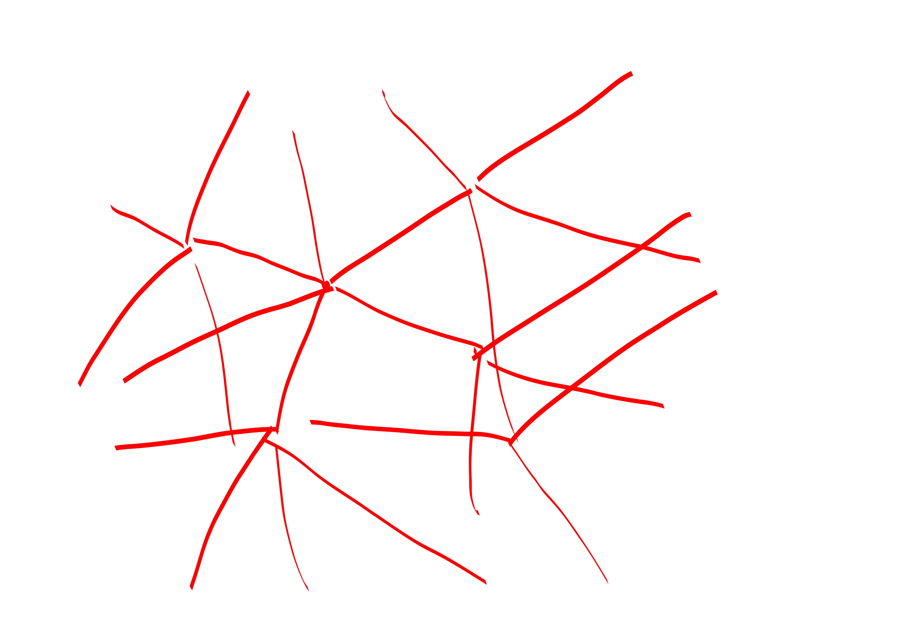

{title}
A little bit of spectral graph theory
{contents}

{description}

{body}
\usepackage{amsfonts}

Ok so *spectral graph theory* refers to studying graphs by
looking at their eigen-stuff.
First, an important theorem:
**Spectral Theorem**: A symetric real matrix (i.e. $A^{\dagger} =
A$) 

1. has real eigenvalues, 
2. has an orthonormal eigenbasis!

Having an orthonormal eigenbasis is really **op**.

Ok briefly let's talk about norms; this is important: 
begin prop
Let $v\in \R^n$.

Let $|v|_1 = \sum |v_i|$ denote the $\ell_1$ norm of $v$ (if we
just write $|v|$ we mean $|v|_1$) and A $||v||_2 = \sqrt{\sum
v_i^2}$ denote the $\ell_2$ norm of $v$ (if we just write $||v||$
we mean $||v||_2$), and $|v|_{\infty} = \max_i |v_i|$ denote the
$\ell_{\infty}$ norm of $v$.

Then, 
$$|v|/\sqrt{n} \leq ||v|| \leq |v|$$
Because crow's distance is shorter than taxicab distance, but not by
more than a factor of $\sqrt{n}$ (this extreme is achieved by a
vector with all components equal).

Also, 
$$|v|_{\infty} \leq ||v|| \leq \sqrt{n}|v|_{\infty}.$$
Because just do the math.

end prop

Ok, now we are going to talk about a nice type of graph:
begin defn
A $n$ vertex $d$ regular graph is a graph where each vertex has
  degree $d$.
end defn
Note that if you feel like it you can make any graph into a
regular graph by adding a bunch of self loops. We probably want a
pretty low degree graph though generally. 

Consider a symmetric stochastic matrix $A$ arising as the adjacency
matrix of an undirected $n$ vertex $d$ regular graph. Yay,
spectral theorem says that it is orthonormally-diagonalizable.

Note that $\mathbf{1} /n$, the uniform distribution, i.e. $(1/n,
1/n, \ldots)$ is an eigenvector for $A$ with eigenvalue $1$.
Ok so that's a boring eigenvector though. It turns out that
generally the second largest eigenvalue is pretty interesting.

begin clm
All eigenvalues of $A$ are at most $1$ in absolute value.

Well, think about:
$A^k = V \Lambda^k V^{-1}$. If $A$ had an eigenvector
$|\lambda_i| > 1$, then $\Lambda^k$ would blow up. But $A^k$
doesn't blow up, it's super nice and still a stochastic matrix:
multiplying the matrix corresponds to taking more steps in your
path. Anyways, so there is no way that $A$ has huge eigenvectors. 

end clm

Ok, so for any graph we define
begin defn
$\lambda(G)$ is the second largest eigenvalue.

**Spectral gap** is $1-\lambda(G)$.
end defn

So having a spectral gap means that if you random walk a bit you
get to the uniform distribution.
Here's a Lemma that says this more better.

begin lem
$$||A^k p - \mathbf{1}/n || \leq \lambda ^k$$
for any $|p| = 1$, where $\lambda$ is the second largest eigenvalue of $A$, which is a symmetric stochastic matrix.

In other words, if you start with a probability distribution $p$
over the vertices and random walk for $k$ steps, then you are
pretty dang close to the uniform distribution, especially if
$\lambda \ll 1$.
end lem
begin pf
Well, this is really asking 
$$\max_{v\perp \mathbf{1}, ||v||\leq 1} ||A^k v||$$

Because orthonormal change of bases are norm preserving, we can
just think about this relative to the eigen-basis for $A$, but
then it is abundantly clear that $\lambda^k$ is an upper bound
for this thing.
end pf

begin defn
ok, so we can see that it would be nice if we had a graph with a
large spectral gap. Such a graph is called an **expander**.

We can talk about expander families algebraically, parameterized by
$(n,d,\lambda)$, or combinatorially.
The combinatorial definition basically says 

that for all small sets of vertices $S$, i.e. $|S| < n/2$, they
have a bunch of edges out of them. We can parametrize this to a
family $(n,d,\rho)$ with 
$$|E(S, \bar{S})| \geq d\rho |S|.$$

end defn

Ok, so what's all the **hype** about expanders?

So far the coolest thing I know about expanders is that they can
reduce the number of random bits you need when doing probability
amplification.
More precisely

begin thm
Imagine that you had an algorithm with one sided error that had
probability of success $1/2$ and required the use of $m$ random
bits.

We can obviously amplify it to have probability of success
$1/2^k$ by running it $k$ times. Naively this would require
$m\cdot k$ random bits.

But using expander magic we can get away with only $m +
O(k)$ random bits and still amplify the probability of success up
to $2^{-\Omega(k)}$.

end thm
begin pf
ok actually the proof is maybe a little complicated, 

but the idea is super simple: 
just take an expander with $n = 2^m$ vertices (each encoding a binary
string of length $m$) and degree $d \in O(1)$ and then step along
the expander to get your random bits.

If the probability of success for the algorithm is at least
$1/2$, then at most $n/2$ of the vertices of the graph are "bad
coins".
And sufficiently long walks in expanders start to look
pseudorandom pretty fast with exponentially good probability.

Any ways this is all to say, expanders can fake randomness pretty
well.

end pf

ok. 
So you might be wondering. Um. Can you give me an actual example
of an expander family. That's a good question. That would seem to
be important if you wanted to do stuff with expanders.
**Stay tuned.**

<rat>

