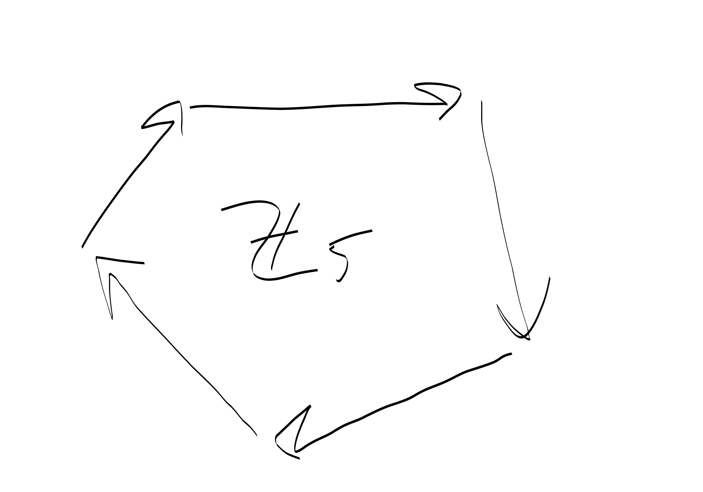
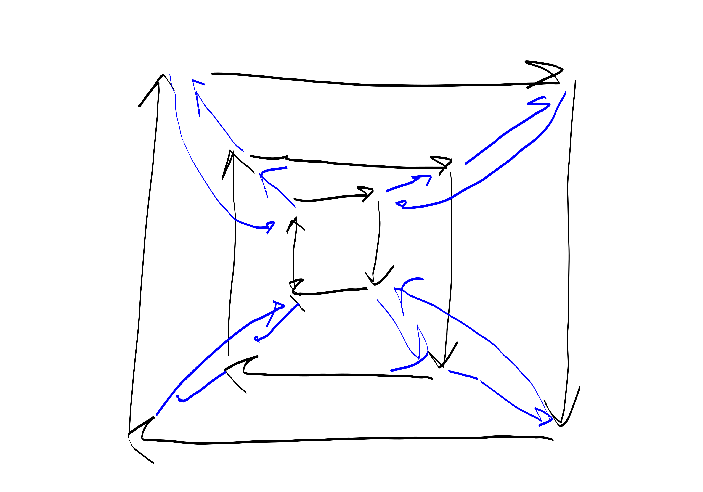
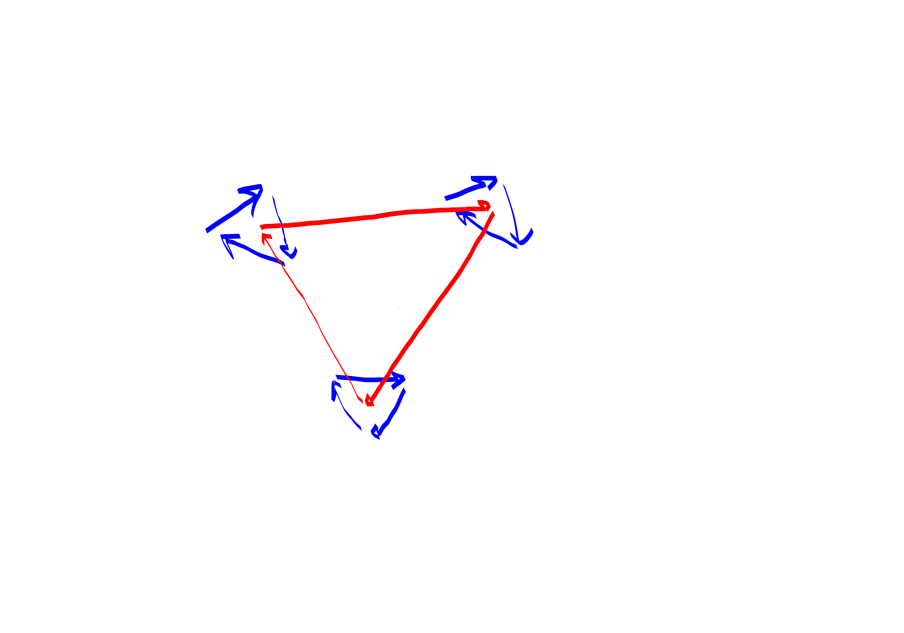
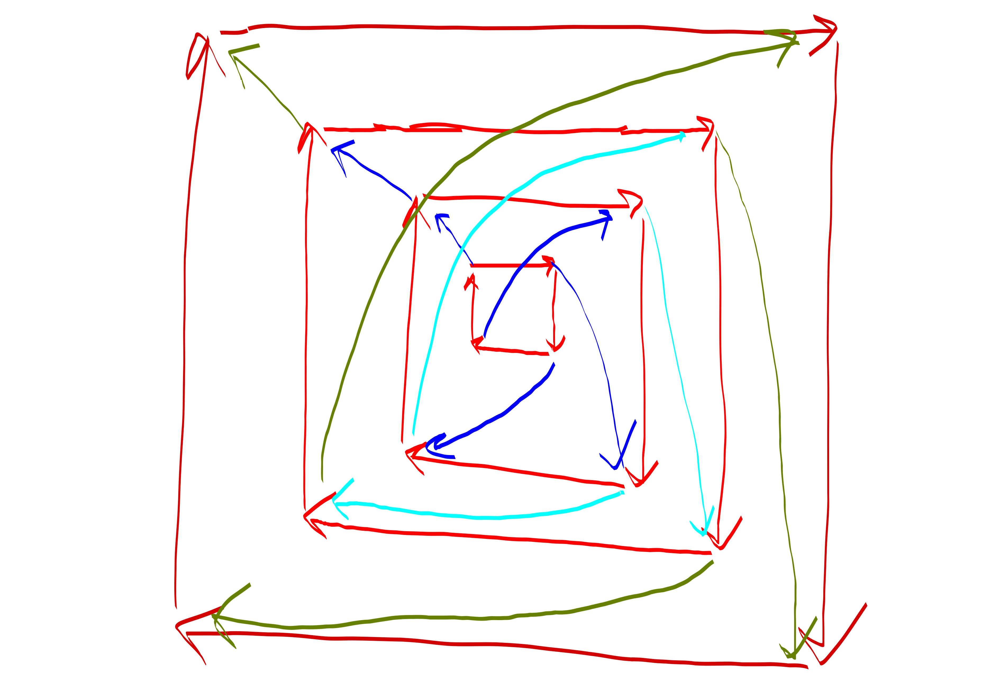
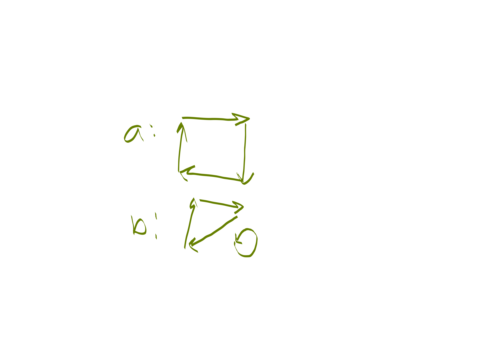

{title}
group products
{contents}
semi-direct products
{description}
Ever wondered what a semi-direct group  product is?
what, if anything is the difference between an inner semidirect
product and an outer semidirect product?
Yeah. I've wondered these things too. But then I met $\Z_5
\rtimes \Z_4$. And it became less mysterious.
{body}

[wikipedia: probably more correct than whatever I say here](https://en.wikipedia.org/wiki/Semidirect_product)

Ok so first, a reminder. Here is what the cyclic group looks
like. It's the group for addition modulo 5. 

So the little points are the group elements and the arrows
represent action of a generator $(+1)$ on them.

OK, now let's look at the direct product. 

hmmm. I think this is a fine picture.

Maybe this is a better picture. 

But you get the idea, you basically can move via two clocks at
the same time.

# semi-direct products
Now what if we did  a weird permutation in between?

so in this picture the outer-most square and the inner-most
square are actually the same, but I didn't want to draw too-dense
arrows.

So what's the deal with this weird product thing?
Well. I dunno. It seems kinda cool though.

