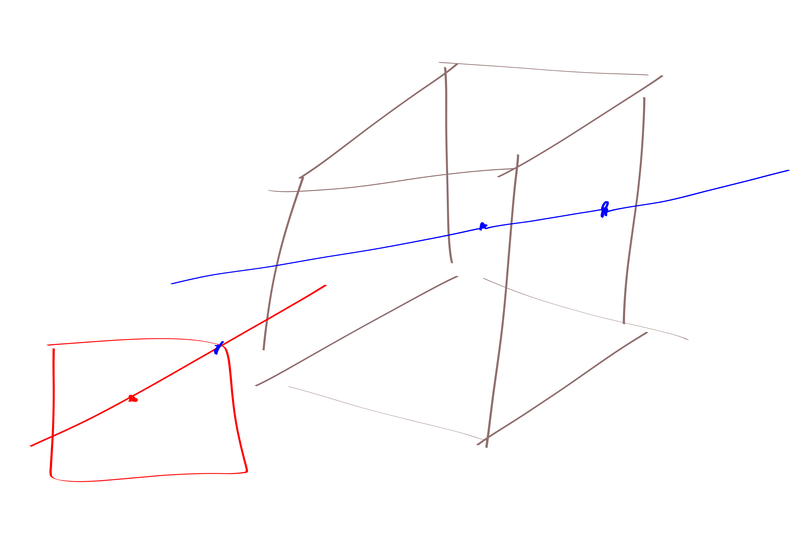

{title}
Bela Fleck Theorem
{contents}
introduction
{description}
The Beck Fiala theorem is a fundamental result in discrepancy
theory. Basically it says, if you have a collection of subsets of a
universe and each element of the universe shows up in a limited
number of the sets in your collection then there is a 2-coloring
of the universe such that all sets have a roughly equal number of red and blue elements. 
{body}

# introduction

The Beck Fiala theorem is a fundamental result in discrepancy
theory. Basically it says, if you have a collection of subsets of a
universe and each element of the universe shows up in a limited
number of the sets in your collection then there is a 2-coloring
of the universe such that all sets have a roughly equal number of red and blue elements. 

In fact, it is convenient to think of the colors as $\pm 1$.
We'll let red be $+1$ and blue be $-1$.
For $x\in U$ let $\chi(x)$ denote the color of $x$ if it has been
assigned. For $S\subset U$ let $\chi(S) = \sum_{x\in S}\chi(x)$
be the discrepancy of $S$.

beg rmk
My notation is inspired by 
[this paper](https://arxiv.org/abs/1306.6081)
which proves a truly insane bound: you can make the discrepency
of every set smaller than $2d-\log^* d$. The classic result is
$2d-2$.
Now, to me its not actually clear whether $\log^* d > 2$. But
presumably this is true if you had some really large $d$ like
$2^{2^{2}}=16$.
end rmk

beg thm
Fix "degree" $d\in \N$.
Let $U$ be a universe of size $n$. Let $S_1,S_2,\ldots, S_m
\subset U$ such that each $x\in U$ appears in at most $d$ of the
$S_i$'s. Then there is a two-coloring of $U$ such that $disc(S_i) \le 2d-2$ for all  $i$.
end thm
beg pf

We use a really cool "floating colors technique". 
The idea is, we are going to start with all the colors being
tentatively assigned $\chi(x) = 0$ for all $x\in U$.
Then we will repeatedly change the colors, always maintaining
$\chi(x) \in [-1,1]$  for all $x\in U$.
In particular, we will do some change that causes some $x$ to
change from $\chi(x)\in (-1,1)$ to  $\chi(x) \in \{-1, 1\}$.
We say that $x$'s color is **frozen** once it is set to $\pm 1$.
After an element's color is frozen we won't change it any more. 
If $\chi(x)\in (-1,1)$ we say that $x$'s color is **floating**,
meaning that it has not yet been chosen.

Now we argue why it is possible to freeze colors. 
We say that a set is **dangerous** if it has more than $d$
elements with floating colors in it. 
Let $D\subset [m]$ be the set of indices $i$ for which $S_i$ is dangerous. 
Let $n_0$ be the number of elements with floating colors.

We claim that $|D|< n_0.$ 
You can think of it like this: each element with a floating color
pays one dollar to each set that it is contained in. To be
dangerous a set needs more than $t$ dollars. The amount of money
distributed is at most $n_0 d$ because each element is in at most
$d$ sets. So the number of dangerous sets is certainly smaller
than $n_0$.

Consider the following set of constraints: 

- For all $i\in D$
$$\chi(S_i) = 0.$$
This is a set of $|D|$ constraints, and there are $n_0$
variables. That is, the system is undet-constrained. So there is
at least a 1-dimensional space of solutions. 

We start at some solution, which corresponds to a point with all
the floating variables $x$ being at points $\chi(x)\in (-1,1)$.
Then we travel along this degree of freedom until one of the
floating $x$'s hits $\chi(x) = \pm 1$. At this point we stop and
freeze this $x$.
Crucially all the remaining floating elements still have $\chi(x) \in [-1,1]$.
So we can repeat this process to neutralize all dangerous sets. 

Note that once a set becomes not-dangerous we are guaranteed
that, no-matter what the other $t$ variables in it are set to,
they can't mess with its value by more than $2t$.

So at the end the discrepencies will all be at most $2t$ or
something as claimed ish.

end pf