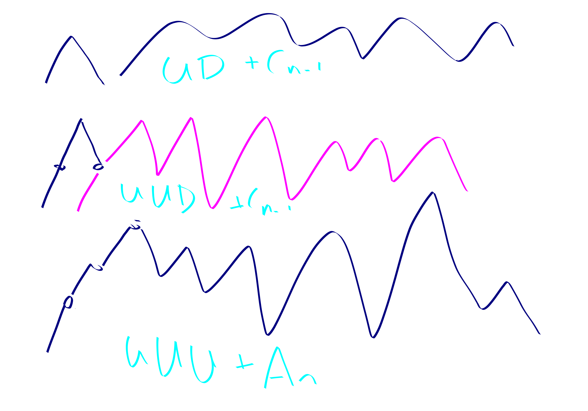

{title}
hales jewett
{contents}

{description}
finding a monochromatic arithmetic progression in a coloring of
some numbers. And playing tick tack toe in high dimensions.
{body}

Consider a $t$-coloring of $[k]^d$ (i.e. a $k\times k \times k \cdots$ cube). 
For instance, if $k=3,d=2,t=2$ and our colors are "X" and "O"
then this corresponds to placing X's and O's in a $3 \times 3$
grid.
A "monochromatic combinatorial line" in $[k]^d$ is generated by a
string that looks kind of like $1*4**2*5$. In particular, this
string is encoding a size $k$ subset of $[k]^d$. For instance in
tick-tack-toe, $1*$ would correspond to the set  $\set{11,12,13}$
i.e. a line in the first row of the tick tack toe board.
Similarly, $**$ would correspond to the diagonal
$\set{11,22,33}$.

We all know tick-tack-toe can end in a tie, although I bet I can
still beat you more often then not.

However, an interesting question is, if you played really high
dimensional tick tack toe would it still be possible to end in a
tie? It turns out, the answer is **no**.

begin thm
For any $t,k$, there exists $d$ sufficiently large so that any
$t$-coloring of $[k]^d$ must contain a monochromatic
combinatorial line.
end thm
begin pf
We proceed by induction on $k$.
Assume that we have proved the statement for $k-1$ and all $t$.
Now we aim to establish it for $k, t_0$, for some fixed $t_0.$
We do so by the following lemma:

begin lem
There is a $d$ such that $[k]^d$ either just has a monochromatic
combinatorial line, or it has $j$ combinatorial lines that are
monochromatic besides their endpoints, and these lines all share
an endpoint and all have distinct colors.
end lem
begin pf
We take $d'$ large enough that the lemma holds for $j-1$.
We take $d''$ large enough that $t^{k^{n'}}$-colorings of
$[k-1]^{d''}$ have monochromatic combinatorial lines.
We claim that $d=d'+d''$ is large enough to establish the lemma
for $j$.
Here is a proof by picture:

end pf

We use the lemma until we supposedly get $t_0$ lines each of
distinct color with common endpoint. One of them has to have
color the same as the endpoint. So we just win.

end pf

