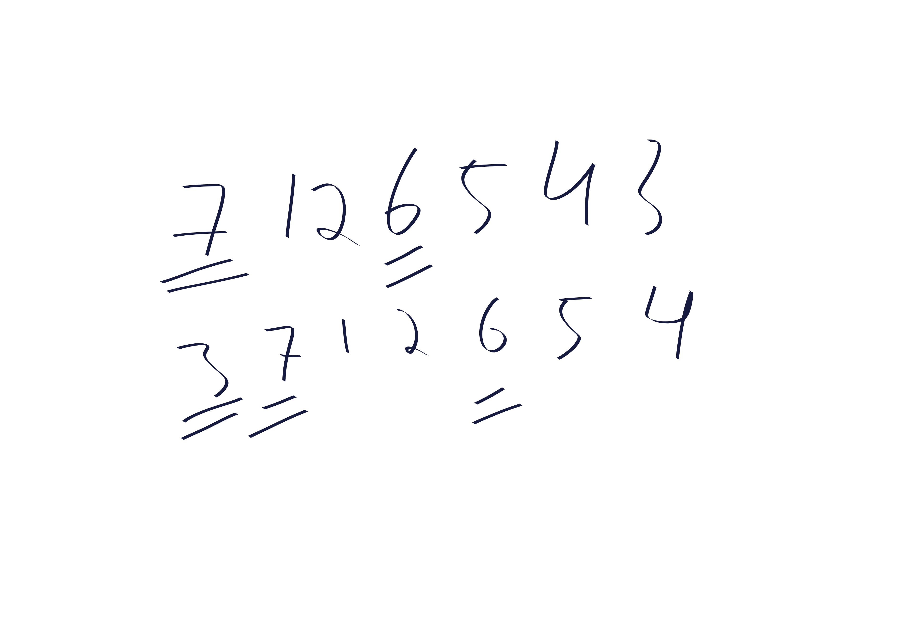
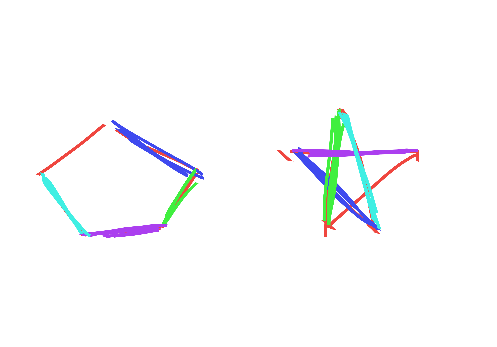

{title}
algebraic combinatorics
{contents}

{description}
some cool combinatorics problems with lots of color!
{body}

\DeclareRobustCommand{\stirperm}{\genfrac[]{0pt}{}}
\DeclareRobustCommand{\stirpart}{\genfrac\{\}{0pt}{}}
\DeclareRobustCommand{\euler}{\genfrac\langle\rangle{0pt}{}}

# {UUU dyck path}
Let $C_{n}=\frac{1}{n+1}\binom{2n}{n}$ denote the $n$-th Catalan
number. We have seen that $C_n$ counts the number of Dyck paths
with $n$ up steps and $n$ down steps.
Let $A_{n}$ denote the number of Dyck paths with $n$ up steps and
$n$ down steps where the first $3$ steps are up steps. The goal
of this problem is to determine $A_{n}.$

begin prop
  $A_{n}=C_n-2C_{n-1}$
end prop
begin pf
  The first step of a Dyck path must be up. Then, it can either
  go up or down. If the first two steps are up steps the third
  step can also be chosen from up and down.

  The total number of Dyck paths is the sum of these three
  disjoint starting possibilities: UUU, UUD, UD.
  Note that the number of Dyck paths that start with UUU is
  precisely $A_n$, while the number of Dyck paths starting with
  $UD$ is precisely $C_{n-1}$ because we have arrived back on
  the $x$-axis, and the number of Dyck paths starting with UUD is
  also $C_{n-1}$ because the first mvoe of any Dyck path must be
  an up step, so we can think of our path from now on as being
  the remainder of such a path.

  Thus, 
  $$C_n = 2C_{n-1}+A_n.$$

  Re-arranging gives
  $$A_n = C_n - 2C_{n-1} = \frac{1}{n+1}\binom{2n}{n} -
  \frac{2}{n}\binom{2n-2}{n-1} = \binom{2n-2}{n-1}2(n-2) =
  2n(n-2)C_{n-1}.$$

end pf

\newpage
# {bijection of trees}

We showed in class that the number of plane trees with $n+1$
vertices is $C_n$, i.e. the number of Dyck paths with $n$ up and
$n$ down steps. The bijection is straightforward: take a
depth-first traversal of a plane tree with $n+1$ vertices (and
thus $n$ edges); each step away from the root is turned into an
up step in the Dyck path, and each step towards the root becomes
a down step. The process is clearly invertable: we can generate
the tree from it's depth-first traversal sequence.
To count Dyck paths, we reasoned as follows in lecture:
let $2k \in \set{2,4,6,\ldots, 2n}$ be the first time that the
Dyck path comes back down to height $0$. Then, the Dyck path is
clearly composed of an up step, followed by a Dyck path of length
$2k-2$ shifted up $1$ unit followed by a down step. After hitting
height $0$ we can do another Dyck path now of length $2n-2k.$
This gives the well-known recurrence
$$C_n = \sum_{k=1}^n C_{k-1}C_{n-k} =
\sum_{k=0}^{n-1}C_{k}C_{n-k-1}.$$
But it also gives us more than just a recurrence: it gives us a
way of thinking about how Dyck paths are recursively composed of
smaller shifted Dyck paths. 

Now we will show that binary trees with $n$ vertices exhibit the
same recursive structure. One consequence of this is that the
numbers $B_n$, which we use to denote the number of binary trees
on $n$ vertices, obeys the same recurrence as $C_n$. But more
interestingly, the fact that both objects have the same recursive
structure allows us to form an algorithm that converts between
the two objects, i.e. a bijection.
We can see that a binary tree will have a root, and then some
number $k\in 0,1,\ldots, n-1$ of nodes to its left, with the
remaining $n-k-1$ of nodes being to the right of the root (i.e.
descendants via its right child, if there is a right child).
In other words, 
$$B_n = \sum_{k=0}^{n-1} B_k B_{n-k-1}.$$
Now, checking / defining that $B_0=C_0 = 1, B_1=C_1=1$ suffices to prove
that the sequences are equal, but doesn't quite give us an
understanding of why they are equal.

Now we exhibit a bijection between binary trees and dyck paths;
combined with our bijection between dyck paths and plane binary
trees this constitutes a bijective proof that $B_n = C_n$.

Consider a binary tree; we associate a Dyck path with it. If the
root has no left children, the associated Dyck path starts with
up, down and then the remainder of the Dyck path is the Dyck path
associated with the right sub-tree. If the root has left
children, the associated Dyck path will be up, then the Dyck path for the
left sub-tree, and finally down, and then followed by the right
sub-tree's associated Dyck tree (if the right sub-tree is
non-empty).
The conversion backwards is similarly straightforward. If we
consider a segment with length $2k+2$ of a Dyck path that starts and ends at height
$0$ but does not touch height $0$ in the middle, then we
recursively use this segement to construct the left sub-tree of
the root in the associated tree. In particualr, if $k=0$ this
corresponds to up down.
This is better described via a picture:

\newpage
# {3}
\todo{this isn't quite formal enough yet}
The bijection is as follows: draw the non-crossing set partition
in a circle as a set of non-crossing polygons by connecting the
points in the same parts of the partition.
Now, put a "dual vertex" on the midpoint of each edge of the
original diagram. Connect two dual vertices iff doing so is
possible without crossing the original diagram's polygons.
If the original diagram had $k$ sets in the partition, then this
new diagram will have $n-k+1$. And, if we apply the
transformation again then we get back the original set partition,
so the transformation is a bijection of non-crossing set
partitions with $k$ blocks to those with  $n-k+1$ blocks.

\newpage
# {modmaj, modinv}
It is well known that major index is equidistributed with number
of inversions. Thus, we may consider instead \defn{modinv} the
number of permutations with a number of inversions which has some 
$k$ under $\mod n$.
Consider a random permutation. It will have some number of
inversions contributed by pairs of elements in $[n-1]$. Then,
there will be some inversions which are inversions with element
$n$. If we are considering a random permutation then $n$ is
equally likely to be inverted with any number of other elements.
If the number of inversions was some number $k$ just counting
elements pairs in $[n-1]$, then we see that it will be equally
likely to be any value $k+0,k+1,k+2,\ldots, k+n-1$ after
considering the last one. But of course, this means that it is
uniformly randomly distributed on $[n]$ if we consider it $\mod
n$. This is equivalent to the desired result because the
probability of having modinv of $k$ is simply the number of
permutations with modinv $k$ divided by  $n!$.

In fact, Major index has this same property: that randomly adding $n$ into
a permutation of length $n-1$ increases the major index by a
uniformly random value in $[n]-1$. Thus, the following
Proposition more directly establishes the result desired in the
problem.
begin prop
  \label{prop:invmaj}
  If we consider each possible way to form $\pi'$ from $\pi\in
  S_{n-1}$ by inserting $n$ into $\pi$ at some location, then
  there is exactly one such way which will result in
  $inv(\pi')-inv(\pi) = k$ and also exactly one way to result in
  $maj(\pi')-maj(\pi) = k$ for any $k\in [0,n-1]$. 
end prop
begin pf
  For inversions this is obvious: if we place $n$ at position
  $k\in [n]$ in the one-line notation for the number then it will be
  inverted with all $n-k$ elements to its right.

  This is less obvious for $maj$, but still true.
  Again, we fix $\pi\in S_{n-1}$ and consider all ways to add
  $n$ to $\pi$, and the corresponding effect on major index. 
  Let $des_\pi(k)$ denote the number of descents after index $k$
  in  $\pi$.
  If we insert $n$ at the end of $\pi$ then the major index does not
  increase. We break the remaining inserts into two possible
  cases:
  \begin{itemize}
    \item \defn{annihilating} inserts: when we insert $n$ after
      the start of a descent in $\pi$, then that descent is
      actually destroyed, and we add a new descent (at index $1$
      larger than that of the destroyed descent) due to $n$
      being larger than the next value. In this case the major
      index increases by $1+des_\pi(k)$.
    \item \defn{non-annihilating} inserts: when we insert $n$
      after a non-descent, then we are adding a new descent. Here
      the major index increases by $k+des_\pi(k)$.
  \end{itemize}
  Let $d$ denote the number of descents in $\pi$. We can see that
  the annihilating inserts which corresponds to changes of
  $1+des_\pi(k)$ in major index will range over $1,2,\ldots,
  d$, hitting each value exactly once, because if we go from
  the right heading left then each annihilation corresponds to another
  descent which is now to our right.
  On the other hand, if we consider the non-annihilating inserts
  starting from the left, i.e. index $1$, we see that they will
  range over $d+1, d+2, \ldots, n-1$ hitting each value exactly
  once. In particular, this is because if we pass an ascent then
  $k+des_\pi(k)$ increases by $1$ due to  $k$ increasing by  $1$,
  but when we pass a descent $k+des_\pi(k)$ does not change
  because the increase in $k$ is offset by us having less
  descents to our right. 
  This concludes the proof.
end pf
\begin{corollary}
  Inv and Maj are equidistributed. 
\end{corollary}
begin pf
As an immediate corollary of \cref{prop:invmaj}, we have that
$inv, maj$ have the same generating functions (after checking the
base case of course), namely, if we let $inv(n,s)$ denote the
number of permutations of  $[n]$ with $s$ inversions then:
$inv(n,s) = \sum_{k=0}^{n-1} inv(n-1, s-k).$

However, we actually also can infer a bijection from
\cref{prop:invmaj} to better understand the relationship
between these statistics.
In particular we can make a recursive algorithm which forms a
bijection $\phi$ such that $maj(\phi(\pi)) = inv(\pi)$.
The bijection is as follows: say you had a permutation $\pi \in S_n$.
Recursively compute $\phi$ on $\pi_0$ which is $\pi$ but with $n$
excluded (i.e. write $\pi$ in one-line notation, and then delete
$n$ and interpret the resulting string as a permutation in
one-line notation.) 
Now, in $\pi$, $n$ is inverted with some number $k\in [0,n-1]$ of other
elements. Insert $n$ into $\phi(\pi_0)$ to get $\phi(\pi)$ in such a way that
$maj(\phi(\pi)) - maj(\phi(\pi_0)) = k$.
end pf
See the figure below for a nice representaton of
\cref{prop:invmaj}.
\newpage

\begin{figure}[h!]
  \centering
\includesvg[width=0.75\linewidth]{images/ink_img010.svg}
\caption{modmaj}
\end{figure}

\newpage
% 5
# {color permutation}
We prefer to write the rising-factorial as 
$$x(x+1)(x+2)\cdots (x-1+n) = \binom{x-1+n}{x-1}n!$$
which is true for all $x\in \N.$
We denote the Stirling number of first kind, i.e. the number of
permutations of $[n]$ with $k$ cycles by $\stirperm{n}{k}$. Let $S_n$
be the symmetric group on $n$ elements.
We define a \defn{coloring} of $\pi\in S_n$ with $x$ colors to be a map
$f:[n]\to [x]$ which assigns one of $x$ colors to each element of
the permutation. 
Finally, we say that a coloring is a \defn{cycle-monochromatic
coloring} if any elements $i,j$ involved in the same cycle of the
colored permutation have the same color.

begin prop
  $$\binom{x-1+n}{x-1}n!,\quad\quad \sum_{k=0}^n \stirperm{n}{k}
  x^k$$ both count the number of $x$-color cycle-monochromatic
  colorings of permutations of $[n]$.
end prop
begin pf
  The expression $\stirperm{n}{k}x^k$ counts the number of
  permutations of $[n]$ with $k$ cycles times $x$ choices per
  cycle for the color of the cycle. Summing over all $k$ this
  clearly counts the total number of ways to color permutations
  such that elements in the same cycle get the same color.

  Now we count the number of cycle-monochromatic colorings of permutations where we
  must use $b_1$ of color $1$, $b_2$ of color $2$, etc, with
  $b_i\in [x]$ for each  $i\in [x]$ and $\sum b_i = n$.
  To construct such a permutation and coloring, we could first decide on which
  elements will be assigned to each color.
  This can be accomplished in $n! / \prod_i b_i$ ways; it is
  equivalent to forming an $n$-letter word using $b_i$ of letter
  $i$ and using character $i$ of the word to color the element $i\in
  [n]$. Then, if we have decided which elements to assign to each
  color class, there are $\prod_i b_i$ ways to make the
  permutations, where all permutations can only send numbers to
  other numbers of the same color.
  In total this means that once we have decided on the partition
  $b_i$ of how many of each color to use, there are $n!$ ways to
  perform the coloring and permutation.
  The number of ways to form this partition is
  $\binom{x-1+n}{x-1}$ because we can think of inserting $x-1$
  dividers into a string of length $n$, where the dividers will
  divide the string into color classes.
  Thus, $\binom{x-1+n}{x-1}n!$ also counts the number of
  permutations with elements of the same cycle having the same
  color.

  Because the expressions count the same quantity for each $x\in
  \N$, and because they are continuous in $x$, we have that the
  two desired expressions are equal.
end pf

\newpage
# {exceedences, weak exceedences}
begin prop
  The number of permutations with $k$ exceedences is the same as
  the number of permutations with $k+1$ weak exceedences.
end prop
begin pf
  Consider a permutation $\pi \in S_n$ written in one-line notation with
  $k$ exceedences. Note that there is never an exceedence at
  index $n$, because $\pi_n>n$ is impossible.
  Now, form $\pi'$ by moving the final character in $\pi$'s
  one-line  notation to the start. In other words, $\pi' = \pi_n
  \pi_1 \pi_2 \pi_3 \cdots \pi_{n-1}$ in one line
  notation.
  Note  that there is always a weak exceedence at index $1$
  because $\pi'_1 \geq 1$ is trivially satisfied. 
  We claim that there are exactly $k+1$ weak exceedences in
  $\pi'$. If we can establish this we are finished
  because this transformation is a bijection (with the inverse
  achieved by shifting backwards).

For every index $i<n$ corresponding to an exceedence in $\pi$ we
have $\pi_i  > i$. Then, in $\pi'$ we have $\pi_{i+1}' = \pi_{i}
> i \implies \pi_{i+1}' \geq i+1$ so there is an exceedence at
$i+1$ in $\pi'$. In fact this is if and only if. If $\pi_i \leq i$ then
$\pi_{i+1}' = \pi_{i} \leq i$ so there is not an exceedence at
$i+1$ in $\pi'$.

end pf

\newpage
# {coloring with skips}
Let $\stirpart{n}{k}$ denote the number of partitions of $[n]$
with $k$ blocks, and let $\euler{n}{k}$ denote the number of
permutations of $[n]$ with $k$ descents.
begin prop
$$\sum_{k\in [n]}\stirpart{n}{k}k! x^{n-k} = \sum_{k=0}^{n-1}
\euler{n}{k} (x+1)^{k},$$
because for any $x\in \N$ both quantities count the number of
ways to color a permutation of length $n$ with $x$ colors, except
that some points are allowed to be left uncolored, in particular
descents may not be colored.
end prop
begin pf
  First we show LHS accurately counts the combinatorial object we
  defined in the Proposition statement.
  The LHS can be interpretted as follows: take an ordered set partition of
  $[n]$, arrange the elements within each block of the partition
  in increasing order, and then color all but the final element
  of each block using any of $x$ colors. The final element of
  each block is left uncolored.
  This corresponds exactly to a permutation where descents and
  some other points have been left uncolored, but each other
  point is colored with one of $x$ colors. In particular, the set
  partition is recoverable from the colored permutation by
  writing the permutation in one-line notation, and breaking it
  into pieces on the non-colored elements.

  Now we show that the RHS counts the same quantity.
  Actually, for the RHS we should first make use of the fact that
  Euler numbers are symmetric, i.e. $\euler{n}{k} =
  \euler{n}{n-k-1}$ which is because given a permutation $\pi$ with
  $k$ descents, the permutation $\pi^{-1}$ has $n-k-1$ descents. 
  Thus we may re-write the RHS as 
  $$\sum_{k=0}^{n-1}\euler{n}{k}(x+1)^{n-k-1}.$$
  Now we can interpret the RHS combinatorially as saying
  take a permutation with some number $k$ of descents, and then
  color each non-descent element with one of $x$ colors, or
  decline to color it (this is the $+1$). Again, we see that this
  corresponds exactly to generating a permutation colored
  according to our specification.
  Thus the expressions are equal.

end pf

\newpage
# {a map of edges of $K_n$}

First we consider $n$ which is even.
For each $i\in [n], j\in[\frac{n}{2}-1]$ there is an edge
$(i,i+j)$ where the addition is done $\mod n$. 
Also, there are an additional $\frac{n}{2}$ edges of the form
$(i, i+\frac{n}{2})$ for $i\in [\frac{n}{2}]$.
For $j>1$, the edges $(i,i+j),(i+1,i+j+1)$ do not share any
vertices. For $j=1$ we note that the edges $(i,i+1)$ and
$(i+2,i+3)$ do not share any vertices. Thus the map 
$$(i,i+j)\mapsto (i+1,i+j+1) \forall i\in [n],j>1$$
$$(i,i+1)\mapsto (i+2,i+3), \forall i \in [n]$$
is a map $f$ of edges such that $e,f(e)$ share no vertices.

For $n$ which is odd, we use a different construction.
Let $n=2k+1$ for some  $k\in \N$.
For odd $n$ we actually have edges of the form $(i,i+j)$ for each
$i\in [n], j\in [k]$. 
We observe that the following set of edges is "vertex disjoint"
(i.e. they share no vertices):
$$(i,i+1), (i+2,i+4), (i+3,i+6), \ldots, (i+k, i+2k).$$
Thus, we propose the following map:
$$(i,i+j)\mapsto (i+1,i+j+2)$$
where again, everything is $\mod n$.

Here are some pictures that do a better job describing this:

\newpage
# {bonus: boolean lattice}
more explicitely construct the boolean lattice.
3: needs more than just a picture.

