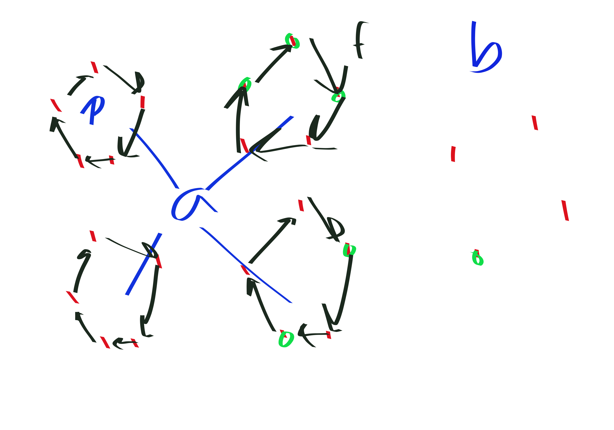

{title}
Binomial coefficients $\mod p$
{contents}

{description}
Have you ever wondered what binomial coefficients look like $\mod
p$? turns out there is actually a simple answer. Credit to
Enumerative Combinatorics for the problem
{body}

beg thm
Let $n = \sum a_i p^i, m = \sum b_i p^i$ be the base $p$
representations of $m,n$. Then,
$$\binom{n}{m} \equiv \prod \binom{a_i}{b_i}\mod p.$$
end thm

The theorem follows immediately by repeated application of the
following lemma:
beg lem
$$\binom{ap+b}{cp+d} \equiv \binom{a}{c}\binom{b}{d} \mod p$$
end lem
beg pf
Without loss of generality we take $a\neq 0$,  $ap+b>cp+d$;
otherwise the lemma is trivial.

Think of the $n$ points as divided into $a$ groups of size $p$
with $b$ left over.

One way of choosing $cp+d$ points is to saturate $c$ of the
groups and then distribute the $d$ remaining points among the
$b$ left over points; note that this is only possible if $d\leq b.$
There are $\binom{a}{c}$ ways to choose which groups to saturate,
and  $\binom{b}{d}$ ways to choose how to fill the left over
points.

Otherwise, we have an arrangement that partially fills one of the
groups. Now consider the map $f$ which creates a new subset by
cycling the elements chosen within each group $\mod p$. Clearly
 $f^p = id$, and  $f\neq id$ because one of the groups was
partially filled. Now $f$ can't possibly have order less
than $p$, so we have shown that there are $p$ subsets in the
equivalence class generated by the action of $f$ on the subset.
In other words, the number of subsets which partially fill one of
the groups is divisible by $p$.

Hence, only the earlier computed term
$\binom{a}{c}\binom{b}{d} $contributes to the binomial
coefficient $\mod p.$

end pf

