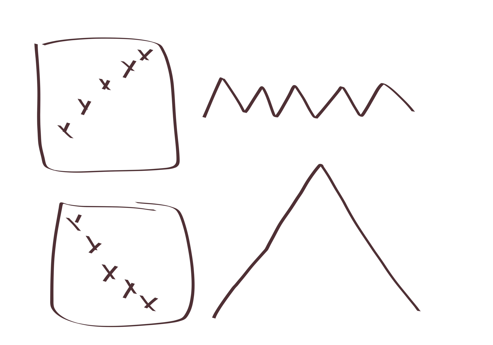
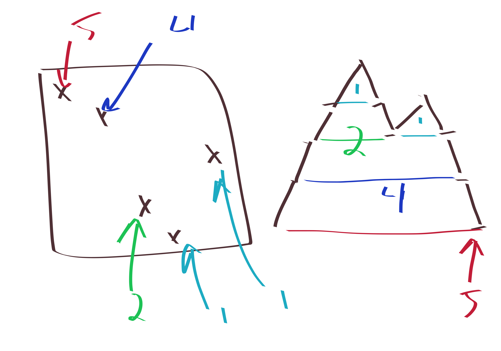

{title}
catalan numbers and permutation avoiders
{contents}

{description}

{body}

A very famous result is that if $\sigma\in S_3$ is any $3$-letter
permutation, then the number of  $n$-letter permutations which
avoid $\sigma$ is counted by the catalan numbers $C_n$, which is
pretty cool!

Here's a proof for $\sigma=231$ (you can check the other $5$
cases yourself, at least one is immediate by symmetry)

So here's the proof:
Let $\pi\in S_n$ be a $231$-avoiding permutation.
Then, the corresponding Dyck path will return to height $0$ for
the first time after exactly $2\pi_1$ steps. Now you recursively
find the segment before the return, and recursively find the
segment after the return.

Basically, the key to note is that after you fix $\pi_1$ then you
have to deal with everything less than $\pi_1$ before dealing
with anything larger than $\pi_1$, because once you leave the
below $\pi_1$ teritory, you can't return. ever.

