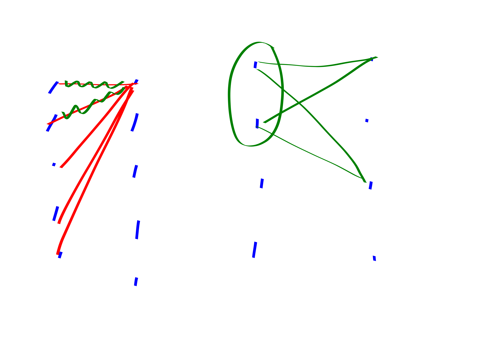

{title}
KST theorem
{contents}

{description}
I wanted to tell my sister about the KST theorem, so I'm writing
it down here really fast first to make sure I understand it. 
{body}

beg thm
Let $s,t \le O(1)$. Any $K_{s,t}$-free bipartite graph with $n$
vertices in both parts must have $m\le O(n^{2-1/s})$ edges. 
Note: this is true for non-bipartite graphs as well, probably
just by deleting half the edges to find a large bipartite subgraph. But this seems the simplest way to talk about it.
end thm
beg pf
We count the number of right-facing $s$-stars in two ways:

First, you could choose a vertex on the right and pair up any $s$
of its neighbors. This gives
$$\sum_{v\in R} \binom{|N(v)|}{s}$$
$s$-stars.
Second, you could choose $s$ vertices on the left, and connect
them to at most $t-1$ common neighbors. This gives at most 
$$\binom{n}{s}(t-1)$$
$s$-stars.

Comparing we have:

$$ \sum_{v\in R} \binom{d_v}{s} \le \binom{n}{s} (t-1) $$
At this point its pretty clear that you should say "by convexity
blah blah."
I came up with a helpful mnemonic to remember which way convexity
points:
$$\E X^2 \ge (\E X)^{2}.$$
So anyways we also have:
$$\E \binom{X}{s} \ge \binom{\E X}{s}.$$

Applying this and some standard bounds to our equation gives:
$$m\le n^{2-1/s} \frac{e(t-1)^{1/s}}{2} \le O(n^{2-1/s}),$$
as desired.

end pf