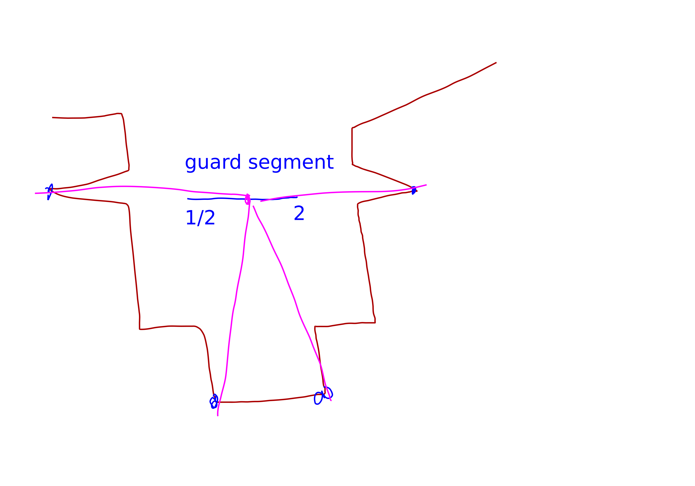

{title}
Art Gallery Problem
{contents}
In this post I will summarize Mikkel Abrahamsen, Anna Adamaszek, and Tillmann Miltzow's paper [STOC '18] on proving that the Art Gallery Problem is $\exists \R$-complete.
{description}

{body}

# introduction

An $\exists \R$ formula (**ETR**) is defined as follows:
You form a sentance $\Phi$ using variables $X_1,\ldots, $, the symbols
"$\lor, \land, \not, 0, 1, +, -, \cdot, (,),=, <, \le$".
The formula is then 
$$ \exists X_1,X_2,\ldots, X_n\in \R \mid \Phi(X_1,\ldots, X_n). $$ 
The language $\exists \R$ is the set of all true $\exists \R$
formulas. 

Note that we can encode constants other than $0,1$ by adding $1$
to itself many times and then dividing. However, the length in
bits of the numerator and denominator of a rational fraction will
influence the formula length.

A simple example of an $\exists \R$ formula is a formula for
checking if an intersection of half-planes with rational slopes
is empty.
To build such a formula we first note that the determinant can be
used to check if one vector is to the left or to the right of
another vector.
For rational numbers $a_1,b_1,a_2,b_2$ we define the proposition $\Phi_{L((a_1,b_1),(a_2,b_2))}(x,y)$ for checking if point $x,y$ lies above the line that passes through $(a_1,b_1), (a_2,b_2)$ as follows:
$$ (a_2-a_1)(y-b_1)-(x-a_1)(b_2-b_1) \ge 0. $$ 
Now, given several half-planes we can write a formula of the form
$$ \exists x,y \mid \Phi_{L((a_1,b_1),(a_2,b_2))} \land \Phi_{L((a_3,b_3),(a_4,b_4))} \land \Phi_{L((a_5,b_5),(a_6,b_6))} $$ 
and this formula is satisfied by some $x,y\in \R$ if and only if
the intersection of half-planes described by the formula is
non-empty.

It is also worth noting that you can force variables to take
irrational values (although the values will always be algebraic).
For instance, the formula:
$$ \exists x \mid x\cdot x = 2, $$ 
forces $x=\sqrt{2}$.

# Containment in $\exists \R$

beg thm
Let $P,g$ be an instance of the art gallery problem, where  $P$
is a polygon with $n$ vertiecs, each of which has rational
coordinates represented by at most $B$ bits.
There is a polynomial time algorithm that turns $P,g$ into an
$\exists \R$ formula $\Phi$ such that the $\exists \R$ formula has
length  $O(n^{14}B^2)$ and such that the $\Phi$ is satisfiable if
and only if $P$ can be guarded by $g$ guards.
end thm
beg pf
First we show how to turn an art gallery problem into a simple formula which is not quite in the $\exists \R$ class of formulas, but is quite close. Specifically, the problem will be that it has a $\forall$ quantifier.
The formula is as follows:
$$ \Psi := \exists x_1,y_1,\ldots, x_k, y_k \forall p_x,p_y \mid
\text{INSIDE-POLYGON}(p_x,p_y)\implies \lor_{i=1}^{k} \text{SEES}(x_i,y_i,p_x,p_y).$$ 
Now we expand out the INSIDE-POLYGON and SEES sub-formulas.
INSIDE-POLYGON can be implemented by triangulating the polygon
and doing an $\lor$ of checks for if the point  $p_x,p_y$ is in
each of the triangles. To check containment in a triangle we can
exactly use the formula described earlier in this note for
checking intersection of half planes. We simply orient the edges
of the trianlge counter-clockwise and then check if the point is
to the left of each of these edges.
The INSIDE-POLYGON predicate has length $O(nB)$.

For the SEES predicate we insert, for every pair of consecutive
edges, a predicate that checks if $e_1,e_2$ blocks the line of
sight between $p_x,p_y$ and $x_i,y_i$; this can be done with a
constant number of determinants.

To convert the formula $\Psi$ into an ETR formula we create a
**witness set**: a small subset of points such that if these
points are guarded then it guarantees that the entire polygon is
guarded.

Roughly speaking the witness set is constructed as follows:
Let $L$ denote the set of lines containing either an edge of
$P$ or a guard $g$ and a corner $v$ of the polygon (modulo an
issue that this is not well defined if a guard is placed on a
corner).
The lines divide $\R^2$ into **regions** (faces of the
arrangement). 
The set of regions satisfies:

- each region is an open convex polygon
- each region is either fully inside the polygon or fully outside
- the closure of the union of the regions inside the polygon
    gives the entire polygon including the boundary
- For each region $R$ and each guard $g$ we have that $g$ either
    sees all of $R$ or none of $R$.

So, what we will do is, for each region $R$ contained in the
polygon we choose a point in the interior of $R$, namely the
centriod of $3$ distinct points. Then we add a check for if there
is a guard that can see this internal point.
The entire polygon is guarded if and only if each of these
internal points is seen by some guard.

The way they handle the possibly degenerate lines and the
possibility of parallel lines is kind of as follows:

- for each pair of (potentially degenerate) lines they have a formula that asserts that either (a) one of the lines is degenerate, or (b) the lines are parallel, or (c) some variable gets assigned to have value equal to this intersection point.
- then they a condition that says, for each triple of points, if
    those three points are all defined, then force some variable
    to be made equal to the centroid and if that centroid is
    inside the polygon, then force some guard to see it.

end pf

# $\exists \R$ hardness

The first hint that the art gallery problem might be harder than
NP-hard is that there are polygons where it is necessary to place
the guards at irrational points.

[TODO: draw example]

The hardness proof is based on the following simpler but
equivalent variant of ETR, which they call **ETRINV**:
beg thm
The variables $x_1,x_2,\ldots, x_n$ all must be within $[1/2,2]$.
The allowed constraints are of the following form:

- $x_i = 1$
- $x_i + x_j = x_k$
- $x_i\cdot x_j = 1$

Deciding satisfiability of ETRINV is just as hard as deciding
satisfiability of ETR.

The proof of this theorem is some rather involved algebra.
end thm

Now we outline the components of their proof.
They will have variable gadgets at the bottom and clause gadgets
on the sides.

The variable gadgets look like this:

The idea is, in order for a guard to be able to see all of the 4
corners it needs to be somewhere on the "guard segment". The
location on the guard segment will encode the variable's value.

They also need a variation of this with some extra pockets to
enforce $x_i = 1$ constraints.

Next they need a copy gadget.

Then they need an addition gadget.

Finally they need an $x=1/y$ gadget.

These gadgets are cool but very tricky to construct and required
some computer search.

# open questions

- Is guarding the boundary $\exists \R$ complete? Actually this
    was recently resolved by Jack Stade. 
- interesting note: you can guard the boundary without guarding
    the interior.

# line guard problem

In the line guard problem you are given a polygon and number $k$.
The question is, can you draw $k$ line segments inside the
polygon such that if you had guards patrolling those line
segments then every point in the polygon would be visible at
*some* point in time?
This is called *weak visibility*. 
There is also the notion of *strong visibility*; which kind of
sounds freaking cool. I'll consider it next. But first weak
visibility.

Now we try to adapt the $\exists \R$ containment proof from above
to the line guard problem (weak visibility variant first).

beg thm
(hopefully will prove this)

Deciding whether an art gallery polygon $P$ is weakly-line-guardable by $k$ guards is solvable in $\exists \R$.
end thm
beg pf

First we write a formula with (illegal) $\forall$ quantifiers.
I'm cautiously optimistic that the same "witness points" from
above can help us just $\forall$ over a finite set of witness
points (aka, finite $\land$, which is legal) rather than the
continuum of points in the interior of the polygon.
Anyways the formula looks like this:

$$ \exists (a_1,b_1,c_1,d_1),\ldots,(a_k,b_k,c_k,d_k) \mid
\forall x,y: \exists t_1,\ldots,t_k$$ 
such that 
$$ \text{INSIDE POLYGON}(x,y) \implies \bigwedge_i t_i\in [0,1] \bigvee_{i} (a_i,b_i)t+(c_i,d_i)(1-t) \text{ SEES } x,y. $$ 

end pf

