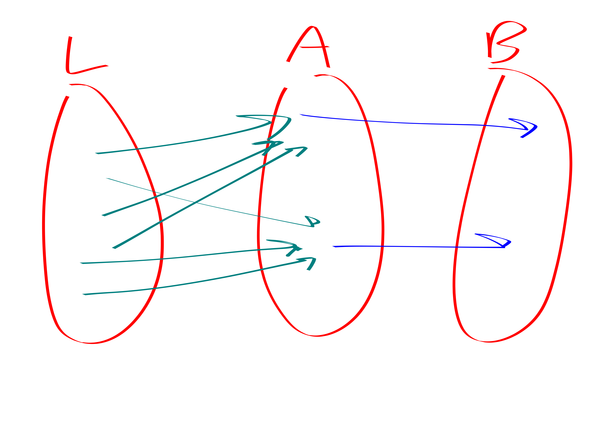

{title}
Exchanging triangles / squares for larger cycles and listing cycles
{contents}
reductions between square/triangle and k-cycle
square listing
{description}
Proof from Appendix of Aboud FOCS22. 
"Hardness of approximation in P via short-cycle removal"
{body}

# reductions between square or triangle and k-cycle

Henceforth $C_4$ will be refered to as a "square" sometimes.

Proof from Appendix of Aboud FOCS22. 
"Hardness of approximation in P via short-cycle removal"

They prove two interesting theorems:

beg thm
- For any $k\in \N$ there is an $O(m)$ time algorithm that, on 
    an $m$-edge graph $G$ produces a graph $G^{\star}$ whose
    $4k$-cycles are in bijection with $G$'s $4$-cycles.
- For any $k\ge 3$ not a power of $2$, there is an $O(m)$ time
    algorithm that, on an $m$-edge graph $G$ produces a
    graph $G^{\star}$ such that $G$'s triangles are in bijection
    with $G^{\star}$'s $k$-cycles.
end thm

beg cor

- If $k$-cycle can be solved in $m^{\alpha}$ time for any
$k,\alpha$, then for at least one of $k_0\in \{3,4\}$ we can
solve $k$-cycle detection in $m^{\alpha}$ time.
- If there is an algorithm that with $O(m^{\alpha})$
    preprocessing lists $k$-cycles with $m^{o(1)}$ delay, then
    there is also such an algorithm for at least one of triangle
    / square enumeration.
end cor

beg cor
The result of Jin Xu STOC23 implies that there is no
$m^{4/3-o(1)}$ preprocessing followed by tiny delays algorithm
for $2k$-cycle listing.
But this is of course kind of weaker than what we believe to be
the truth.
end cor

ok now lets see some proofs:

<blob>

> "pfs vg!" -Blobby

beg lem
Let $r\mid k$.
$G \to G'$, such that $C_r\leftrightarrow C_k$
end lem
beg pf
Subdivide the edges. i.e., replace the edges with paths of length
$k/r$.
end pf

beg lem
Let $k$ be odd. 
There is an $O(m)$ time algorithm that takes a tripartite graph $G$ and converts it into $G^{\star}$ so that triangles in $G$ are in bijection with $k$-cycles in $G^{\star}$.
end lem
beg pf
Exchange each $B\times C$ edge for a path of length $k-2$, i.e.,
subdivide those edges.

It is clear that triangles get converted into $k$-cycles.
To see the other direction it is helpful to partition the vertex
set into $A,B,C, D_1,D_2,\ldots, D_{k-3}$ where $D_i$ is the
vertices which are  $i$ steps along a $B\to C$ path.

Observe that if we delete any of these parts the graph becomes
bipartite, and then we could certainly not find a $k$-cycle in
it. Hence every $k$-cycle must actually use one of the $B \times
C$ path / edge things and thus actually corresponds to a triangle
in the original graph.

end pf

beg rmk
These both have the unfortunate property of resuling in
graphs with way too many vertices. 
end rmk

# square listing

"Listing 4-Cycles" Abboud et al:
https://arxiv.org/pdf/2211.10022.pdf

beg prop 
You can list squares in $O(n^{2}+t)$ time, where $t$ is number
of squares.
end prop
beg pf
Do a 2 step BFS out of every vertex. For each pair $u,v$ make a
list of the paths of length $2$ between $u,v$.

Then itterate over $u,v$ and itterate over pairs of paths of
length $2$ between $u, v$: each of these is a four-cycle. 
end pf

beg rmk
Now we enter sparse land. In sparse land we always assume wlog
that $n\le O(m)$.
end rmk

beg thm 
You can list squares in $\widetilde{O}(m^{4/3}+t)$ time, where
$t$ is number of squares.
end thm
beg pf
Let $L$ be the set of low-degree vertices, i.e., vertices with
degree smaller than $m^{1/3}$. Let $H$ be the high degree
vertices. 

We break it into a few cases:

- 2-paths wtih an L at the middle
- 2-paths consisting solely of H vertices
- "LHH" 2-paths. these ones are more tricky. But we only have to
    list half of them. So they direct the graph in an interesting
    way.

end pf

beg lem 
You can list 2-paths with an L in the middle in $O(m^{4/3})$ time.
end lem
beg pf
Itterate over edges, if the edge has a low-degree endpoint
itterate over that endpoint's neighbors.
Time $O(m^{4/3})$
end pf

beg lem 
You can list 2-paths only involving H vertices in $O(m^{4/3}+t)$
time.
end lem
beg pf
At most $m^{4/3}$ pairs of high deg vertices. 
Let $G'$ be the graph where we have removed low degree vertices.
This can be computed in time $O(m)$.
Now we do a 2-step BFS out of each vertex in $G'$.
You have to pay for the first 2-path you list between each pair of high degree vertices. 
After the first one though the rest get charged to $4$-cycles. 
end pf

beg thm
The hard case: LHH.
end thm

beg lem
Any graph with $n$ vertices and average degree $d$ has  $\Omega(d^{4}-n^{2})$ 4-cycles.
end lem
beg pf
$\lambda_1(G) \ge d^{4}$.
The number of walks of length 4 is $tr(A^{4})  \ge \lambda_1(G)$.
The number of 4-walks is equal to number of squares plus the
number of 2-paths (degenerate C4s):

The number of $2$-paths is simply:
$$\sum_{uv} codeg(u,v) \le O(n^{2} + \# C_4).$$

In summary:

$$\# C_4 + \# P_2 \ge d^{4}$$
so

$$\# C_4 \ge \Omega(d^{4}-n^{2}).$$

end pf

beg lem
Direct the edges from low degree vertex to high degree vertex
(breaking ties arbitrarily).

There exists a partition $H = A\sqcup B$ of high degree vertices
so that 

1. The partition captures most of the $L\to H\to H$ paths. I.e.,
   the number of  $L\to A\to B$ paths is at least an
   $\Omega(1/\log^{2} n)$-fraction of all of the $L\to H\to H$
   paths.
2. The vertices in $A$ all have about the same number of $L$
   neighbors (up to multiplicative factor of $2$) and about the
   same number of $B$ neighbors.
3. All vertices in $B$ have an $A$ dude pointing at them.
end lem
beg pf

Start by selecting each high-degree vertex to join $A$ with probability $1/2$.
This kills $3/4$ of  the $L\to H\to H$ paths on average.
Now bucket the nodes based on  $\floor{\log_2 \cdot}$ in arrows
from L and out arrows to B. 

end pf

beg thm 
Let $P$ be the number of $L\to H \to H$ paths.
If $P  > 100m^{4/3}\log^{2} n$ then there are at least
$P/(100\log^{2 n})$ $4$-cycles.
end thm
beg pf
Combine the lemmas.
end pf

beg thm
We can list 4-cycles in $\widetilde{O}(m^{4/3}+t)$ time.
end thm
beg pf
Combine the lemmas.
end pf

TODO: read "[AYZ95] Noga Alon, Raphael Yuster, and Uri Zwick. Color-coding. J. ACM, 42(4):844–856, 1995." especially section 4 "perfect hashing"

TODO: read "Listing 6-Cycles": Jin Williams, Zhou 
extends this stuff to work for 6-cycles.

