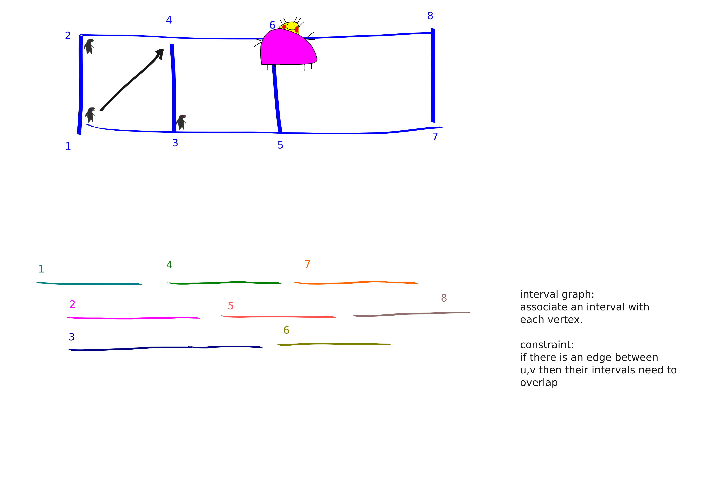

{title}
FPT part 6
{contents}

{description}
tree width part 2
{body}

# 7.4 monadic logic on graphs

They define a certain logic on graphs. 
Let's just write some examples.

beg ex

**partition**: given three vertex subsets, are they a partition
of the vertices of the graph?

$$\text{partition}(X_1,X_2,X_3) = \forall_{v\in V} v\in X_1 \lor v\in X_2 \lor v\in X_3.$$

**indep**: given a vertex subset, is it an independent set?

$$\text{indep}(X) = \forall_{u,v \in X} uv\notin E.$$

**3COLOR**: is my graph three colorable?

$$\exists_{X_1,X_2,X_3 \subseteq V} \text{partition}(X_1,X_2,X_3) \land \text{indep}(X_1) \land \text{indep}(X_2) \land \text{indep}(X_3).$$

end ex

beg thm
Courcelle's theorem:

Let $G$ be a graph with tree width $t$, and let $\varphi$ be a
formula in monadic second-order logic. Then, there is an
algorithm that determines whether $\varphi$ is satisfied on  $G$
in runnning time $f(||\varphi||, t)\cdot n$ for a computable
function  $f$.
end thm

beg rmk
We can't give good bounds on $f$: if you alternate quantifiers a
lot it can be really really really massive. Like much worse than tower.
So this is more of a "if your problem is like this then its FPT"
than the final word on parameterization by tree-width.
end rmk

The following optimization version of Courcelle's theorem is also
useful, e.g., for vertex cover, where it's not clear how to get a
monadic formula thing that doesn't have a $k$ dependence.

beg thm
If you have a formula and a pretty nice function you want to
optimize, that's FPT in $||\varphi||$ and tree-width too.
end thm

# other interpretations of tree-width

## path-width

beg thm
The following graph parameters are basically (up to a dumb $\pm 1$) equivalent:

- node-search number
- interval width
- path width

end thm

Here is a hypothetical story (not real life) to explain
node-search number.

Blobby is on the run from the cops. Luckily Blobby is omniscient
and has unbounded speed.
He's also invisible!
Unforunately for him, the cops are
really out to get him. They know his weakness: each of the cops
has a box of pizza. If Blobby ever occupies the same vertex as a
cop he will be sucked into the box of pizza.
The cops start wherever and at each step you can do a **place**
move: take a cop from the pool of unplaced cops and place it, 
or you can do a **extract** move: take a cop from the graph and
put them into the unused cops pool.

The node-search number of a graph is the fewest number of cops
needed to catch Blobby.

Here's a picture that I think helps see why node-search number is
related to interval width / path width:

It might be hard to think of Blobby as being omniscient,
unbounded speed and invisible. Instead, you can think of Blobby
as being a gas that the cops are cleaning up. If there is gas on
an edge it will spread to any edges that share a vertex with it,
unless that vertex is blocked by a cop. If cops occupy both
endpoints of an edge then the gas dies in that edge. But of
course edges can be recontaminated.

## tree-width

Somewhat similar story for tree-width.

Key difference: cops can see the Blobby in the tree chase
version. And cops have to announce their next move, and Blobby
gets to choose where to go after the cops announce move. 

**bramble**: a collection of pairwise touching connected vertex subsets. 
(We say that two vertex subsets are *touching* if they share a
vertex or if there is an edge between them).

beg thm
treewidth $k$ iff bramble of order $k+1$.
end thm
beg pf
one direction pretty clear, other apparently very tricky.
end pf

beg def
cordal graph:
Largest induced cycle is a triangle.

cordal width: min max-clique in a chordal super graph.

end def

beg thm

TFAE up to $\pm 1$

- treewidth
- chordal width
- max bramble
- cops to catch visible robber

end thm

# computing treewidth

unforunately tree-width exactly NP-hard. But we can settle for
FPT algo / approx algo.

beg def
$H$ is a minor of $G$ if you can obtain $H$ from $G$ by some
combination of deleting vertices, edges, and contracting edges.
end def

beg rmk
Apparently you can efficiently test if a constant size graph is a
minor of your graph. In like $n^{3}$ time. No idea how.
end rmk

beg thm 
MEME FPT algorithm for computing treewidth (i.e., determining
whether treewidth is larger than $k$ or not).
end thm
beg pf

tree-width is **minor monotone**: taking minors only decreases
tree-width. Hence, the set of graphs with tree-width at most $k$
is closed under taking minors. Hence, there is a set of forbidden
minors, whose size depends only on $k$, such that a graph has
tree-width at most $k$ iff it avoids the forbidden minors.

Thus, to check if a graph has tree-width at most $k$ you just
check for each of the forbidden minors whether it is a minor of
your graph.

This is not such a useful algorithm maybe because determining the
set of forbidden minors seems really hard, and that set is going
to be freaking massive.

end pf

beg rmk
Ok there is also an actual (uniform) algorithm. with run time
$k^{k^{3}} \cdot n$. 

But this is a bit slow, so we're gonna just do an approx algo
instead.
end rmk

beg thm
There is a $8^{k}k^{2}n^2$ algo that either constructs a tree
decomposition of widdth at most $4k+4$ or outputs (correctly)
that $G$ has treewidth larger than $k$.

Ok, more recently:
There is a $2^{O(k)}\cdot n$ algo that either constructs a tree
decomposition of widdth at most $5k+5$ or outputs (correctly)
that $G$ has treewidth larger than $k$.

Anyways, we're gonna prove the easier version. 
But it's looking pretty intense, so prolly has to wait till after
lunch.
end thm

Before proving giving an FPT treewidth/decomposition
approximation algorithm we need some graph theory lemmas.

beg rmk
In a tree there is a "centroid": a vertex whose removal splits
the tree into some subtrees each with at most $n/2$ vertices.

It turns out that graphs of bounded tree-width also have "small
separators": if a graph has tree-width $k$ there is a set of size
$k+1$ whose removal "splits the graph nicely".
We need a weighted version of this.
end rmk

beg lem
separation lemma part 1:

Let $G$ be a graph of treewidth at most $k$ and let $w$ be a
function that assigns weights to the vertices of $G$.
Then, there exists a vertex set $X$ of size $k+1$ whose removal splits $G$
into some of connnected components, each of which has weight at
most $1/2$ the total weight $w(V(G))$.
end lem
beg pf
Consider a tree decomposition of $G$. (This isn't circular, we're
arguing existence of a separator, not giving an algorithm for
anything yet).

Arbitrarily root the tree $T$.
Find a vertex $t\in V(T)$ satisfying:

- $w(V_t)\ge \frac{1}{2}w(V(G))$
- But, for any child $t'$ of $t$ we have $w(V_{t'}) < \frac{1}{2}w(V(G))$
  - This can be equivalently formulated as "the furthest vertex
      from the root whose subtree still has half the weight of
      the entire graph."

Anyways, the claim is that the bag $X_t$ is the separator that we
want.

And indeed, connected components of $G-X_t$ either live in
$V\setminus V_t$, which we already know has less than half the
weight, or in a subtree of one of $t$'s children, which also
can't have too much weight.

end pf

beg lem
We can find a $2/3$-balanced separation $(A,B)$
of order at most $k+1$.
end lem
beg pf
We use the previous lemma, form two groups of connected
components in a certain way to get the balance property.
end pf

beg rmk
Menger's theorem (special case of max-flow = min-cut)
says that that the minimum size of a separator between two sets is the maximum
number of vertex disjoint paths between the two sets.
This is very algorithmic, because we can run maxflow to get
separators / paths.
end rmk

beg cor
If you have a vertex subset $S$ of size $3k+4$ in a graph with
treewidth $k$ then you can partition $S$ into two nicely sized
sets such that the $\mu(S_A, S_B)\le k+1$.
end cor

Anyways, seems pretty powerful.
Now we prove the theorem.

beg pf
Assume $G$ connected and at most $kn$ edges.

We have a recursive procedure **DECOMPOSE** for constructing the decomposition.

First, we arbitrarily choose a subset $\hat{S}$ of $W$ with
$3k+4$ elements. Applying the corollary from above  we 
know that there should be a partition $S_A, S_B$ of $\hat{S}$
such that $\mu_{G[W]}(S_A, S_b) \le k+1$, i.e., there is a
separator of size at most $k+1$ separarting $S_A, S_B$ in $G[W]$.
We run maxflow to try and find this separator. If we can't find
it we conclude that the graph actually has large treewidth.

Anyways, assuming we found this separator $A,B$ with  $|A\cap
B|\le k+1$ we then set  $\hat{S} = S\cup (A\cap B)$.
This is going to be the root bag of our tree decomposition.

We then recursively call the DECOMPOSE procedure on all connected
components that arise by deleting the root bag. 

end pf

beg rmk
Not related to tree-width but I finally got around to fixing my
image compilation script to only compile images in the file that
I'm editting rather than all the images. I should probably still
upgrade it to auto compile rather than manual compile. 
But this is a big step up: before now I was really scared to add
images bc it took like 10sec to compile them. Now it's back down
to like 1sec. 
As I always like to say "blogging isn't like ski rental because
if someone breaks your legs you probably will end up writing more
blog posts not less."
end rmk

## some random treewidth related problems

beg prop
Trees have pathwidth $O(\log n)$.
And, there exists trees with pathwidth $\Omega(\log n)$.
end prop
beg pf
For the upper bound use a centroid decomposition.
Let $v$ be a centroid and let $x,y,z$ be its neighbors (might be
more or less than $3$). Then our path decomp is, $v$'s interval
spans the whole way, but then we do $T_x$'s interval graph,
followed by $T_y$'s and followed by $T_z$'s.

hmm, the book claims that it's non-obvious that there are
trees with pathwidth $\Omega(\log n)$. But it seems to me that
it's pretty clear that e.g., binary trees have  $\Omega(\log n)$
pathwidth. Not exactly sure how to prove though.

end pf
