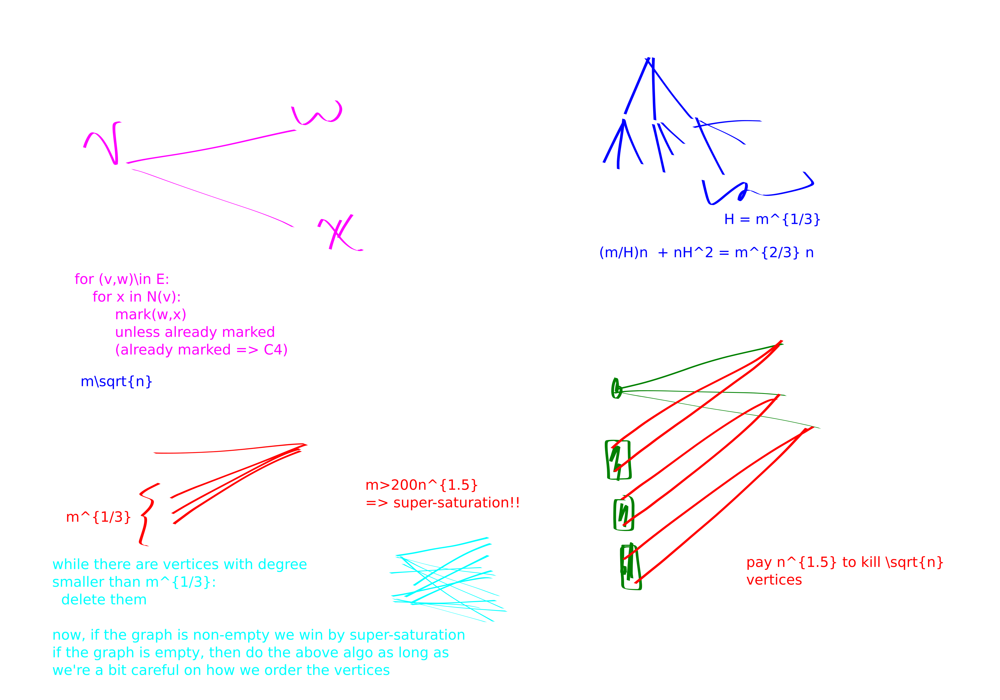
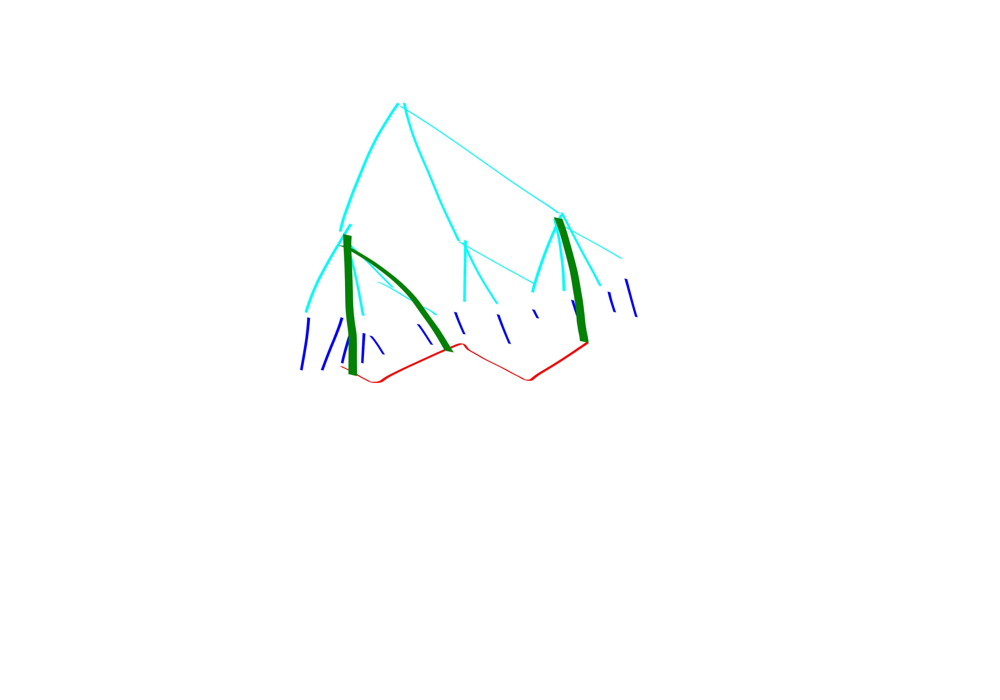

{title}
cycles
{contents}
General Notes on Exact Cycle Finding
Finding Even Cycles
Girth
some not-so-good algorithms that I made up
relatively old work on girth approximation
cutting-edge approximations
{description}
Some notes about algorithms for finding cycles in graphs.
{body}

The topic today is taken from [Virginia Williams' MM + Graph Algs lecture notes](https://people.csail.mit.edu/virgi/6.890/). Throughout the post $\omega<2.4$ is the matrix multiplication exponent.
MM will stand for matrix multiplication.

# General Notes on Exact Cycle Finding

beg thm 
Let $k\in \N_{\ge 3}$ be a constant. 
directed/undirected-$k$-cycle detection can be accomplished in $n^{\omega}$ time on
$n$-vertex graphs.
end thm
beg pf
It suffices to prove the theorem for directed graphs. We won't
need to explicitely mention this throughout the proof, but just
note that the adjacency matrices needn't be symmetric. 

For $k=3$ you can just cube the adjacency matrix and check
whether its trace is $0$. This doesn't work for $k>3$ because
powers of the adjacency matrix count walks, i.e., are allowed to
repeat vertices. 

Instead we do color coding!
Color with $k$ colors. 
Make matrices $A_1,A_2,\ldots, A_{k-1}$
where $A_i$ represents the transition from color $i$ vertices to
color $i+1$ vertices. That is, fix some ordering of the vertices
within each color class, and then make the rows of $A_i$ be the
vertices of color $i$ and the columns of $A_i$ be the vertices of
color $i+1$, and place edges if the vertices are adjacent.

Let $B = A_1\cdot A_2\cdots A_{k-1}$; $B$ can be computed in
$n^{\omega}$ time.
$B[u,v]$ counts the number of $k$-vertex paths from $u$ to $v$
whose vertices are colors $1,2,\ldots, k$.

Now, for each $u,v$ check whether $A[v,u]=1 \land B[u,v]>0$. If
the check ever passes then we have found a $k$-cycle.

If the cycle was correctly colored we must find a $k$-cycle in
this manner. 

The coloring succeeds with probability $\frac{1}{k^{k}}\ge
\Omega(1)$.
Taking $\Omega(\log n)$ tries for the coloring lets us succeed at
least once with high probability.


end pf

It turns out that even cycle detection can be done in $n^{2}$
time in undirected graphs. 
Now I establish that odd cycle detection does require $n^{\omega}$ time.
First we prove another interesting result:

beg thm
Let $k$ be an odd constant. Then directed-$k$-cycle is equivalently hard to undirected-$k$-cycle.
end thm
beg pf
We can convert an instance of undirected-$k$-cycle to
directed-$k$-cycle by thinking of each edge $\set{u,v}$ as being
two directed edges $u\to v$ and  $v\to u$.

The other direction is more subtle.
We are given an instance of directed-$k$-cycle.
By color coding we assume that the graph has parts
$V_1,V_2,\ldots, V_k$ and we only consider edges from $V_i\to
V_{i+1}$.
Let this new graph be $G'$.

Let $G''$ be the graph obtained by dropping the directionality on
the edges in $G'$. 

**Claim**: $G''$ has an undirected-$k$-cycle iff colorful $G'$ has
a directed $k$-cycle. 

Proof of claim:
If $G'$ has a cycle then dropping the directionality won't kill
the cycle. 
If the cycle in $G''$ uses a vertex from each of the $k$ parts
$V_i$ then it is clearly a cycle in $G'$. 
Assume for contradiction that there is a cycle in $G''$ that
doesn't use some part $V_i$. But $G''\setminus V_i$ is bipartite,
so it cannot contain an odd cycle. 


end pf

beg thm
Let $k$ be a constant.
Directed-$k$-cycle is equivalently hard to triangle detection.
end thm
beg pf
We already showed how to solve directed-$k$-cycle with MM. 

Let $G = (V, E)$ be a graph we want to do triangle detection in. 
Make $k$ copies of the vertex set: $V_1,V_2,\ldots, V_k$.
We denote the copies of a vertex $v$ by $v_1,v_2,\ldots, v_k$.

- Connect $u_1\to v_2 \in V_1 \times V_2$ iff $(u,v)\in E(G)$. 
- Connnect $u_k\to v_1 \in V_{k}\times V_1$ iff $(u,v) \in E(G)$
- For each $i\in [2, k-1]$ and each vertex $v\in V$ connect $v_i\to v_{i+1}\in V_i \times V_{i+1}$.

  A $k$-cycle in this new graph corresponds to a triangle in the
  original graph.

end pf

-----------------------

# Finding Even Cycles

beg thm
"Even cycles Even Faster" 

1. For all $k$, there is an $n^{2}$ algorithm to detect existence of a $2k$ cycle (and find it, if it exists).
2. There is an $n^{2}$ time algorithm to find the shortest even cycle.
end thm

First I present two simple proofs of the theorem for $k=2$.
Then I'll present a proof for general $k$.

beg thm
$4$-cycle, $n^{2}$ time.
end thm
beg pf
1. Common neighbor(x,y): 
  make an $n \times n$ matrix $A$. $A[i,j]$ will store whether we
  have found a common neighbor for $i,j$ so far. 
  If any cell in the matrix ever gets hit twice then we found a
  $4$-cycle.
  What we do is, for each vertex $v$, for each pair of vertices
  in $N(v)$ mark them as having a common neighbor. 

2. wlog its bipartite:
  In particular, take $G=(V,E)$, and form $G'$ by duplicating the
  vertex set to $V\sqcup V'$ and put an edge between  $uv'$ if $uv$ is an edge in $G$.
  Then, if you had a $4$-cycle in $G$ it is converted into a
  $4$-cycle in $G'$. But of course $G'$ is bipartite and only
  a constant-factor larger.
   Then, run BFS-cycle out of each vertex (for depth $2$).
This must terminate fast. 
More precisely, for all vertices in the neighbor-set of one of
your vertices color their left-neighbors. If a left-neighbor gets
colored twice it means you have a $C_4$.

3. Again, lets just work in bipartite graphs. 
wlog by Bond Simonivitis $m\le 200 n^{1.5}$.
Do a 2 step BFS out of some vertex $v$ with degree $\ge \sqrt{n}$. If we found a $4$-cycle
then that's lovely. Else, itterate over all $w\in RHS$ and check
if any of them have two neighbors in $N(u)$ for any $u\in N(v)$.
This will take $n^{1.5}$ time.
If any of the checks pass, we get a $4$-cycle. 
Else, we can delete the vertices $N(v)$: they are not part of any
four-cycles. 
The gist is we keep paying $n^{1.5}$ to kick $\sqrt{n}$ vertices.
Should pay  $n^{2}$ to kick all $n$ vertices.

**You can also get better results if your graph is extra sparse.**
4. For instance, here's an $O(nm^{2/3})$ time algorithm:
   BFS-cycle out of all vertices with more than $m^{1/3}$ degree,
   do a restricted BFS-cycle ignoring high degree vertices out of
   all vertices. Costs $$\frac{m}{H} n + nH^{2}.$$
   IMPORTANT: first make your graph bipartite before you do this,
   to kill triangles.

5. $m\sqrt{n}$ algorithm:
again, we are going to assume bipartite (we can make a bipartite
instance in $O(m+n)$ time so this is legal; could also
argue by color coding but that's overkill).
- BFS-cycle out of all vertices with degree larger than $\sqrt{n}$
- Now we only focus on vertices of degree smaller than $\sqrt{n}$

- for $(v,w)\in E(g)$
  - for $x\in N(v)$
    - Mark $x,w$ as friends, unless they were already friends in
        which case we have a $4$-cycle.
Run time is 
$$\frac{m}{\sqrt{n}}n + m\sqrt{n}.$$

6. $O(m^{4/3}$ algorithm (ok, we're assuming $m\ge n$, here and
   always and forever)

```python
degrees = [array storing hash-sets of which vertices are of each degree]
my_degree = [lookup table, for each vertex tells you where it is in the degree table]
while there are vertices with degree < 200 m^{1/3}:
  delete some such vertex w
  modify the degrees of the neighbors of w appropriately

if this resulted in a non-empty graph:
  we have super-saturation in this graph, and insta-win
else:
  Let v1,v2,... be the order that we deleted vertices in

  for v = v1,v2, etc:
    for each pair (a,b) in N(v):
      mark a,b as friends, 
      unless they are already friends,
      in which case we found a 4 cycle
```

The correctness of this algorithm is pretty clear. 
Now we analyze its performance.

First, assume that the resulting graph after the deletions is
non-empty. It costs $m^{1/3}$ to delete a vertex, because the
vertex has low degree and we must update its neighbor's degree
counters. Finding the minimum degree vertex is always super cheap
because we keep a sorted list. The super-saturation stuff is super
cheap. So we pay $nm^{1/3}\le m^{4/3}$ in this case.

Now, assume that the resulting graph after the deletions turns out to be empty. Then, we claim that if we do the construction from the previous method a bit more carefully stuff will work. You might hope that we can just immediately use the previous construction. But its not the case that all vertices have degree smaller than $m^{1/3}$ here, they just did after some deletions. So, we will process vertices in this same order and achieve the same bound. 
Specifically, if we deleted the vertices in the order $v_1,v_2,v_3,\ldots$
we first handle the edges out of $v_1$, then delete $v_1$ and
handle the edges out of $v_2$ etc. And when I say delete I really
do mean clean up the adjacency lists of all of $v_1$'s friends;
this should be find seeing as there are not so many of them. 
Anyways with this method you repeatedly take time $|N(v_i)|^{2}$
(note it's the number of neighbors after we have already deleted
some neighbors) to kill $|N(v_i)|$ edges. But of course we have
our degree constraint. So the worse time-edge-killed tradeoff
possible is  $m^{1/3}$ edges per $m^{2/3}$ time. But even this
way we will kill all edges after $m^{2/3}$ steps. So we win in
time $m^{4/3}$.


end pf

beg thm
An $\widetilde{O}(n^{2})$ time algo for $6$-cycle.
end thm
beg pf
Important fact: any connected graph with average degree at least
$4$ has a $4$-edge path emenating from every vertex. 

Corollary: in any graph $G$ with average degree at least $4$ we
can find a $4$-edge path in $G$ in linear time. 
Proof: 
First, if the edge density of $G$ is more than $n^{.1}$ we can do
it by super-saturation in $\log n$ time with high probability. 
Else, just do a $2$-step BFS (not BFS cycle) out of some vertex.
And then its pretty easy.

We give an $\widetilde{O}(n)$ algorithm that given a vertex $v$
contained in a $6$-cycle outputs a $6$-cycle not-necessarily
containing $v$.

We BFS but we quit if there is every average degree at least $4$
within a level of BFS or between levels of BFS. 
More particularly, let $L_1,L_2,L_3$ be the levels of BFS.

Let $G[L_i]$ denote the induced subgraph on vertices $L_i$ and
let $G[L_i, L_{i+1}]$ denote the bipartite subgraph consisting of
edges with one endpoint in  $L_i$ and the other endpoint in $L_{i+1}$.

- Case 1: $G[L_1]$ has average degree at least $4$. 
Then, find a connected component of $G[L_1]$ with average degree
at least $4$; this can be done in linear time. Then, find a $4$-edge path in this connected component of $G[L_1]$ and connect it to the BFS root $v$: it's a $6$-cycle!
- Case 2: $G[L_1, L_2]$ has average degree at least $4$. 
Then, find a $4$-path in a connected component of $G[L_1, L_2]$ with average degree at least $4$ and connect it to the BFS root $v$: it's a $6$-cycle. Note the key fact that a $4$-edge path in a bipartite graph starts and ends in the same part. 
- Case 3: $G[L_2]$ has average degree at least $4$. Here we need
    a picture:

Basically, you find a $4$-path. If it contains a $2$-path that is
connected to $2$ separate vertices from $L_1$ then that gives a
$6$-cycle. If the $4$-path's endpoints are connected to the same
vertex in $L_1$ we also get a $6$-cycle. Finally, if both of the
above things fail we get a $6$-cycle on the other end. Or rather
I should say, it is impossible for both of these things to fail.
- Case 4: $G[L_2, L_3]$ has average degree at least $4$. Again
    this is great because this is bipartite so a $4$-path in it
    works ust the same way as a $4$-path in $G[L_2]$ from case 3. 

- Case 5: Now, assuming all that stuff didn't happen, we can win  in time $n\log n$ with high probability.

    Let's mark the vertices in $L_2$ by which vertex from $L_1$
    they are reachable from. If a vertex in $L_2$ is reachable
    from multiple $L_1$ vertices, call that vertex **extra-nice**.

    Then we want to find a vertex in $L_3$ that is hit by two $L_2$ vertices with distinct labels. E.g., a $v_1$-reachable and a $v_2$-reachable $L_2$ vertex or an extra-nice vertex and any other vertex. 
    Seems like this should be $O(n)$ time because there are $O(n)$ edges emenating from $L_2$.

    **TODO: I think I must be wrong here, because this is quite a
    bit stronger than what the pset asked for.**

end pf

**Broken proof** for general $k$
beg pf 
**EDIT: no this is not quite right. the problem is, BFS-cycle
might return a smaller cycle than our target size!! so this
doesn't work. CAUTION.**

goal: check whether our graph contains a $2k$-cycle
Note: wlog $m\le 200 n^{1+\frac{1}{k}}$ or else we are guaranteed to have a
$2k$-cycle (even, super-saturation of $2k$-cycles. anyways, we
can find them.)

**Case 1:** There exists a high degree vertex, say with degree larger
than $H$ somewhere on the cycle.
There aren't so many vertices like this. It costs $\frac{m}{H} n$
to just BFS-cycle out of all the high degree vertices.

**Case 2**: Negation of case 1. i.e., all vertices on the cycle have degree smaller than $H$.
Then we can do BFS-cycle a bit more efficiently, in time $n H^{k}$.

Balancing (1) and (2) gives:

$$ \frac{m}{H}n = nH^{k} \implies H = m^{1/(k+1)}.$$

This yields running time 
$$n m^{k/(k+1)} \le n n^{(1+1/k)(k/(k+1))} = n^{2}.$$

end pf

# Girth

**GIRTH**: length of shortest cycle

## some not-so-good algorithms that I made up

beg prop
2-approx  in $n^2$ time.
remark: This is kind of bad, we can get a $+1$ approx in $n^{2}$
time lol.
end prop
beg pf
Let $G=(V, E)$. 
form a new graph with vertex sets $V, V'$. make an edge $xy' \in G'$
for $x\in V, y'\in V' \iff xy\in E(G)$. So $G'$ is bipartite. 
claim: If G' has a cycle of length $k$ then G has a cycle of length at least $k/2$. 
proof: I brute-forced k=6. It seems like it should be true in general. 

recall: "even cycles even faster": we can find even cycles (even
is redundant because G' is bipartite but whatever) in G' in $n^2$ time.

end pf

beg thm
There is an algorithm that, on graphs of girth $g\le 100$ outputs a
cycle of length at most $g+25$ in time $O(n^{1.999})$
end thm
beg pf

If 
$$m \ge \Omega( n^{1+ \frac{1}{\floor{(g+25)/2}} }) $$
then we have super-saturation of $2\floor{(g+25)/2}$-cycles.
So wlog may assume this is not the case. 
Now, high-deg low-deg cases.

- High deg cost: $n\cdot m/H$. 
- Low deg cost: $n\cdot H^{\ceil{g/2}}$.

Balancing:
$$H = m^{\frac{1}{\ceil{g/2}+1}}.$$

So the cost is 
$$n m^{ \frac{\ceil{g/2}}{\ceil{g/2}+1} } \le n n^{\frac{\ceil{g/2}}{\ceil{g/2}+1}  \cdot (1+\frac{1}{\floor{(g+25)/2}})}.$$

not clear how good this is.

end pf


## relatively old work on girth approximation

### additive $1$-approximation for girth in $n^2$ time

beg thm
Given a graph $G$ of girth $g$ we will find a cycle of length at
most $g+1$ in time $O(n^{2})$.
Futhermore, if $g$ is even the cycle we find will actually be of
length $g$.
end thm
beg pf
Algorithm: BFS-Cycle out of every vertex.
Run time: $O(n^{2})$.
end pf

### Exact Algorithm for Girth in $n^{\omega}$ time

beg thm
Exact Algorithm for Girth in $n^{\omega}$ time.
end thm
beg pf
First run the additive $1$-approximation. 

If it outputs a cycle of odd length we know it is equal to the
girth. 
Else, call the length of the ouput cycle $2\ell$. The girth is
either  $2\ell$ or $2\ell-1$.

So, now we would just like to determine whether $G$ has a cycle
of length $2\ell-1$. At the beginning of this blog post we showed
how to solve this with $2\ell-2$ matrix multiplications.
But that's not going to cut it here, we don't really have a bound
on $\ell$.

Here's how we construct a triangle-detection instance:
Make a new graph $G'$.
Place $G$ in $G'$. Then create copies of the vertices. Connect
$v\in V(G)$ and copy the copy $w'$ of $w\in V(G)$ if $dist(v,
w)=\ell-1$. We know this distance because of our BFS-ing.

$G'$ has a triangle iff $G$ has an $(2\ell-1)$-cycle.


end pf


beg thm
$\widetilde{O}(n^{3}/m)$ time $+3$ additive girth approx.
end thm
beg pf

- case 1: graph has $O(n\log n)$ edges: just give up and do a
    quadratic time algorithm. 
- case 2: graph has enough edges that we can find a good enough
    cycle via super-saturation: then just do that 
- case 3: graph is reasonably sparse, but not crazy sparse. 
  * case 3.1: assume that all vertices on the cycle have degree at most $n^{1/k}$.
    - BFS-cycle for $k-1$ levels, only visiting low degree vertices. 
  * case 3.2: there is a high degree vertex on the cycle. sample
      $n/H$ vertices. *this won't necessarily hit a high degree
      vertex, but should at least hit a neighbor of a high degree
      vertex*. So we could do a $+3$ approx this way. Very few
      vertices we need to BFS out of here.

end pf


beg thm 

- "Finding and Counting Given Length Cycles" Alon Yuster Zwick:
- $m^{4/3}$ algorithm for $C_4$'s
- $m^{13/8}$ algorithm for $C_6$'s
- Count number of $C_k$'s for $k\le 7$ in $n^{\omega}$ time.
    Unlikely to be possible for $C_8$'s because $K_4$'s are
    harder than $K_3$'s.

end thm


beg thm 
Every connected $n$ vertex graph with $kn$ edges has a $k$-edge path (not
necessarily induced) emenating from every vertex.
end thm
beg pf
We prove this by induction on $k.$
For $k=1$, the base case, this is quite clear. 
For $k>1$ we induct on $n$.
Let $G$ be an $n+1$ vertex graph with at least  $k(n+1)$ edges.

Deleting any vertex may disconnect the graph into several
connected components $V_1,V_2,\ldots,V_\ell$. However, we claim
that at least one of these connected components has average
degree at least $k-1$. You can check this. 
So to find the desired path, delete your vertex and then
recursively find a $k-1$ path in the connected component with
highest average degree. 
end pf


beg thm
Any graph with more than like $200kn^{1+1/k}$ edges is
super-saturated with $2k$ cycles. I.e., we can find $2k$-cycles
in such a graph super easily.
end thm

beg thm
There is a $m^{2k/(k+1)}$ time algo for finding a $2k$-cycle in a
$m$-edge graph, if one exists. 
end thm


## cutting-edge approximations

beg rmk
  In "New Subquadratic Approximation Algorithms for the Girth"
  Knudsen talks about Virginia and Roditty's paper. He observes that her
  algorithm outputs a cycle of size $2\ceil{g/2} + 2\ceil{g/4}$
  when the girth is $g$. 
  So technically for $g=3$ this is a $2$-approx. But for larger
  values of $g$ it is essentially a $1.5$-approx. 
  And her algo is indeed $n^{5/3}$.

  Note:
  Knudsen gives a sub-quadratic algorithm that, if the girth is
  $g$, returns a cycle with size at most 
  $$2\ceil{g/2}+2\ceil{\frac{g}{2(k-1)}}\le (1+\eps)g + 3,$$
  for suitably large $k$, although the run time is of course $n^{2-1/k}$.

  So I feel like the barrier to an $o(n^{2})$ $(2-\eps)$-approx
  is really "given a graph with girth $3$, can you find any of 
  a triangle, a square, or a pentagon in subquadratic time?"


end rmk

beg thm
There is an algorithm that, given an $n$-vertex graph $G$ with
girth $g\ge 3$ outputs a cycle of length at most
$$2\ceil{g/2}+2\ceil{g/4}\le 2g,$$
in running time $n^{5/3}$. 
end thm

---

beg pf
**CAUTION** I have not been especially careful with the floors
and ceilings in this proof. They are really important if you care about small $g$! Beware.

Let $C$ be a length $g$  cycle in $G$.
Call a ball **huge** if it has size larger than $n^{1/3}$.

**Case 1:** 
Some vertex $v\in C$ has a huge $t$-radius ball, for some $t\le \ceil{g/4}$.
Then, if we randomly sample a subset $S$ of size  $n^{2/3}\log n$ we
intersect with $B$ with high probability. 
Imagine we ran BFS-cycle out of $y\in B$. Then we would find a
cycle of length at most $g+2t \le 2g$. 
So what we do is run BFS-cycle out of all the points in $S$.
The cost of this is $n^{2/3} \cdot n\le n^{5/3}$.

**Case 2:** No vertices on the cycle have huge $\ceil{g/4}$-radius balls. 
Sort the vertices in the graph as $v_1,v_2,\ldots, v_n$ based on how fast their ball gets
huge, i.e., the smallest $k$ such that their radius-$k$ ball is
huge. In particular, make it so that $v_1$'s ball becomes huge
the slowest  and $v_n$'s ball becomes huge the fastest.
Let $H_k$ denote the induced subgraph on $v_1,v_2,\ldots, v_k$.

We do a BFS-Cycle from vertex $k$ in $H_k$ for each $k$, except we stop once we
have visited $n^{2/3}$ vertices. 
Let $k_0$ be the first index when all vertices of $C$ are
contained in $H_{k_0}$. We claim that doing this limited BFS in
$H_{k_0}$ will find a cycle of length at most $2g$.

Note that all vertices $v\in H_{k_0}$  satisfy $|B(v, \ceil{g/4})| \le n^{1/3}$ and thus $|B(v, 2\ceil{g/4})|\le n^{2/3}$.
Thus the BFS-cycle out of $k_0$ will successfully find a cycle of
length like at most $4\ceil{g/4}+1$ ish.

The run time of doing this is going to be $n\cdot n^{2/3}\le n^{5/3}$.

end pf

beg rmk 
Virginia gives a somewhat different proof of this in her lecture
notes. I'm writing it down too so that I'll maybe understand it.
end rmk
beg pf 

Let $T_v$ denote the result of BFS-ing out of  $v$ until we get
$n^{1/3}$ vertices in the tree.

She also starts by BFS-ing out of an $(n^{1/3}\log n)$-sized random set. 
(Basically. But she also checks that her random set intersects
with all the $T_v$'s. Presumably this happens with high
probability? so not sure why she's checking it.)
This handles the case that some vertex in the cycle has a very
large $\floor{g/4}$-neighborhood.

But she handles the other case a bit differently from Knudsen. 
Case 2: Each $v\in C$ has a  $\floor{g/4}$ ball  of size at most
$n^{1/3}$. In this case we will compute the girth *exactly*.

Here's the algorithm: 

- for each $v$ 
  - for each pair $x,y \in T_v$
    - Insert  $v, d_{T_v}(x,y), p_{T_v}(x,y)$ into $Q_{x,y}$

- For each $x,y$ where $Q_{x,y}$ is non-empty:
  - Sort the values in  $Q_{x,y}$'s by distance. 
  - Find $u,v$ such that $d_{T_v}(x,y) + d_{T_u}(x,y)$ is
      minimized
  - consider the cycle determined by $x,y,u,v$ as  defining the
      quarters.

end pf

---

beg thm
(Due to Knudsen et al, also from the paper "New
Subquadratic Approximation Algorithms for the Girth".)

There is a (multiplicative) $\bigO(1)$-approx for girth with
running time  $n^{1+1/k}$ for any constant $k$.
end thm
beg pf 
We present it for $k=5$ for simplicity. 

We are going to give a $31$-approximation or something.

Do each of the following things:

- Sample a set of $n$ vertices, BFS-Cycle for $n^{1/5}$ steps out
    of each of them.
- Sample a set of $n^{4/5}\log n$ vertices, BFS-cycle for $n^{2/5}$ steps out of each of these vertices.
- Sample a set of $n^{3/5}\log n$ vertices, BFS-cycle for $n^{3/5}$ steps out of each of these vertices.
- Sample a set of $n^{2/5}\log n$ vertices, BFS-cycle for $n^{4/5}$ steps out of each of these vertices.
- Sample a set of $n^{1/5}\log n$ vertices, BFS-cycle for $n^{5/5}$ steps out of each of these vertices.

Let $C$ be a minimum length cycle.

Let $r_0$ be the minimum $r>0$ such that  $|B(C, \ceil{g/2}(2^{r}-1))|  \le n^{r/5}$.
Then we have that $|B(C, \ceil{g/2}(2^{r_0-1}-1))|  > n^{(r_0-1)/5}$.

We claim that we will find a pretty short cycle when we run the
$r_0$-th itteration of our for-loop. 

By a calculation we find that we will, with high probability, get some vertex $u \in B(C, \ceil{g/2}(2^{r_0-1}-1))$ in the set of size $n^{\frac{6-r_0}{5})} \log n$ that we sample. 
Then if we BFS-cycle out of this dude we get the desired short
cycle. 

end pf

beg thm
In fact, in more recent work "Algorithmic trade-offs for girth
approximation in undirected graphs" Virginia shows how to get an
almost $k$-approximation in $n^{1+1/k}$ time. (exponentially better than
Knudsen's result above!)
More precisely, it outputs a cycle of length at most
$2k\ceil{g/2}$ where $g$ is the girth of $G$.


There is also a version of this that gives a slightly different
guarantee if the girth $g$ is odd:
it outputs a cycle of length at most $2k\floor{g/2}+2$ in time
$O(m(n^{2}/m)^{1/k}).$
end thm


beg thm
In "Algorithmic trade-offs for girth
approximation in undirected graphs" Virginia gives an algorithm
that takes as input parameters $g_0,k$ and has the following guarantee:

- Either output a cycle of length $\le 2k$ or fail. This algo
    runs in time $O(\min(m, n^{1+1/k}))$.
- If fail, we can run another algorithm that will either:
  - output a shortest cycle OR
  - determine that the girth is larger than $g_0$

- $O(n^{1+2/k})$ if $g_0\in \set{3,4}$. Can also do $O(m^{1+1/(k+1)})$ here.
- $O(n^{1+3/k})$ if $g_0=5$. Can also do $O(m^{1+2/(k+1)})$ here.
- something some-what similar for $g=6$.

For instance, if $g_0=3$ and $k=3$ we get:
Either a cycle of length $\le 6$ or a shortest cycle OR the
algorithm declares the graph to be triangle free. All in running
time $n^{5/3}$.

end thm

beg thm
$n^{1+1/(2-\eps)}$ algo gives a cycle of length at most $(2-\eps)g+4$ for  $g\le \lg^2 n$ and $(2-\eps/2)g+3$ else.
This is like a continuous extension of Knudsen's similar result.
end thm

-----------------------

There is also some work on weighted graphs, e.g., "Improved girth approximation in weighted undirected graphs". 

And even work on directed graphs.

-----------------------

## list of things to look up 

relevant graph parameters that we could do case-work on:
- degeneracy
- capped walls?
- arboricity

