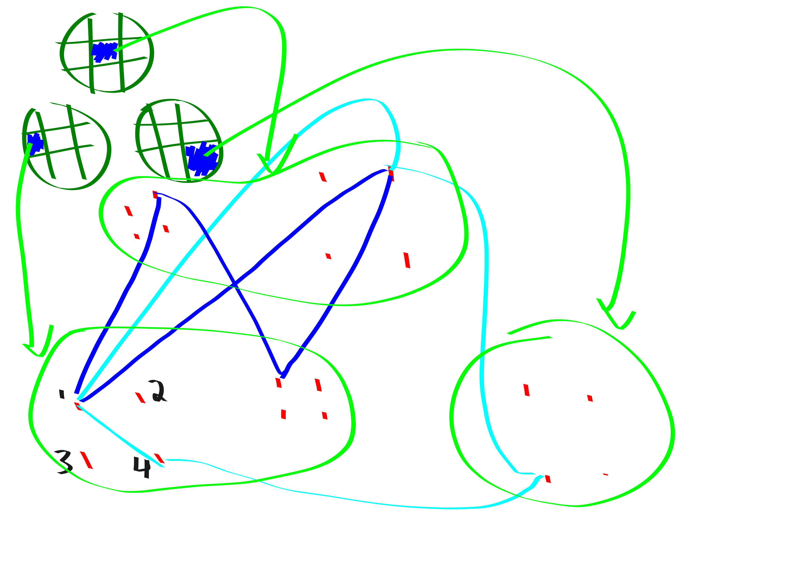

{title}
"Stronger 3SUM lower bounds via Additive Combinatorics"
{contents}
4-cycle enumeration
triangle listing
energy reduction amplification
energy reduction initial
{description}
In this blog post I summarize "Stronger 3-SUM Lower Bounds for
Approximate Distance Oracles via Additive Combinatorics" by
Abboud Bringmann and Fischer and also discuss the very similar
"Removing Additive Structure in 3sum based reductions" by Jin and
Xu.
{body}

**Work in progress**

In this blog post I summarize "Stronger 3-SUM Lower Bounds for
Approximate Distance Oracles via Additive Combinatorics" by
Abboud Bringmann and Fischer and also discuss the very similar
"Removing Additive Structure in 3sum based reductions" by Jin and
Xu. I will present the results "backwards", because I think this
makes the motivation clear. 
In particular, I will present the results in the following order:

1. Reduction from "sparse triangle listing" to $C_4$-enumeration.
2. Reduction from 3SUM instance with $n^{2+\delta}$ additive
   energy to sparse triangle listing.
3. Reduction from 3SUM instance with $O(n^{3-\eps})$ additive
   energy to 3SUM instance with $n^{2+\delta}$ additive energy.
4. Reduction from 3SUM instance with $\Theta(n^{3})$ additive
   energy to 3SUM with $n^{3-\eps}$ additive energy.

Before giving the proofs, it will be helpful to state all the
results.

beg rmk
The 3SUM problem is, given a list of numbers, are there any $3$
summing to $0$?
The 3SUM conjecture states that there is no $n^{2-\eps}$
algorithm for 3SUM.
end rmk 

beg thm 
3SUM is "just as hard" when restricted to sets with additive
energy $n^{2.9999}$.
end thm

beg thm
3SUM is "just as hard" when restricted to sets with $n^{2.0001}$
additive energy.
end thm

beg thm 
Fix $\eps>0, k_{\max}\ge 3$. 
The **sparse triangle listing** problem is, given an $n$-vertex
graph $G$ where all vertices have degrees in $\Theta(\sqrt{n})$
and where $G$ has at most $O(n^{k/2})$ $k$-cycles for each $k\in
[3,k_{\max}]$ list all the triangles. Under the 3SUM conjecture there is no
$O(n^{2-\eps})$-time algorithm for sparse triangle listing.
end thm 

beg thm 
Assuming the 3SUM conjecture, there is no $C_4$ enumeration
algorithm in time $\widetilde{O}(n^{2-\eps}+t)$ or
$\widetilde{O}(m^{4/3-\eps}+t)$ where $t$ is the number of
$C_4$'s.
end thm


# 4-cycle enumeration

In this section we reduce sparse triangle listing to
$C_4$-enumeration.

beg pf
Assume that we have a $C_4$ enumeration algorithm with running
time $\widetilde{O}(n^{2-\eps}+t)$ (where $t$ is the number of
$C_4$'s).

Randomly partition the vertex set into $s=n^{\eps/4}$ parts:
$V=V_1\sqcup V_2 \sqcup \cdots \sqcup V_s$.
For each tripple $i,j,k \in [s]^{3}$, we make a graph $G_{ijk}$.
In $G_{ijk}$ we make 4 copies $v_1,v_2,v_3,v_4$ of each vertex
$v\in V_i\sqcup V_j \sqcup V_k$.
We add the following edges:

- $\{v_1, w_2\}$ if $\{v,w\}\in E(G)$
- $\{v_2, w_3\}$ if $\{v,w\}\in E(G)$
- $\{v_3, w_4\}$ if $\{v,w\}\in E(G)$
- $\{v_1,v_4\}$ 

**Claim 1:**
Each triangle in $G[V_i\sqcup V_j \sqcup V_k]$ becomes a $C_4$ in
$G_{ijk}$.

**Claim 2:**
Each $C_4$ in $G_{ijk}$ either corresponds to a $C_4$ in
$G[V_i\sqcup V_j \sqcup V_k]$ or a $C_3$ in $G[V_i\sqcup V_j
\sqcup V_k]$.
And each $C_4,C_3$ in $G$ generates $O(1)$  $C_4$'s in
$G_{ijk}$'s.

Proof by picture of Claims 1 and 2:


**Claim 3:**
Thus, the number of $C_4$'s across all $G_{ijk}$ is at most 
$O(n^{2}/s + n^{3/2})$.

proof: 
Each $C_4$ from $G$ survives the slicing with probability
$1/s^{4}$. Thus, the expected number of survivors is
$ts^{3}/s^{4}$ (where $t$ is number of $C_4$'s).
By assumption there are at most $O(n^{2})$ $C_4$'s in $G$ so this
is bounded by $O(n^{2}/s)$.

The number of triangles in $G$ is $O(n^{3/2})$.

Adding these up gives the desired bound.

<!-- can we do something similar for C6's ? but stronger in terms
of the sparseness? like the sqrt{n} regular is the wrong regime?-->

**claim 4**: Algo run time is $O(n^{2-\eps/4})$.
The run time is bounded by 
$$\sum_{ijk\in [s]^{3}} n^{2-\eps}+t_{ijk} \le
n^{2-\eps+(3/4)\eps} + n^{2-\eps/4} \le \widetilde{O}(n^{2-\eps/4}).$$

This same computation would show that you're toasted if you were
assuming the existence of an $m^{4/3-\eps}$ time algorithm
instead. 

I think the tilde everywhere is because we have given an algo
with a certai expected running time, and in order to boost this
to working in the desired time whp we can repeate it $\log n$
times, terminating if its taking longer than twice the
expectation. 
end pf

beg rmk
Everything would go through identically in the above proof if you
replaced "sparse triangle listing" problem with "sparse pentagon 
listing" problem.
Of course, the difference is that I don't know a proof based on
5sum that "sparse pentagon listing" is hard.
Also I'm not sure what to define "sparse pentagon listing" as.
end rmk


# sparse triangle listing

beg pf
Let $G = \F_p^{O(\log n)}$ be the group that all our sets live in. 
Our 3sum instance is an $n$-element set $A\subset G$, which we
may assume by the theorem about decreasing energy has additive
energy at most $O(n^{2.0001})$. 

Let $G'$ be a subgroup of $G$ with size $\sqrt{n}$.

Let $h_1,h_2,h_3: G\to G'$ be random projections.
(You would have projections $h_1,\ldots, h_5$ if you were trying
all edges sparse pentagon)

Construct a tripartite graph as follows:

Vertex set $X\sqcup Y \sqcup Z$ with
$$X = G' \times G' \times \{0\},$$
$$Y = G' \times \{0\} \times G',$$
$$Z = \{0\} \times G'  \times G' .$$

Edge set: 
For each $a\in A$, place an edge $\{x,y\}\in X\times Y$ if $y=x+h(a)$. etc.

**pseudo-solution**: $h(a)+h(b)+h(c)=0$.
**real solution:** $a+b+c=0$.

**claim 1**
psuedo-solutions basically correspond to triangles,
so triangle listing would suffice to sift through all the
pseudo-solutions and find a real solution.
More precisely, each pseudo-solution turns into $O(1)$ triangles
and the labels on each triangle correspond to a pseudo-solution.

Here's why: if you have a triangle, i.e., a closed walk, then its
gotta satisfy $h(a)+h(b)+h(c)=0$ or it isn't a **closed** walk.

The reverse side is a bit more subtle but not too bad.
I claim that for any $a,b,c$ with  $h(a)+h(b)+h(c)=0$ it
generates at most $6$ triangles.
Basically you gotta satisfy some system of equations. And the
only way to do it is 

$$x_1=-h_1(a), x_2=-h_2(a)-h_2(b), x_3=-h_3(a)-h_3(b)-h_3(c)=0,$$
and then to define $y$'s and $z$'s based on the $x$'s in the
obvious manner.
*(for sparse pentagon listing you would have like $x_1=-h_1(a),
x_2=-h_2(a)-h_2(b),$ and so on)*

**claim 2**: 
Probably not too many triangles.
More precisely, there are two cases:

- case 1: there are more than $n^{3/2}$ real solutions to the 3sum
instance. In this case we can guess like $\sqrt{n}\log n$  $(a,b,
-a-b)$ triples and with high probability we will hit a solution.
- case 2: there are at most $n^{3/2}$ real solutions.
Then it remains to count the contribution of fake
pseudo-solutions to the triangle count. 
But observe, $\Pr[h(a+b+c)=0] = 1/n^{3/2}$ so long as $a+b+c\neq
0$. Hence, the expected number  of fake pseudo-solutions is  $n^{3}/n^{3/2}.$

Thus, the number of triangles is $O(n^{3/2})$, as desired.

(*if we were doing the pentagon version instead this would look as
follows: there are at most $n^{4}/|G'|^{5}$ fake solutions in
expectation. then we do two cases: lots of real solutions in
which case we just win and very few real solutions in which case
they don't contribute much to the pseudo solutions.*)

**claim 3:** counting cycles

For simplicity we assume $A \cap -A = \varnothing$, this just
simplifies the labelling scheme and is not necessary.

Now we bound the number of $C_4$'s. 
Fix some ordering of the parts as "clockwise".
We classify a $C_4$ with labels $\pm a_1,\pm a_2,\pm a_3,\pm a_4$
(The $\pm$-ness is determined by the orientation) into two types:

(1) pseudo-cycle: $\sum a_i \neq 0$. We will arguge that there
cannot be too many of these due to independence. 
(2) zero-cycle: $\sum a_i = 0$. We can't use independence here.
Fortunately, additive energy gives the bound instead!

claim 3.1: **Rate of zero-cycles:**
Let $a_1,a_2,a_3,a_4$ be a set of vectors summing to $0$,
spanning a space of dimension $s\le 3$.
Then probability of a cycle with labels $a_1,a_2,a_3,a_4$
containing some specific vertex is at most $|G'|^{-s}$.

proof: simple inductive argument. either you add a new linearly
independent vector in which case you get a new constraint that
hits your probability with a $|G'|^{-1}$, or else you get a
linearly dependent vector, in which case it can't have helped
your probability.

claim 3.2: **rate of pseudo-cycles**:
Fix vertex $v$ and $a_1,a_2,a_3, a_4 \in \pm A$ with $\sum a_i
\neq 0.$
Then, there is a cycle starting from $v$ labelled with
$a_1,a_2,a_3,a_4$ with probability at most $|G'|^{-s-2}$ where $s
= dim\ang{a_1,\ldots, a_4}$.

proof:
It's basically the same proof as the previous zero-cycles, except
we get a boost in the base case.
(it is actually convenient for their induction to consider the
probability that $h(a_0)=0$ and "there is a $a_1,a_2,\ldots, a_k$
walk starting from $v$" and define $s = dim (a_0,a_1,\ldots,
a_k)$).
*(remark: this stuff seems to work pretty similarly in the
pengaton case. should would get $|G'|^{-s-4}$ in the
pseudo-cycles rate. Let the record show that I'm a little bit
worried about cycles of length shorter than $6$ / if the pentagon
thing makes any sense.)*
(remark: they do all this also banning longer cycles and stuff)

claim 3.3: combining the previous two claims to bound the number
of cycles:

First we count the expected number of pseudo-cycles:
$$\sum_{a_1,\ldots, a_k\in \pm A \mid a_1+\cdots+a_k\neq 0} \sum_{v\in V} \Pr[\text{cycle starting from and ending at v labelled} a_1,\cdots,a_k].$$
We break the sum up by $\dim(a_1,\cdots,a_k)$.
And then we bound the number of $s$-dimensional spaces by
$n^{s}$. Size of $V$ is $|G'|^{3-1}$ here. 
Overall we get:
$$O(n^{k}|G'|^{-k}).$$


**claim 4:** degree regularization
Observe:
The expected degree of each vertex is $\Theta(\sqrt{n})$: for
each $a\in A$ there is a $1/\sqrt{n}$ chance that $h(a)=-x_2$ or
whatever.
It turns out the variance of the degree is $O(\sqrt{n})$.
Thus, we can do the following algorithm:
Kick out high degree and low degree vertices.
After not too long everyone has degree that is
$\Theta(\sqrt{n})$.

**claim 5:** put it all together

**TODO: understand this one more!**

end pf

# energy reduction amplification

beg rmk
The Jin, Xu paper shows how to actually get a Sidon set, i.e., a set with the absolute
minimum additive energy. Abboud et al only show how to obtain a set with $O(n^{2.0001})$
additive energy.
The Jin Xu result seems pretty cool, but the results are equaly
good for our applications. I think the Abboud one is a bit
simpler so I will present theirs.
 end rmk


beg pf
**HASHING!!!!!**

Use some hash functions to subsample your instance. 
Basically in Abboud et al 's language this is just some random
projection.

Intuitively, slicing up the instance kills additive energy faster
than it kills 3sum solutions. So the little boost that we started
with is enough that we can win here. 

**TODO: understand more.**

end pf

# energy reduction initial

beg pf

**Claim 1**: 
(tripartite) 3SUM is easy if one of the sets has bounded
doubling. 

proof:
For sake of intuition, think of the set $A$ as being contained in a
small interval $I$ (In general, $A$ is contained densely in some "approximate
group").

Partition $B,C$ into $B_1,B_2,\ldots, $ and $C_1,C_2,\ldots$ by
covering them with disjoint translates of $A$.

Call $(i,j)$ **relevant** if it could possibly be the case that
 $A+B_i \cap -C_j \neq \varnothing$ just based on the intervals
 that are covering the dudes.  Observe that $A+B_i$ is contained
 in a small interval, so it only intersects  $O(1)$ $C_j$'s.
 Then we do the following:

```python
for relevant i,j:
  if Bi and Cj are both small (size smaller than n^{1/3}):
    brute force check if there is any b in Bi and c in Cj for
    which b+c in -A
  else if one of Bi, Cj is large:
    Use FFT to compute Bi + Cj. Then check if Bi + Cj has
    non-empty intersection with -A
```

Run time: 

- light: $n\cdot n^{2/3}$ ($n$ many, $n^{2/3}$ brute cost)
- heavy: $n\log n\cdot n^{2/3}$ ($n^{2/3}$ many, $n$ fourier cost)
- total: $\widetilde{O}(n^{5/3})$.

**TODO: talk about Ruzsa covering lemma, and just generally how
you do this**

Now that we have claim 1, we give the following algo for the
initial energy reduction:

```python
while additive energy > n^{2.999}:
  A' = use BSG to peel off a set with bounded doubling
  check if A' is useful for any 3SUM solutions using the fast
  bounded doubling 3sum algo.

  if: 
    so, return the found solution
  else:
    Evict A' and keep going
if size is really small: 
  brute force solve
```

**Claim 2:** As long as the additive energy is larger than
$n^{2.999}$ we almost certainly can do the peeling off step and
its probably fast.
So, either the size gets too small in which case we can afford to
just brute force and find a solution, or if not then we have
reduced to a reasonable 3sum instance just with slightly subcubic
additive energy.

**TODO: argue more formally that this works. **

end pf
