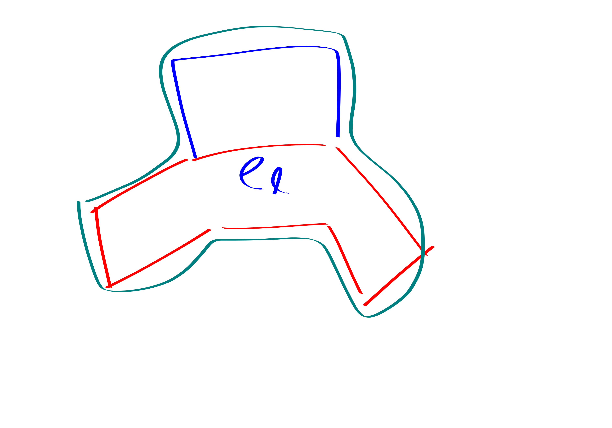
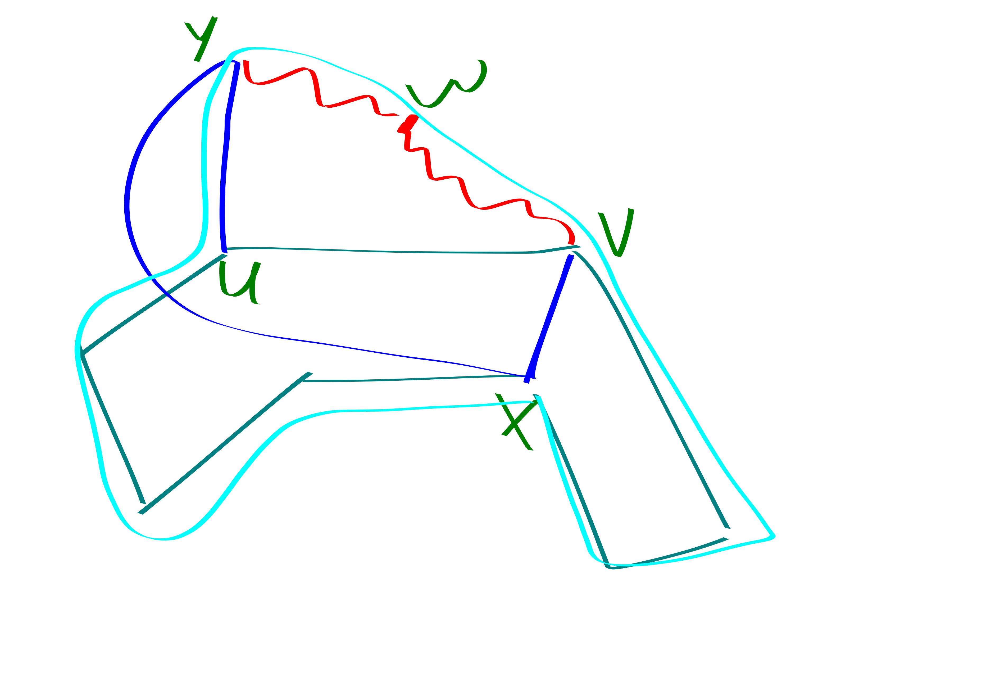

{title}
graph inequalities part 2
{contents}

{description}

{body}

Generalized Turán problems for even cycles
arXiv:1712.07079v3 [math.CO] 17 Dec 2018
Dániel Gerbner 
Ervin Győri 
Abhishek Methuku 
Máté Vizer

Note: in this blog post put a big-O around every statement that
you see, even if there is already a big-O (in that case, it could
be constructive to make the O even bigger, or put a tilde on it).

Typing some proofs from the paper Turan problems Even Cycles in
hopes of better understanding them

beg thm
$ex(n, C_4, C_{2k}) = \Theta((kn)^2).$
end thm
beg pf
Call a pair of vertices FAT if they have $k$ common neighbors. 
Call a $C_4$ FAT if both pairs of opposite vertices are FAT.

observation: $O((kn)^{2})$ FAT $C_4$'s.

Now will show that there are very few non-fat $C_4$'s:
$O(n^{1+1/k})$ only!

Itterate over the fat C4s in an arbitrary order. 
Each fat C4 marks whichever of its edges has been marked the
fewest number of times so far. 
In the end we get some numbers $m(e)$ which is how many times
each edge has been marked.
Clearly 
$$\sum_e m(e)$$ 
is the number of C4's.

We claim that each $m(e)$ must be smaller than  $k^{4}2^{k}$ or
else we can find a $C_{2k}$. We argue by contradiction. 

Actually we will prove this in the following lemma:

end pf

We show  how to turn a $C_{2\ell}$  with a heavily marked edge
into a $C_{2(\ell+1)}$ also with a heavily marked edge:
beg lem
For each $\ell \in [2,k]$ $G$ contains a $2\ell$-cycle $C$, and there is an edge $e_\ell\in C$ 
with  $$m(e_\ell) \ge 2(k-1)k^2\binom{2k}{k}.$$
end lem
beg pf
We argue by induction.
The base case is true by assumption.
Now we assume that we have a $2\ell$-cycle and a heavily marked
edge, and show how to construct a $2(\ell+1)$-cycle with a
(slightly less) heavily marked edge. 

Let $F_\ell$ be the last $2k^2\binom{2k}{k}-1$ fat $C_{2k}$'s to
mark $e_\ell$.
In order for the cycles in $F_\ell$ to mark  $e_\ell$ when
$e_\ell$ already has such a high weight it must be the case that
all of their edges are pretty heavy as well.
In particular they have weight at least $2(k-\ell-1)k^2\binom{2k}{k}$.

So, the edges in $F_\ell$ are great. If we can somehow replace
$e_\ell$ with $3$ edges from a cycle in $F_\ell$ to produce a
longer cycle then we would be cooking.
This isn't quite going to be possible but its the right flavor
idea.

So it remains to show that there is some cycle in $F_\ell$ that
we can glue nicely to $C$.

First, we need to eliminate cycles in $F_\ell$ with all four
vertices in $C$. This is not so bad: all cycles in $F_\ell$ of
course contain  $e_\ell$. Hence, there are at most
$\binom{2\ell-2}{2} \ll |F_\ell|$  ($\ll$ here just means, we can
afford to charge more stuff to  $F_\ell$ beyond these cycles)
$C_4$'s in $F_\ell$ that are fully contained in $C$. 

So, if we had a $C_4$ in $F_\ell$ with two vertices outside of
$C$ then we would be chilling:

So, the only remaining case to consider is $C_4$'s in $F_\ell$
that have one vertex in $C$ and one vertex outside of $C$.

We'll call one of these C4's **good** if the outside of C vertex
in it has fewer than $k$ connections to $C$.
We call such a C4 **bad** if its outside of C vertex has at least
$k$ neighbors in $C$. (Note that this is only an issue for the
latter half of the recursion once the cycle gets rather long).

Now we use the fact that $G$ is $K_{k,k}$-free to argue that
there aren't too many bad C4's.
First, consider how many vertices can have more than $k$
neighbors to $C$: we see that it is at most
$(k-1)\binom{2\ell}{k}$ by virtue of  $G$ being $K_{k,k}$-free
using the pidgeon hole principle.
Thus, there are at most $(2\ell-2)(k-1)\binom{2\ell}{k}$ bad C4's.

Adding together the number of bad C4's in $F_\ell$ and the number of C4s from $F_\ell$ that
are completely contained in $C$ we find that $|F_\ell|$ is large
enough that there is at least $1$ good C4 (or else there is a
C4 in $F_\ell$ that has two vertices outside of $C$, which we
already noticed was good).

Now we show that a good C4 can help us find a larger cycle with a
heavy edge.
$y,v$ are a fat pair, so they have $k$ common neighbors. 
But $y$ doesn't have $k$ neighbors in $C$. So $y,v$ have a common
neighbor $w$ outside of $C$. And that lets us find the desired
longer cycle.

end pf

beg thm
$ex(n, C_{6}, C_{2k}) \le O((kn)^{3})$

This proof generalizes relatively easily to 
$ex(n, C_{2\ell}, C_{2k}) \le O((2kn)^{\ell})$
end thm
beg pf
standard lemma: $\# P_2$'s out of any vertex is $O(n)$. proof:
look at 2 step BFS.

Let $g(v_1,v_2,v_3)$ denote the number of C6's with $v_i$ as the
$2i$-th node for each $i$.
Let $f(u,v)$ denote the number of common neighbors of $u,v$ (i.e., uv 2-paths).

We have:

$$g(v_1,v_2,v_3)\le f(v_1,v_2)f(v_2,v_3)f(v_3,v_1).$$

$$\# C_6 \le \sum_{v_1,v_2,v_3} g(v_1,v_2,v_3) \le \sum_{v_1,v_2,v_3} \left(f(v_1,v_2)^2 + f(v_2,v_3)^2\right) f(v_3,v_1)$$
And as yufei would say, the "non-naive" bound above (pulling out
the first terms) is vg.

Anyways we get
$$C_6 \le \sum_{v_1,v_2,v_3} \left(f(v_1,v_2)^2 + f(v_2,v_3)^2\right) f(v_3,v_1) \le \sum_{u\neq v} f(u,v)^2 \sum_{w} \left(f(w, v_1)  + f(w,v_2)\right  \le 2n\sum_{u\neq v} f(u,v)^2$$
In this last inequality we used the fact that there are at most
$O(n)$ P2s coming out of each vertex.

Now, we can bound hte $\sum_{u\neq v} f(u,v)^{2}$ thing because
this is just the number of $C_4$'s. See the previous theorem in
this blog post for a proof of the C4 statement.

So we get $\# C_6\le O((kn)^{3}).$

end pf

