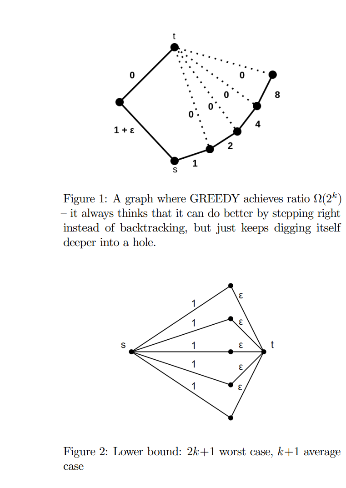

{title}
Some writeups
{contents}

{description}
This contains some technical writeups for various projects I've
worked on, including parallel partition, cup game, canadian
traveller (this is a survey for a final class project; not
published, not research), and soon probably scheduling stuff.
{body}

- William Kuszmaul and Alek Westover. The Variable-Processor Cup
Game. In 12th Innovations in Theoretical Computer Science
Conference (ITCS), 2021. [10.4230/LIPIcs.ITCS.2021.16](10.4230/LIPIcs.ITCS.2021.16)

- William Kuszmaul and Alek Westover. Brief Announcement: Cache-Efficient Parallel-Partition Algorithms using Exclusive-Read-and-Write Memory. In 32nd ACM Symposium on Parallelism in Algorithms and Architectures (SPAA), 551-553, 2020.
[Full paper](arXiv:2004.12532), [Code](github.com/awestover/Parallel-Partition), [Visualization:]
(parallelpartition.surge.sh/)
- Alek Westover, Nathan Sheffield, Ryan Chang. [Canadian Traveller](src/images/6_854_final_project.pdf)

