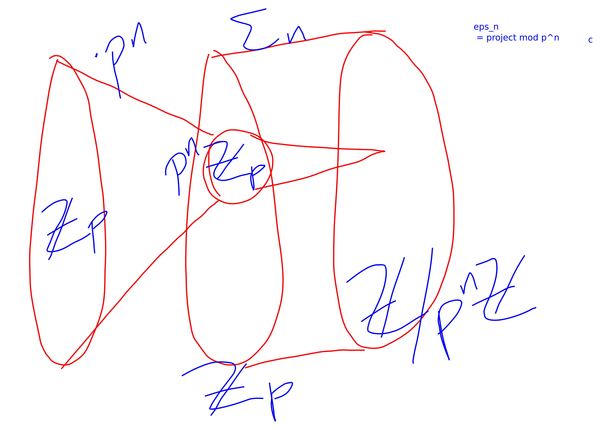
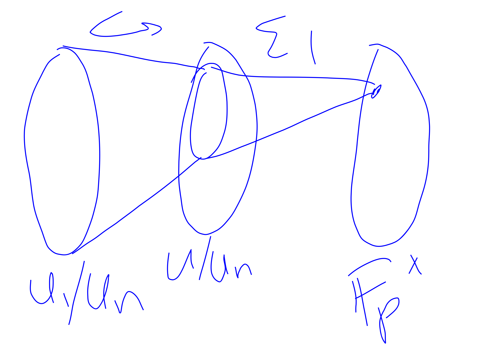

{title}
NT part 2
{contents}

{description}
I have partially decrypted chapter 2 of NT book. 
{body}

In chapter 2 we define the p-adics and develop some stuff about
them.

We use $\Z_p, \Q_p$ to denote the q-adic integers and q-adic
rationals repsectively. We use $\Z/p\Z$ to denote the cyclic
group with $p$ elements. Sorry about that!

> Question: What metrics, besides the standard absolute value,
can you put on $\Q$?

In particular, this question is probably modulo the topology
induced by the metric.
That is, if two metrics induce the same topology then they aren't
"super different".

For instance, $|x|$ and $|x|^{1/2}$ (or $|x|^{\alpha}$ for any $\alpha\in (0,1]$) where $|\cdot|$ denotes the
standard absolute value, induce the same topology on $\R$.

beg prop
There are only two types of norms that you can put on $\Q$: 
the standard absolute value, and the $p$-adic norm.
end prop
beg pf

First, suppose there is some $n\in \N$ such that  $||n|| > 1$. 
In this case we will show that the norm is equivalent to the
absolute value norm.
Let $n_0$ be the smallest $n\in \N$ with norm larger than $1$.
Take $\alpha\in \R_{>0}$ such that  $||n_0|| = n_0^{\alpha}$.
Write any number $n$ in base $n_0$.
By the triangle inequality we derive that there exists a constant
$C$ such that 
$$||n||\le C n^{\alpha}.$$
Then you can boost this by replacing $n$ with  $n^2$ whereby we
obtain
$$||n||\le \sqrt{C} n^{\alpha}.$$
Continuing we can make $C\to 1$.
You can by similar means also show $||n||\ge n^{\alpha}$.
And then you can extend to all of $\Q$.

Then consider the case that $||n||\le 1$ for all  $n\in \N$.

Then you find that $||n||$ must be of the form  $||n|| =
\rho^{\nu_p(n)}$ for some $\rho\in(0,1)$ and  $p$ prime.

end pf

> Question: Why do we care about the p-adic numbers?

They can sometimes help you find/count roots of polynomials in $\Z[x_1,x_2,\ldots,
x_n]$, which is one of the main goals of NT.

beg prop
Suppose you have some polynomials with a common zero in $\Z_p^{m}$ 
This is equivalent to the polynomials having a common zero in
$\Z/p^{n}\Z$ for all $n>1$.
end prop
beg pf

"**projective limit**"

think of a projective limit as just saying "if you can extend
something from $\Z/p^{n}\Z$ to $\Z/p^{n+1}\Z$ then you can extend
it all the way to $\Z_p$".

You ususally need some kind of "plays nice under projections"
property / some diagram commutes for this to  be well-defined.

end pf

beg prop
Some kind of crazy way to lift solutions all the way using Taylor Series.

Basically, if you have $\nu_p(f(x))\ge n$ and $\nu_p(f'(x))<n/2-1$
then you can lift this to a solution in $\Z_p$

This even works in some multivariable setting, and you only need
one partial derivative to have this property.
end prop

beg cor
Every simple zero of the reduction modulo $p$ lifts to a zero in
$\Z_p$.
end cor

beg cor
something about lifting solutions to quadratic forms.
end cor

beg prop
$x\in \Z_p$ invertible iff $p\not\mid x$.

$\Z_p$ is an integral domain.

Let $U$ denote the units.
Then $\Z_p \cong \Z\times U$.
end prop
beg pf 
invertability: taylor series for $\frac{1}{1-pz}$.
end pf

beg prop

I think this diagram roughly means
$$\Z_p / p^{n} \Z_p \cong \Z/p^{n}\Z.$$

end prop

## DANGER EXTREME INTENSITY

Now we say some stuff about the units in $\Z_p$.

Ok, now here is the theorem that I spent like forever trying to
understand. It was good, I had to come up with special case that
I could understand and then slowly was able to figure out a
proof.

Let $U_n = 1+p^{n}\Z_p$.

beg thm 
$$U = V\times U_1$$
where $V = \setof{x\in U}{x^{p-1}=1}\cong \F_p^{\times}$.
end thm
beg pf

Claim 1:
$$V_n = \setof{x^{p-1}}{x\in U/U_n}\subseteq U_1/U_n.$$
Proof: if you consider the reduction of $x^{p-1}$ modulo $p$ it is $1$.

Claim 2:
$$U/U_n = U_1/U_n \oplus V_n.$$
Proof:
Any $x\in U/U_n$ can be expressed as 
 $$x = x^{(p-1)s}x^{p^{n-1}r}$$
because $p^{n-1}\perp (p-1)$.

Observe that $(x^{p^{n-1}})^{p-1} = 1$ because $|U/U_n| =
(p-1)p^{n-1}$.
Thus, $x^{p^{n-1}r} \in V_n$.
Also, $x^{p-1}$ we showed in claim  1 is in $U_1/U_n$.
Thus we have the direct sum decomposition.

Then we "projective limit"-anate $V_n$ to get $V$.

And $\lim U/U_n = U.$

end pf

beg prop
Let $p\neq 2$.
$U_1\cong \Z_p$
end prop
beg pf
Consider $(1+p)^{p^{i}}$. This is a generator for $U_1/U_n$.

some diagram commutes. 

Hence we can projective limit lift lift lift.
end pf

beg cor
Let $p\neq 2$. Then
$\Q_p^{\times} \cong \Z\times \Z_p  \times  \Z/(p-1)\Z$.
end cor

