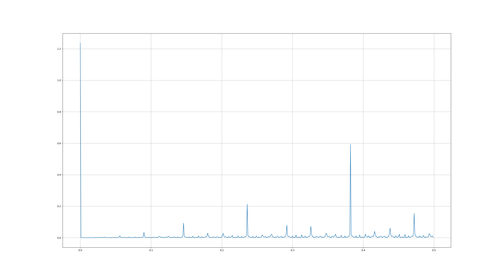

{title}
Fourier Phi
{contents}

{description}

{body}
The other day I was talking to a friend about $\phi$, as one
does. In particular, we discussed the sequence of optimal
approximations to $\phi$.
I conjectured that this sequence should be a sum of things which
are periodic at periods of fibonacci numbers.
Here's a plot

