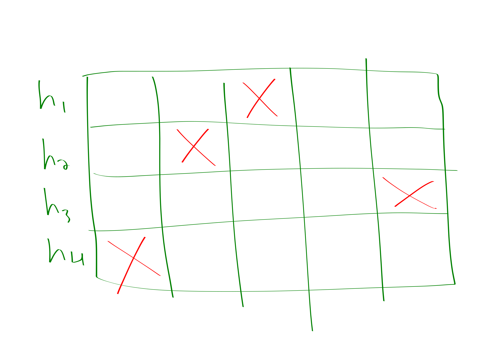

{title}
basic sketching
{contents}

{description}
I skimmed a couple of lecture notes and textbooks about
sketching. In this blog post I summarize some of the main
takeaways.
{body}

> Hi JJ!\
> Hello my friend Shatar, what endeavors have you been pursuing of
late?\
> Lately I've been tracking the web-traffic for skyspace. I just
sit in front of my computer 24/7 and increment a counter every
time we get a new page request. It's quite exciting!\
> Oh Shatar, I fear that you have fallen on grave misfortune. You
see, whenever you notice a like or page-view it triggers a
short burst of dopamine resulting in addictive compuslsions to
check--\
> Oh, don't lecture me about biology, I know about all these
"neuro-transmitters" and
"hetero-dimerous-nucleotide-phosphorylates". Its all rotten
cheese. Anyways, I didn't even tell you the problem I ran into.
> Which is?\
> I ran out of fingers!!!!\
> Why Shatar, whatever do you mean by this?\
> Well you see, I was counting the page views on my fingers, and
I only have like 17 of those, counting toes, because, you
know\
> JJ: Yes\
> Shatar: well. yes so anyways, I was counting and I was being
rather clever because I was counting in binary, but then the
number of page-views exceeded $2^{17}$!\
> I take by $!$ you mean to exclaim disbelief rather than to
indicate a factorial.\
> Shatar: quite!\
> JJ: Well, I believe that your relationship with technology
deserves a separate blog post to discuss, but for your counting
problem I think I have a neat tool that could prove quite useful. \
> Shatar: :O you have a tool that gives me more fingers?\
> JJ: Em, not *exactly*. But maybe in some approximate sense?

Credit to Jelani Nelson's "Sketching Algorithms Lecture Notes"
for this stuff.

<cat>

## Morris: Approximate Counting

JJ: 
Let's formalize the problem. We want a data-structure that can
support the following two operations:

- Increment add one to some implicit variable $X$
- Count: return a value $\hat{X} \in X\cdot (1\pm \eps)$

for some $\eps\ge 0$. And our data-structure is required to
correctly answer count queries with probability $\delta \le 1$

We would like the data-structure to use as little space as
possible. 
Of course if $\eps=0$ or $\delta=1$ there is no hope but to store  $X$
which requires $\ceil{\log X}$ bits. 
But for $\eps>0,\delta<1$ we can actually do much better. 

Imagine we instead keep a counter $X'$ via the following rule:

- Whenever we get an increment call, increase $X'$ with
    probability $\frac{1}{2^{X'}}$.

Intuitively this is a counter for $\log X$. 
This won't quite work by itself. But if you take the mean of a
couple of these counters, where the specific amount "a couple" is
determined by $\eps,\delta$ then you can get an $1\pm \eps$
approximation with $1-\delta$ success probability. But this
scheme only requires  $\bigO(\log \log n)$ bits!

Specifically we will take $\Theta(\eps^{-2}\delta^{-1})$ samples
of this thing and it will do great. 

Why does it do great: 
Let random variable $X_n$ denote the value of our new counter
after $n$ udpates. 
You can compute 
$$\E[2^{X_n}] = n+1$$
and 
$$\E[2^{2X_n}] = \bigO(n^2).$$

Chebyshevy'ing the mean of our $\eps^{-2}\delta^{-1}$ samples
gives the desired probability bound. 

It turns out that you can do even better, getting the $\delta^{-1}$
down to like a  $\log \delta^{-1}$ by taking the median of a
bunch of the above approach.

<rat> 

## Number of Distinct Elements

> Shatar: Ok, its kind of amazing that this strategy works. But you know what? I've decided that I actually wasn't really counting the right thing. I want to know how *many* distinct people we are getting on skyspace. It shouldn't count if Blobby is just reloading [Blobby's favorite post](https://awestover.github.io/skyspace/posts/number-theory/05-29-23.html) every second. I feel like sketching seems pretty nice and all but can it really solve this problem too?\
> JJ: In fact, sketching is a quite general tool that can be
utilized in a variety of situations including the above mentioned scenario.
The general technique is as follows:

- come up with a random variable with expectation equal to the
    value that you desire to approximate
- average several copies of your estimator and then take the median of several instances of the averaged estimators.
- sometimes other transformatinos such as $\min$ are reasonable to apply to the estimators.

Here's a rough *sketch* of how to do this for the distinct count
problem:

- pick a random function $h:[n] \to [0,1]$ (you should be highly
    skeptical about this step; we will remedy it later) 
- maintain $X = \min_{i\in sofar} h(i)$.
- estimate is $\frac{1}{X}-1$

It will turn out that $\E[X_n] = \frac{1}{n+1}$, that $\E[X^{2}_n]$
is pretty reasonable, and that doing the averaging and median-ing
works.

> shatar: um, that's a pretty powerful hash function...
> JJ: Indeed, this is simply a demonstration of the idea. For an
actual solution we turn to KMV

KMV just usese a $k$-wise independent hash family which you can
actually do. It stores the $k$ lowest hash values and uses the
$k$-th to guess the number of elements. 

## linear sketching

### heavy hitters

> Shatar: ok, interesting. But I actually just changed my mind.
Now I really want to know who are the biggest fans of skyspace.
Specifically, I'm interested in knowing at least approximately
all people who have visited the page at least $\frac{n}{k}$ times
for some parameter $k$ where $n$ is the total number of page
visits. 

Count-Min sketch. Closely related to Bloom Filters.

So the most basic instantiation of this problem is pretty
classic:

- You have a stream of $n$ numbers, where $n$ is maybe unknown.
    The numbers come from some known range, e.g., assuming they
    are of size at most $n$ seems pretty reasonable.
- You want to find the number that occurs more than $\frac{n}{2}$ times; you are guaranteed that there will be some such number. 
- But you only get like $\bigO(1)$ space. 
- the solution is to store the current winner, and increment a
    counter whenever they show up, decrement the counter when
    other people show up, swap the current winner if the count
    would go negative.

How could we extend this to $k$ heavy hitters?
The most obvious way is to have a hash table with
$k^{2}\delta^{-1}$ entries. 
We map the elements to entries in the hash table. 
We have selected the hash table to be sufficiently large that it
is fairly unlikely that any of the heavy hitters will collide. 
Within each box of the hash table that we map people to you can
then do the basic thing described above to identify the majority. Also just keep a count of the total number of items that mapped to each bin. 

Honestly I just made this up but it seems pretty reasonable. 
Anyways, now let me talk about what people actually do  which is
(a) cooler, (b) probably works better. 

So what people actually do is solve a related problem:
you want to be able to answer queries of the form "how many times
have I seen this element before".

If you can answer the "how many times have I seen this element
before" then you can also solve the "what are the $k$-heavy
hitters" question as follows:
just loop over all possible values and ask how many times those
get hit. 

Now we describe how to solve the streaming problem of being able
to process the "how many times have I seen this element before"
query.
You choose a bunch of hash functions and you increment a counter
in the spots dictated by each of the hash functions.
Then at the end you take the $\min$ of all of the hash functions
corresponding to your element.

A pair-wise independent hash-family suffices. We will just
chebyshev.

Here is a depiction of what the profile might look like for one
of the elements. 

Basically the idea is, in order to get a false positive you need
to collide with a bunch of big stuff on **all** of the hash functions. 
But this is rather unlikely. 

We remark that this is also basically how Bloom filters work,
except bloom filters are a boolean version of this. 
In particular, Bloom filters are for handling the following
situation:

You have a set. You want to be able to answer membership queries
in the set. 
So, you choose some hash functions. For each inserted element you
put a one in its place for all its hashes. Then you take the AND
to determine whether elements are in the set. 

It might seem unfortunate that our reduction between heavy
hitters and the count query was so slow, linear time in $n$.
Here's how to do better. 

You make a binary tree on the items. Then you have a sketch for
each of the $\log n$ levels of the tree. 

Basically think of it like this: I formed some groups of the
items. And if you have a heavy hitter in a group then you can
kind of tell and zoom in on the heavy hitter. You won't waste
time on groups that lack heavy hitters. 

> Shatar: aha! I noticed a problem with all of this analysis! \ 
> JJ: Oh dear, what is it?\
> Shatar: I forgot! I thought it wasn't an important datum so I
didn't record it. \
> JJ: Ah. I am glad to hear you are already applying the
principals of sketching to real life!

<blob>

> Blobby: more numbers please yum yum

## other stuff

The lecture notes has a lot of cool stuff including:

- quantiles
- lower bounds
- linear algebra stuff
- graph stuff

maybe I'll cover it later.

