# The Probabilistic Method 

### preface
I am going to try to read "The Probablistic Method" by Noga Alon and Joel H.
Spencer. The Probablistic Method, pioneered by Erdos, is a really interesting
way to think about combinatorics problems. Here is a high level overview of how
proofs by the probabilistic method go 

---

> Consider a random thing  
> Break the thing up into simple sub-things  
> Compute something on the sub-things  
> Combine the sub-things together to get  
> Pr[thing is good] > 0  
> Thus, there must be some thing that is good.  

---

The approach is often pretty non-constructive but sometimes it can be made
constructive. 

##### story
begin rmk
This part is a somewhat soggy and crumbly "personal motivation
for doing this story thing". Consider skipping straight to my
post on Chapter 0, or even Chapter 1. Nevertheless I feel
obligated to write an at least somewhat compelling preface,
because I like to read prefaces. So yeah, whatever. If the real
numbers are complete, then I better be complete in my blogging.
end rmk

I want to read this book because I believe that it contains some really elegant
math, and I think math is super cool. The first half of my senior year wasn't
super fun for me; I was super busy and doing a lot of things that I didn't find
very interesting. Thinking back on that time, the most prominent positive
memory is of math. In particular, I was taking a functional analysis class.
Twice a week, every week, I would rush out of school and jump on my bike to
ride over to a local university (Harvard) where I was listening to the
lectures. I left behind all the baggage of tasks performed grudgingly and was
immersed in theland of infinite dimensional vector spaces and bounded linear
functionals for a magnificent hour and fiveteen minutes. On
weekends and whatever other spare moments of time that I found I
worked on the psets for the class, which usually consisted of a
couple really interesting and often pretty challenging proofs.

One time when I was biking there it rained (really hard). Prior to the bike
ride I was annoyed because of "school and stuff". I was completely soaked by
the time I got there, and pretty cold too (Note: some people have pointed out
that I should have taken the bus instead of biking, especially when the weather
was sub-optimal. This is a good point. Also note that I am not advocating for
biking in the rain, especially when it is cold. In fact this is kind of a dumb
thing to do.). Yet, seemingly strangely I felt very happy while biking. I
thought about it a bit and came up with this list of things that I think made
my experience with functional analysis so great:

- I was learning it purely for fun (in particular, I didn't tell my school that I was taking this class, and didn't do anythign with my grade)
- An incredibly enthusiastic professor guided us through the definitions and proofs from the book, with many fun examples (on a black board!)
- The content had some really interesting and non-trivial, while still elegant, proofs. 
- I was able to share the novel math I was learning with my friends. I did this a lot while walking to and from school, and I also gave a talk to our math team about it and even [wrote a (short) blog post about it!!!](https://awestover.github.io/skyspace/functional_analysis/) 

Anyways, this story does have a point. It just is going to take
me a minute to get to it.

The point is: I love math. 

OK, you might say, I probably could have guessed that. What's
with the long story?

I love math, But keeping a consistent schedule, even at doing things that you
love, is hard (for me at least), especially if the thing in
question is challenging. Other stuff will innevitably try to get in the way.
That's where this blog comes in. 
I'm going to write a blog post regularly about
the chapter of the Probabilistic Method that I've been reading.
Having a blog means that with **non-zero probability** some people will be sad if I
don't read for a week. It also gives me a very nice record of the things I've
learned, and will look very cool (I plan to draw lots of pictures). 
So that's my selfish rationale for writing this blog.

Furthermore, maybe this blog can teach you some cool combinatorics too! I will do my
best to make my explanations compelte and understandable to people who haven't
been reading the book. In particular I will introduce any combinatorial objects
that it talks about. Sharing math with others is something I find
super fun, so I hope you enjoy.

If you're interested in reading this, please don't be put off by all the fancy
words and stuff, or by personal feelings of inadequacy. I didn't know what a
"Ramsey number" or a "Hypergraph" was before reading this book either. In
actuality these are not too complicated ideas; I hope to be able to convince
you of this proposition by drawing some pictures. Some more notes:

- If you read this and think it's cool please let me know! 
- If you read this and are confused about something, also let me know! I'd love to talk about it!
- If you read this and think I've botched some math somewhere, definitely let me know!

A final note to the reader: this blog is going to be somewhat casual,
especially in terms of language used, although also sometimes in terms of
definitions and proofs. In particular I'm potentially gonna use slang, and
exclamations of excitement such as "yo epic" and "now that's pretty cool" or
similar. Also there are going to be a *lot* of speelling mistakes. I hope
neither of these things distract from the mahtematical content of the blog (in
fact I suspect the enthusiasm will be helpful).

Really the final note to the reader before starting: 
begin rmk
**Thank you for reading! (conditional on the existence of you). I hope you find this experience as epic as I have.**
end rmk

Now we begin our discussion of **THE PROBABILISTIC METHOD**!!!!!!  

# Chapter 0 
### [[May 13]]

This is not a chapter in the book. In this post I'm just going to define a bunch of combinatorial objects.
Some of them you are likely already familiar with, but some definitions may be new. At least look at the pictures.

## some basic combinatorial objects

begin defn
A set is an (unordered) collection of distinct objects.
end defn

begin ex
Some nice sets:

- $\mathbb{N} = \{1,2,\ldots, \}$ (natural numbers)
- $\mathbb{Z} = \{\ldots, -2, -1, 0, 1, 2, \ldots \}$ (integers)
- $\mathbb{Q} = \{ p/q : p,q\in \mathbb{Z}, q\neq 0 \}$ (rationals)
- $\mathbb{R}$ is the completion of $\mathbb{Q}$ (reals)
- $\mathbb{R}^n$
- $\mathbb{C}$
- $[n] = \{1,2,\ldots, n\}$
- $\{\{1,2\}, \{1,2,3\}\}$
- $\{(1,2), (2,3)\}$
end ex

begin rmk
You might notice that I didn't list the ZFC set theory axioms. That's because 

- this is a blog post on combinatorics
- basically all the sets we are going to be dealing with are **finite**
- I don't know a lot about set theory
end rmk

begin defn 
A multiset is an unordered collection of possibly not distinct objects
end defn

begin ex
some multisets:

- $\{1,2\}$
- $\{1,1,1,2\}$
end ex

begin defn
An $n$ element list, also called a $n$-tuple, is an ordered set of elements
end defn

begin ex
some lists: 

- $(1,2,3,4,5)$
- $(5,4,3,2,1)$
end ex

begin defn 
An undirected graph is composed of a set $V$ of "vertices" along with a set $E$ of "edges".
Every edge $e \in E$ is composed of 2 vertices, i.e. $e=\{x,y\}$ for vertices $x, y \in V$. 
end defn

begin ex
See graphical depictions of these graphs below. (vertices are represented by dots, edges by lines)

- $P_n$ the path graph with $n$ edges.
- $C_n$ the cycle graph on $n$ vertices.
- $K_n$ the complete graph on $n$ vertices
- $K_{n, m}$ the complete bipartite graph with one part having $n$ vertices, and the other part having $m$ vertices.
- $W_n$ the wheel graph on $n$ vertices.
- $St_n$ the star graph on $n$ vertices.
- $\square_n$ the cube graph in $n$ dimensions.

(thanks to [this random site](http://people.qc.cuny.edu/faculty/christopher.hanusa/courses/634sp11/Documents/634ch1-2.pdf) for their "dictionary of graphs" )

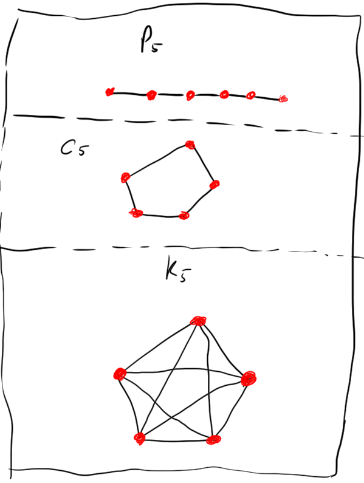
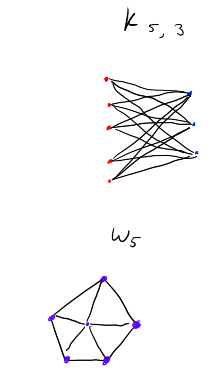
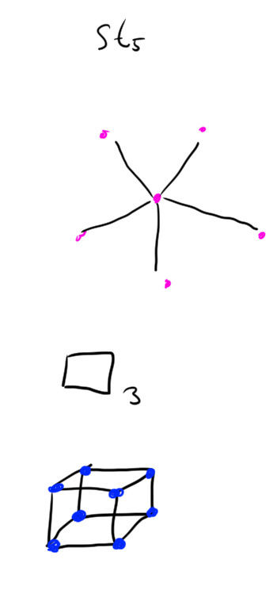
end ex

begin defn
A directed graph is a composed of a set $V$ of vertices along with a set $E$ of
edges. Here the edges are directed, i.e. they are lists rather than sets. e.g.
$(x,y) \in E$ for $x,y\in V$ is an edge.
end defn

begin ex
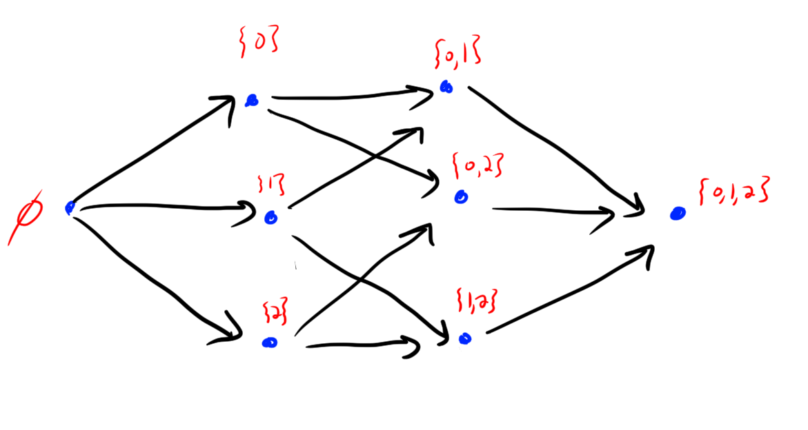
end ex

begin defn 
A tournament on $n$ vertices is a orientation of the edges in $K_n$. That is,
for each pair of distinct $x, y \in V$ either $(x,y) \in E$ or $(y, x) \in E.$
end defn

begin ex
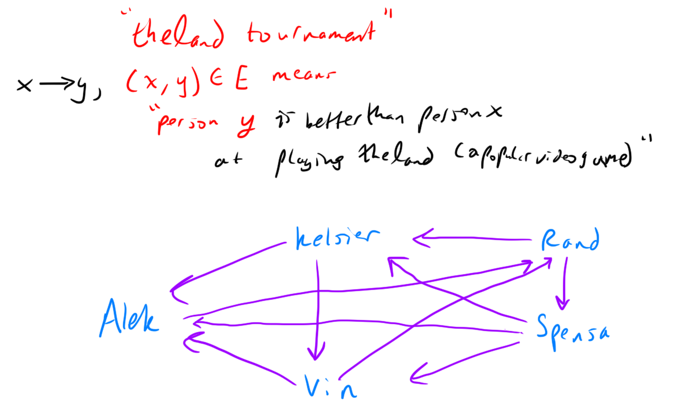
end ex

begin defn
A hypergraph is a set of vertices $V$ along with a family $E$ of subsets of $V$ called edges.
end defn

begin ex
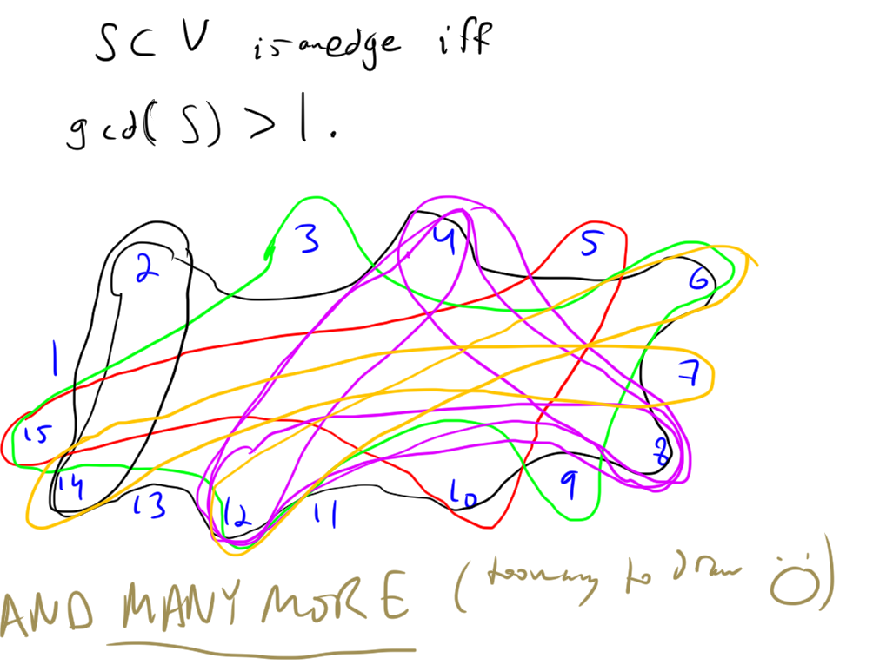
end ex

## some basic functions 

begin defn 
Without getting into measure theory, here's my shot at defining / describing a random variable.

"The outcome of a random process"
end defn

begin ex

- A fair coin toss (aka Bernouli random variable with $p=1/2$)
- Flip $100$ coins, count number of heads (aka binomial random variable with $p=1/2$, $n=100$)

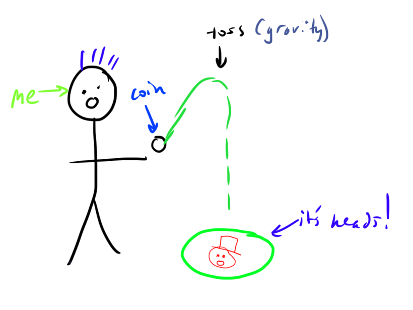

end ex

begin defn
Probability distribution. For the discrete case these are probability mass
functions. In the continuous case we need probability density functions.

Assigns probabilities to events. 

Probabilities are non-negative, and should sum/integrate to $1$.
end defn

begin ex
some pmfs:

- $\Pr(X=k)= 1/n$ for $k \in [n]$. (uniform distribution on $[n]$)
- $\Pr(X=k) = p^k (1-p)^{n-k} \binom{n}{k}$ for $k \in 0,1,\ldots, n$ (binomial PMF with parameters $n, p$)
- $\Pr(X=k) = \frac{e^{-\mu} \mu^k}{k!}$ for $k=0,1,2,\ldots$ (poisson PMF with parameter $\mu$)
end ex

begin defn
An event is a subset of the possible things that can happen.
end defn

begin ex

- You flip 2 coins and get at least $1$ head.
- You choose a random number uniformly from $[0,1]$ and it is at most $0.1415$.
end ex

begin defn
The expectation of a random variable $X$ is 

$$\mathbb{E}[X] = \sum_{x} x \Pr(X=x)$$

this is just "weighted average of outcomes using probabilities as weights"
end defn

begin ex
Some examples

- If you flip $100$ coins the expectation of the random variable "number of heads" is $50$
end ex

OK, sorry if these definitions are a bit too soggy and non-rigorous for the
measure theory enthusiasts / people who know about probability.
Also sorry if it is too long and you're bored now, or if its too short and I
forgot to define important things. Luckily you can google stuff. 
Anyways, see you next chapter!!

# Chapter 1
#### [[May 13]] 
(yes I'm writing these concurrently. gotta jump start the blog.)

OK!!! We're going to actually show the probabilistic method in action now, through a very cool example: **Ramsey Numbers**.

begin defn 
The Ramsey Number $R(a,b)$ is the smallest number of people that must be in a
room such that there must be either a subset of $a$ people who *all know each
other* or a subsetof $b$ people who *all don't know each other*.

Here are two more "graph-theoretically-technical" ways of saying this.

$R(a,b)$ is the minimum $n \in \mathbb{N}$ such that any graph on $n$ vertices
must either have an $a$-clique (i.e. have $K_a$ as an induced subgraph) or have
a $b$-independent set (i.e. have a completely disconnected induced subgraph on
$b$ vertices).

$R(a,b)$ is the minimum $n\in\mathbb{N}$ such that any $2$-coloring of $K_n$
with red and blue must have a $K_a$ monochromatic red induced subgraph or a
$K_b$ monochromatic blue subgraph.
end defn

Computing $R(a,b)$ is in fact a large open problem in combinatorics. Very few non-trivial values of this function are known.

begin ex
Let's compute some trivial values and bounds on $R(a,b)$

- $R(a, b) = R(b, a)$ because if you swap the colors red and blue then its still the same number.
- $R(1, c) = 1$ because if you have $1$ person, then there is definitely $K_1$ as a subgraph and it's certainly monochromatic (it has no edges :) )
- $R(2, c) = c$ because 
  - if we color every edge in $K_n$ blue for $n<c$ then there clearly is no monochromatic red $K_2$ or a monochromatic $K_c$ contained in this graph
  - But, in $K_c$, 
    - Either every edge is blue, in which case there is a monochromatic blue $K_n$
    - There is a red edge, in which case there is a monochromatic red $K_2$
end ex

begin ex
Now we are going to compute the only other value of $R(a,b)$ that I know how to compute: $R(3,3)$.

First, note that $R(3,3) > 5$ by the following picture:

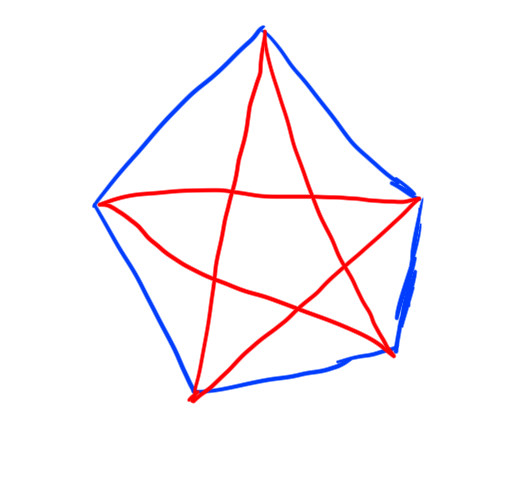

If you look at this graph, you'll see that there are no monochromatic triangles
($K_3$'s). Thus $n=5$ is not large enough to guarantee that every $2$-coloring
of $K_n$ has a monochromatic triangle ($K_3$).

On the other hand though, I claim $R(3,3) \le 6$.

Here's why: 
Consider a coloring of $K_6$ and take some vertex $v$. $v$ of course has $5$
neighbors. By the pidgeon-hole principle $v$ either has at least $3$ red edged
neighbors or at least $3$ blue edged neighbors. WLOG let's say $v$ has at least
$3$ red edged neighbors.

None of these neighbors can be connected to each other by a red edge, or else they would form a red triangle with $v$! 
But then we are forced to have a blue triangle! So it's impossible for $K_6$ to not have a monochromatic triangle.

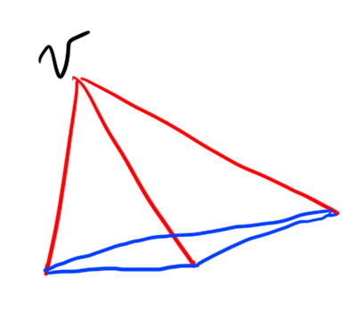

Thus 
$$R(3,3) = 6.$$

end ex

Now I'm going to derive some cool bounds on the Ramsey numbers.
First I'll derive an upper bound. This proof doesn't use the probabilistic method, but it's still cool. 
I read the proof [here](https://math.mit.edu/~apost/courses/18.204_2018/ramsey-numbers.pdf).

begin thm
$$R(a, b) \le R(a-1,b) + R(a, b-1)$$
end thm

begin pf
It's actually pretty similar to the $R(3,3) \le 6$ proof.

Let $n = R(a-1,b)+R(a,b-1)$. 
Assume for contradiction that there exists a $2$-coloring of $K_n$ (with red
and blue) such that $K_n$ doesn't have $K_a$ monochromatic red subgrpah or
$K_b$ monochromatic blue subgraph.

Fix a vertex $v$. Let $A$ be the set of neighbors connected to $v$ with red
edges, and $B$ be the set of neighbors connected to $v$ with blue edges.
There are $n$ total vertices, so $|A|+|B|+1=n$.

Now consider the induced subgraph on $A$. By assumption $A$ doesn't contain a
$K_b$ monochromatic blue subgraph. Furthermore, each vertex in $A$ is connected
to $v$ by a red edge, so if $A$ has a red $K_{a-1}$ then there is a red $K_a$,
which cannot be either, also by assumption.
Thus we have $|A| \le R(a-1, b) -1$.

By identical reasoning we have that $|B| \le R(a, b-1) -1$.

However this is problematic:
$$n = |A|+|B|+1 \le R(a-1, b) -1 + R(a,b-1) -1 + 1 = n-1$$
a contradiction.

Hence $K_n$ actually must have a monocrhomatic red $K_a$ or monochromatic blue
$K_b$. And thus $R(a,b) \le n$ as desired.
end pf

begin cor
$$R(a,b) \le \binom{a+b-2}{a-1}$$

and in particular
$$R(k, k) \le O\left(\frac{4^{k-1}}{\sqrt{k-1}}\right).$$
end cor

begin pf
The recurrence is obviously binomial coefficients. For the base case use the
trivial values of $R(a,b)$ that we computed.

Plugging in $a=b$ we get central binomial coefficients, which can be estimated
easily by Stirling's approximation.
end pf

ok, now what you've actually been waiting for **the first proof in the book!! a
lower bound on diagonal Ramsey numbers by the probabilistic method.**

begin thm
Fix $k$.
Let $n$ be sufficiently small such that $\binom{n}{k}2^{1-\binom{k}{2}} < 1$.

Then $R(k,k) > n$ (i.e. there is some $2$-coloring of $K_n$ that doesn't have
any monochromatic $K_k$ induced subgraphs)
end thm

begin pf
Let $n$ be as specified. 
Consider a random $2$-coloring of $K_n$ with each edge being randomly red or
blue with equal probabilities ($1/2$) and all these random choices being made
independently. 

For any set of $k$ of the vertices ($S \subset V$ with $|S| = k$) let the $M_S$
be the event that the induced subgraph on $S$ is monochromatic. 

For any $S$ 
$$\Pr[M_S] = 2\cdot \frac{1}{2^{\binom{k}{2}}}$$ 
because there are $\binom{k}{2}$ edges in $S$, and $S$ could be monochromatic red or blue.

By the union bound we have 

$$ \Pr\left[ \bigvee_{S\subset V, |S|=k} M_S \right] \le \sum_{S\subset V, |S|=k} \Pr[M_S] = \binom{n}{k} 2^{1-\binom{k}{2}} < 1$$
by assumption.

But then the probability that all events $M_S$ do not occur is strictly positive.

Hence for some random $2$-coloring it must be that all events $M_S$ do not occur. 

That is, there is some $2$-coloring of $K_n$ for which there are no monochromatic $K_k$ induced subgraphs.

end pf

begin cor
$$R(k,k) > \lfloor 2^{k/2}\rfloor$$
for $k \ge 3$.
end cor

begin pf
We claim that $n=\lfloor2^{k/2}\rfloor$ satisfies $\binom{n}{k}2^{1-\binom{k}{2}} < 1$.
Note that 
$$\binom{n}{k}2^{1-\binom{k}{2}} \le \frac{1}{k!}\frac{2^{k^2/2}}{2^{k^2/2-k/2 -1}} = \frac{2^{k/2-1}}{k!} < 1$$
for $k \ge 3$ because I graphed it.
end pf

begin rmk
Stirling's approximation says $$k! \sim \sqrt{2\pi k} (k/e)^k$$ (i.e. the ratio of these functions tends towards $1$ as $n\to\infty$).
end rmk

# Chapter 2
#### [[May 13]] 
(yes again all this is written on the same day. ok writing this much on one day
was probably a bad idea. but it was fun so whatever. I did get a little tired
by the end, but I think I stopped before the content started suffering.)

Chapter 2 is about Expectation.
Specifically the new proof strategy highlighted looks like this:

---

> make some random thing  
> Compute the expectation of it  
> there has to be a point where $X \ge \mathbb{E}[X]$ and where $X \le \mathbb{E}[X]$   

---

One really nice thing about expectation is that it's linear. I recently was
talking about this with people, and I thought of a really nice picture to go
with my usual proof of this fact. 

begin thm
Expectation is linear
That is, if $X, Y$ are random variables and $a \in \mathbb{R}$ is some scalar, then 

$$\mathbb{E}[X+Y] = \mathbb{E}[X] + \mathbb{E}[Y]$$ 
and 
$$\mathbb{E}[aX] = a\mathbb{E}[X]$$ 

end thm

begin pf
First let's prove the scalar multiplier thing. It's basically trivial from the
definition: scaling all the outcomes by some amount clearly scales the average
by the same amount.
More formally we have by the definioin of expectation:

$$\mathbb{E}[aX] = \sum_{y} y \Pr[aX = y] = \sum_{x} ax \Pr[aX = ax] = a\sum_{x} x \Pr[X = x] = a\mathbb{E}[X].$$

ok so that's super intuitive. But the fact that the sum of the expectations of
**even dependent random variables** is still the expectation of their sum seems
counterintuitive to some people at first. Here's a picture that will make it obvious though. 

![$\mathbb{E}[X+Y] =\mathbb{E}[X] + \mathbb{E}[Y]$](data/chpt2/linearityofexpectation.png)

So that's *legendary* as they say.
end pf

ok so there's a couple of problems that I want to share with you now. But I'm
kind of tired of writing atm so I'll just chose my favorite of them

begin thm
Let $v_1,\ldots, v_n \in \mathbb{R}^m$ be arbitrary unit vectors. Then there exists $\epsilon_1,\ldots, \epsilon_n \in \{-1,1\}$ such that 
$$\left| \sum_{i=1}^n \epsilon_i v_i \right| \le \sqrt{n}$$
and there exists $\epsilon_1,\ldots, \epsilon_n \in \{-1,+1\}$ such that 
$$\left| \sum_{i=1}^n \epsilon_i v_i \right| \ge \sqrt{n}$$
end thm

begin pf
Choose the $\epsilon_i$ randomly with $\Pr[\epsilon_i=-1] = \Pr[\epsilon_i = +1] = 1/2$ (and indpendently).
Let 
$$X = \left|\sum_{i=1}^n \epsilon_i v_i\right|^2 $$
Note 

$$X = \sum_{i,j} \epsilon_i\epsilon_j v_i\cdot v_j $$

Let's compute $\mathbb{E}[X]$:

$$\mathbb{E}[X] = \sum_{i,j} \mathbb{E}[\epsilon_i\epsilon_j] v_i\cdot v_j $$

If $i=j$ then $\mathbb{E}[\epsilon_i^2] = \mathbb{E}[1] = 1.$
Else, $\epsilon_i, \epsilon_j$ are independent, so $\mathbb{E}[\epsilon_i \epsilon_j] = \mathbb{E}[\epsilon_i] \mathbb{E}[\epsilon_j] = 0$

Overall we have
$$\mathbb{E}[X] = \sum_{i} v_i\cdot v_i = n $$

There must be choice of $\epsilon_i$ so that $X\ge \mathbb{E}[X]$ and so that $X \le \mathbb{E}[X]$.

end pf

begin rmk
Furthermore, if you choose the $\epsilon_i$ greedily, it works.

Let's say that we are trying to get the resulting vector $\sum_i \epsilon_i v_i$ to be far from the origin.
Greedily choosing them means you flip the vector so that it points in roughly the same directino as the partial sum so far. i.e. make the dot-product 
$$\epsilon_s v_s \cdot \left( \sum_{i=1}^{s-1} \epsilon_i v_i \right) \ge 0.$$

In the worst case for the vector sum being big this dot product is always $0$.
Then we are kind of spiralling around the origin rather than exploding out. But
regardless, even in this trash case we're good! Here's a picture showing that
greed is good and that even in the trash case we're rolling.

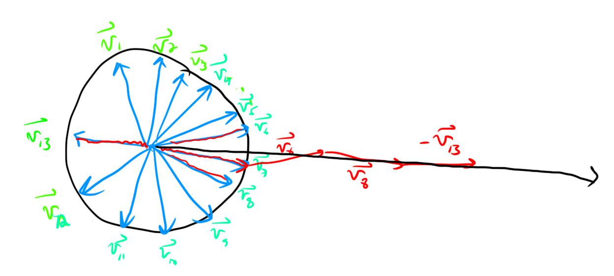
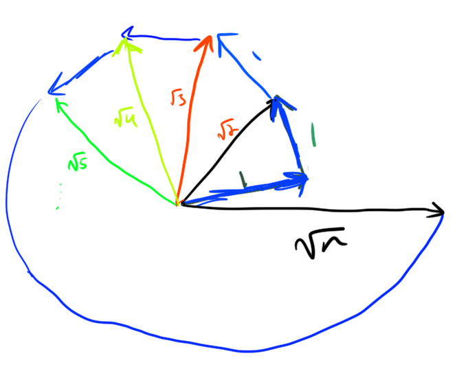
end rmk

I'll try the exercises and put any cool ones I solve here (also for week 1).

# Chapter 3
#### [coming no later than Friday May 22]]

dang it!!! I'm so sorry @my_dedicated_fanbase. I totally forgot about this and
stuff. In my defense I was at a hackathon stayed up till 4:30am, and I've also
been binge-rereading Mistborn (3 700+ page books in 3 days? oops). Agh this
blog is falling apart! I've done like one of the homework problems so far.
aggghhhhh. OK, I'm gonna do better in the future. Anyways, I'm gonna read a bit and go to bed, but tomorrow I really
legitamitely will be trying the homework problems and doing some reading. cya!

Update number 2: again, I didn't get to doing this. I've done a bit more of the
homework now, but it's really intense. Honestly I might go and read a different book...
I do really want to read that generatingfunctionology book, and I think I can
do more of the exercises. I'll keep trying on the probabilistic method though. I'm not having
trouble understanding the proofs, it's creating them that's the problem. lol. Anyways, 
hopefully I can get chapter 3 out soon. 

update number 3:
ok this section is really coming soon. for real now! 
I convinced a couple of people to join a little club to read this
book with me which'll be super helpful in terms of reminding me
to read :). And just super fun in general.

# Chapter 4
# Chapter 5
# Chapter 6
# Chapter 7
# Chapter 8

# The End

