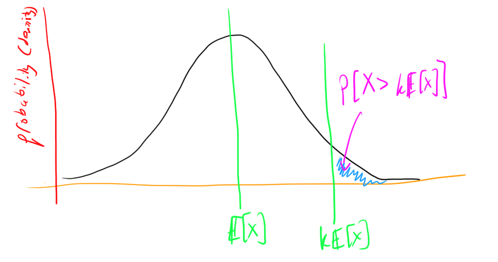
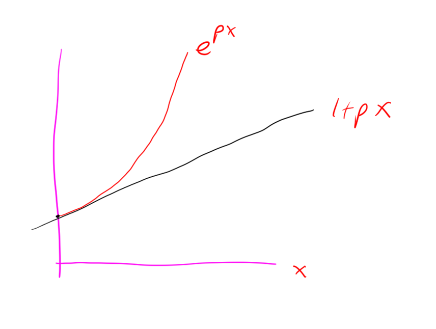
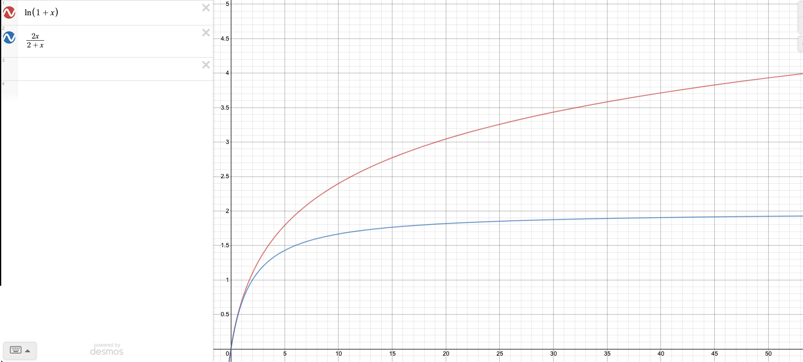
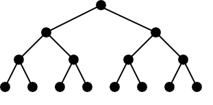

# Randomized Algorithms

---

> Rand: "Mirror, mirror, hanging on Alek's wall (no I don't actually have a mirror that would be kinda creppy / narscisistic, you get the point, maybe read this as "webcam, webcam...") who is the fastest sorting algorithm of them all"

> Alek: "Ummm, Probably _quicksort_"

> Rand: "But it has worst case performance like $O(n^2)$ !!! That's so trash. What about mergesort?"

> Alek: "Actually it turns out that with high probability in n quicksort is super fast, in particular $O(n \log n)$, and actually in particular way better than mergesort because the expected number of comparisons that it makes is like $< 2n \log n$ which is a super good constant"

> Rand: "hmmm, that sounds pretty good. tell me more."

> Alek: "OK, and as an added bonus I'll refrain from my entropy joke"

---

# What is a randomized algorithm?

In this post I'm going to discuss algorithms that use randomness. Randomness
plays a crucial role in many algorithms. For example, randomness is used in

- Getting a good fast heuristic approximate solution to a problem
- Cryptography: randomness is the key to security
- Analyzing algorithms that deterministically get the right answer, but use randomness to get there. With such an algorithm it is often desirable to show that the algorithm is fast "with high probability"

# Analysis of "probably fast" algorithms

Quicksort is the prototypical example (in my opinion) of a randomized algorithm that is fast "with high probability".

begin defn
An algorithm is said to be fast with high probability in $n$ (input size) if for any constant $c$, the algorithm's probablity of "being fast" can be made $1/n^c$.
end defn

I'd like to analyze the running time of quicksort using something called a concentration bound, but first I'll quickly talk about some basic probability theory. 

# Probability background

I define some basic concepts:

begin defn
A **probability space** is defined by 3 sets $(\Omega, \mathcal{F}, P)$ that satisfy some axioms. $\Omega$ is the sample space, $\mathcal{F}$ is the set of events, and $P$ is a function $P: \mathcal{F} \to [0,1]$ that assigns probabilities to events. The axioms that $(\Omega, \mathcal{F}, P)$ must satisfy are:


- $\Omega \neq \emptyset$


- $\mathcal{F}$ is a collection of subsets of $\Omega$, and it is a $\sigma-$algebra on $\Omega$, that is

  * $\Omega \in \mathcal{F}$ (contains the sample space)
  * $A \in \mathcal{F} \implies (\Omega \ A) \in \mathcal{F}$ (is closed under complements)
  * $A_i \in \mathcal{F}$ for $i=1,2,\ldots$, then $\bigcup_{i\geq 1} A_i \in \mathcal{F}$ (is closed under countable unions)


- $P$ is a probability measure, so 

   * $P: \mathcal{F} \to [0,1]$
   * $P(\Omega) = 1$
   * If $E_1, E_2, \ldots \in \mathcal{F}$ are disjoint events then $$P\left(\bigcup_{i\geq 1}E_i\right) = \sum_{i\geq 1} P(E_i)$$
end defn

begin defn
A **random variable** defined on the probability space is a (measurable) function $X: \Omega \to S \subset \mathbb{R}$ ($S$ is some state space).
end defn

begin defn
The probability of an event $A \subset S$ is $$Pr(A) = P(\{\omega \in \Omega : X(\omega) \in A\})$$
end defn

begin remark
For this post, only discrete probability is of interest (stay tuned for a post on measure theory and continuous probability at some point in time!) Thus, we take $\mathcal{F}= \mathcal{P}(\Omega)$ (the powerset). 
Also the state space will always be a (finite) subset of $\mathbb{R}$ in this post.
end remark

begin defn
A **bernouli random variable** with parameter $p$ is defined by 
$$Pr(X=0) = 1-p \quad Pr(X=1) = p.$$
Note that this is just a coin that is heads with probability $p$ and tails otherwise.
end defn

begin defn
Another really common type of random variable is a "binomial random variable"
This is the sum of $n$ bernoulis random variables.
It has probability mass function
$$P(X=k) = {n \choose k} p^k (1-p)^k$$
end defn

begin defn 
The expectation of a discrete random variable $X: \Omega \to S \subset \mathbb{R}$ is
$$\sum_{\omega \in \Omega} X(\omega) Pr(X=X(\omega))$$
end defn

begin rmk
Expectation is linear:
$$ \mathbb{E}[kX]= \sum_{\omega \in \Omega} kX(\omega) Pr(kX =kX(\omega)) = k\sum_{\omega \in \Omega} X(\omega) Pr(X =X(\omega)) = k\mathbb{E}[X]$$
and also 
$$\mathbb{E}[X+Y] = \sum_{x \in \text{im}{X}} \sum_{y \in \text{im}{Y}} (x+y) Pr(X=x \land Y=y)$$
$$ = \sum_{x \in \text{im}{X}}x \sum_{y \in \text{im}{Y}} Pr(X=x \land Y=y) + \sum_{y \in \text{im}{Y}}y \sum_{x \in \text{im}{X}} Pr(X=x \land Y=y)$$
$$ = \sum_{x \in \text{im}{X}}x Pr(X=x) + \sum_{y \in \text{im}{Y}}y Pr(Y=y)$$
$$ = \mathbb{E}[X] + \mathbb{E}[Y].$$
end rmk

begin defn 
The variance of a discrete random variable $X: \Omega \to S \subset \mathbb{R}$ is
$$\mathbb{E}[(X - \mathbb{E}[X])^2] = \mathbb{E}[X^2] - (\mathbb{E}[X])^2$$
The LHS is the definition of variance, which is read "expectation of squared deviation from the mean", and the RHS is derived via simple algebraic manipulations exploiting linearity of expectation.
end defn

begin rmk
The expectation of a bernouli random variable is 
$$0(1-p) + 1(p) = p$$
By linearity of expectation the expectation of a binomial random variable is $np$.
Note that in particular for $p=1/2$ this says that if you flip $n$ fair coins the expectation of the number of heads is $n/2$.

Note that the variance of a bernouli random variable is $p(1-p)$
And then you can show that the variance of a binomial random variable is $n p (1-p)$

Also, we could interpret these as standard deviations too, ($\sigma = \sqrt{\text{Var}[X]}$)

$\sigma = \sqrt{np(1-p)}$ for the binomial random variable.

Note that $\sigma$ is a more geometrically / physically meaningful quantity, as it has the same units as e.g. $\mathbb{E}[X]$.
end rmk

begin defn
Two events $A,B$ are independent if "the fact that one occurs gives no information about whether the other occured". This can be expressed as,
$$Pr[A\land B] = Pr[A] \cdot Pr[B]$$
end defn

begin defn
Two events $A,B$ are mutually exclusive if "they can't both happen". This can be expressed as,
$$Pr[A\land B] = 0$$
end defn

# Bounds 

Now that I have defined probability, I will demonstrate some bounds on probabilities.

begin thm
**Markov's Inequlity**
$$Pr[X > k \mathbb{E}[X]] \le 1/k. $$
end thm

begin pf
Note that $a \cdot Pr[X > a]$ lower-bounds $\mathbb{E}[X]$. Set $a = k\mathbb{E}[X]$ and we reach the desired inequality: $$Pr[X > k \mathbb{E}[X]] k\mathbb{E}[X] \le \mathbb{E}[X] \implies Pr[X > k \mathbb{E}[X]] \le 1/k. $$


end pf
This is kind of useful on its own, but there are some really cool coroloaries: concentration bounds.

begin thm
Chebyshev's inequality:
$$Pr[|X-\mu| > k\sigma] \le 1/k^2$$
Where $X$ is a random variable with mean $\mu$ and standard deviation $\sigma$, for any $k > 0$.
end thm
Note: this is really nice, it says that there is a really good chance that the outcome of a random experiment will be pretty close it's mean (i.e. the random variable is "tightly concentrated around its mean").

begin pf
This is a direct corollary of Markov's inequality:
$$Pr[(X-\mu)^2 > k \mathbb{E}[(X-\mu)^2]] \le 1/k$$
We substitute $k' = \sqrt{k}$ to get
$$Pr[(X-\mu)^2 > (k')^2 \text{Var}[X]] \le (1/k')^2$$
$$=Pr[|X-\mu|^2 > (k')^2 \sigma^2] \le (1/k')^2$$
$$=Pr[|X-\mu| > k' \sigma] \le (1/k')^2$$
end pf

This is nice, but for certain types of random variables you can actually give a much stronger concentration bound.
In particular,

begin thm
**Chernoff Bound**
Let $X_1,X_2, \ldots, X_n$ be iid bernouli random variables with $\mathbb{E}[X_i] = p$ for all $i$. Let $\epsilon \in (0,1)$. Then 
$$Pr\left[ |\sum_{i =1}^n X_i - np| > np\epsilon \right] \le 2 e^{-np\epsilon^2/3}.$$
Or in english "the probability of the sum of the random variables deviating from the expectation of the sum ($pn$) by more than an $\epsilon$ factor of the mean is exponentially small in $\epsilon$"
end thm

begin rmk
I have not stated this theorem in full generality, see [Hoeffding's inequality](https://en.wikipedia.org/wiki/Hoeffding%27s_inequality) on wikipedia, and even [McDiarmid's inequality](https://en.wikipedia.org/wiki/Doob_martingale#McDiarmid's_inequality). But the case of bernouli random variables $X_i$ is the only one relevant to this article.
end rmk

begin pf
Now we prove the Chernoff Bound.

Let $X = \sum_i X_i$

Take some $t>0$
Consider 
$$\mathbb{E}[e^{tX_i}] =  (1-p)e^0 + p e^t = 1+p(e^t-1) \le e^{p(e^t-1)}$$
Where we know that $1+px < e^{px}$ for $x > 0$ (note $e^t -1 > 0$ for $t>0$) by insepction of the graphs / derrivatives:


Then consider
$$\mathbb{E}[e^{tX}] = \mathbb{E}[e^{t\sum_{i} X_i}] = \mathbb{E}[\prod_{i} e^{tX_i}] = \prod_{i} \mathbb{E}[e^{tX_i}] < \prod_{i=1}^n e^{p(e^t-1)} = e^{np(e^t-1)}$$

This is true for all $t>0$. For any $\epsilon > 0$, we take $t = \ln( \epsilon + 1)$ so that $e^t - 1 = \epsilon$.

Then we have
$$\mathbb{E}[e^{tX}] < e^{np\epsilon} $$

Now by Markov's Inequality we have that 
$$Pr[X > a] = Pr[e^{tX} > e^{ta}] \le \frac{1}{e^{ta}} \cdot \mathbb{E}[e^{tX}] $$

Hence we have
$$Pr[X>a] < e^{np\epsilon - a\ln(\epsilon + 1)}$$

We set $a = np(1+\epsilon)$, to achieve
$$Pr[X>np(1+\epsilon)] < e^{np\epsilon - np(1+\epsilon)\ln(\epsilon + 1)}$$
$$Pr[X>np(1+\epsilon)] < \left(\frac{e^{\epsilon}}{e^{(1+\epsilon)\ln(\epsilon+1)}}\right)^{np}$$
$$Pr[X>np(1+\epsilon)] < \left(\frac{e^{\epsilon}}{(\epsilon+1)^{\epsilon+1}}\right)^{np}$$

Then because
$$\frac{2\epsilon}{2+\epsilon} \le \ln(1+\epsilon) $$



we have 
$$\frac{e^{\epsilon}}{(\epsilon+1)^{\epsilon+1}} \le \frac{e^{\epsilon}}{e^{\frac{2\epsilon(1+\epsilon)}{2+\epsilon}}} = e^{\frac{-\epsilon^2}{3}}$$
(the last equality is because $\epsilon \in (0,1)$).

Thus
$$Pr[X>np(1+\epsilon)] < e^{-np\epsilon^2/3}$$
This yields
$$Pr[X-np>np\epsilon] < e^{-np\epsilon^2/3}$$
This is almost what we want, but we also need to bound
$$Pr[X-np < -np\epsilon$$
by a similar argument you can get the same bound on this though.
Thus we have in total
$$Pr[|X-np|>np\epsilon] < 2\cdot e^{-np\epsilon^2/3}$$
as desired.

end pf

> Rand: "Holly cow, that was gnarly, was that really relevant to quicksort?"
> Alek: "yeah we can analyze quicksort now"


# Applying Chernoff Bound to Quicksort

First let me review the quicksort algorithm:

- Pick a pivot _randomly_ (**this is key!**)
- Partition the array relative to the pivot 
- Recurse on the subarray of elements less than the pivot, and recurse on the subarray of elements greater than the pivot

Here is an implementation of this algorithm in `C++`
```{c}
#include <stdio.h>
#include <stdlib.h>
#include <time.h>

int partition(int* A, int n, int pivot){
  int low = 0; int high = n-1;
  while (low < high){
    while(A[low] <= pivot && low < high){
      low++;
    }
    while(A[high] > pivot && low < high){
      high--;
    }
    int tmp = A[low];
    A[low] = A[high];
    A[high] = tmp;
  }
  if(A[low] <= pivot && low < n){
    low++;
  }
  return low;
}

// Note: I assume that the elements of A are all distinct in this simplisitc implementation of quicksort, it is easy to modify this code to work for arrays that can have duplicate elements 
void quicksort(int* A, int n){
  if(n>1){
    int pivot = A[rand()%n]; // randomly select the pivot
    int splitIndex = partition(A, n, pivot);
    quicksort(A, splitIndex);
    quicksort(A+splitIndex, n-splitIndex);
  }
}

int main(){
    srand(time(NULL)); // set seed for rng
    int n = 100;
    int* A = (int*)malloc(sizeof(int)*n);
    for (int i = 0; i < n; ++i) {
        A[i] = rand();
    }
    quicksort(A, n);
}
```


Let $X_i$ be the random variable which has value 1 if the rank of the pivot is in the middle, i.e. in $[n/4, 3n/4]$
Then $X_i$ is bernouli with $p=1/2$.
If you flip $\log n$ coins then whp the number of heads is tightly concentrated around half
thus you basically just need $2n\log n$ comparisons for quicksort whp.

More formally, let $\epsilon > 0$ be constant, and say we have $2\log n$ fair coins.
Then the chernoff bound gives

$$Pr[|\sum_{i=1}^{2\log n} X_i - \log n| > \epsilon \log n] \le 2 e^{- (1/3)\epsilon^2\log n} = 2 n^{-\epsilon^2/3}. $$
In fact we really only need

$$Pr[\sum_{i}^{2\log n} X_i > (1+\epsilon)\log n] < n^{-\epsilon^2/3}.$$
This is awesome, i.e. high probability.
To guarantee that we get more than $\log_{4/3} n$ heads (which is what we need), we set $\epsilon = \frac{1}{\ln (4/3)} - 1 \approx 2.5$
Then we get that the result happens with probability approximately $1/n^2$.

# Lowerbound on comparison based sorting

It turns out that, as you might have known, the algorithm had to be in $\Omega(n \log n)$, because all comparison based sorting algorithms are. Here is a proof:
Consider a binary tree with $n!$ leaves. Then it has depth $\log n!$. By Stirling's approximation this is like $n \log \frac{n}{e} = \Omega(n \log n)$.
With comparison based sorting algorithms every comparison moves you a level in this tree, and you have to get to a leaf starting from the root. Hence the lower bound.



Note that there are other types of sorting algorithms, e.g. _counting sort_, _radix sort_ (these exploit the fact that the arrays they need to sort have a small discrete set of possible values in them).
 

