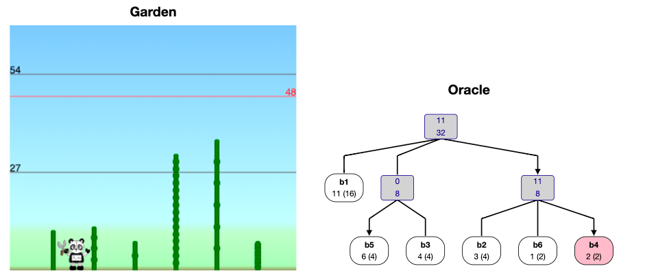

# The Bamboo Cutting Robot Panda Gardener

# Introduction

Everything I learned about this game comes from the following article: [Bilò, Davide, et al. "Cutting Bamboo Down to Size." arXiv preprint arXiv:2005.00168 (2020).](https://arxiv.org/abs/2005.00168). This is an awesome article! I highly recommend reading it. Obviously they do a better job explaining this topic than me. I'm pretty much just writing this so that I can understand it. The one reason why maybe this is a good article for you to read is that I was pretty unfamiliar with some of the ideas from the article before reading it, so I spell out a few things more explicitely (e.g. the cool data structures used in their oracle) than the article. I'm not the type of person that likes making things longer but whatever. I dunno. lol. if I haven't convinced you that there is no reason for this blog post to exist, then read and enjoy!

The other day I was reading about robot panda gardeners. 
Specifically here is the problem:

begin defn
**Growing Bamboo problem:**

You just bought a nice house on a lake. Oh no! There are $n$ bamboo stalks
$b_1, \ldots, b_n$ with growth rates $h_1, \ldots, h_n$ satisfying $\sum h_i =
1$ and $h_1 \ge \cdots \ge h_n$ that are growing and obscuring your view of the
lake! In particular, the height of the tallest bamboo stalk determines your
ability to see the lake. The height of the tallest bamboo is called the
**backlog** of the set of bamboos. To fix this terrible problem you are going
to program a robotic panda gardener. Every day the height of bamboo $i$ will
increase by $h_i$. Then, at the end of the day, the robotic panda gardener can
choose $1$ bamboo to cut-- that is, to reduce its height to $0$. 
end defn

So the question is, how do we program the panda to minimize the largest height
the bamboo ever achieves? And of course, what is the largest height that the
bamboo will ever achieve given our strategy?

This game is a restricted version of a game that I've been analyzing: **the cup
game**. The cup game is basically like this except that the growth rates can
change. And actually I've been looking at a variant of the cup game where the
amount of growth sums to $1 \le p \le n$ and where the gardener (called the
**emptier** in the cup game) can cut $p$ bamboos. In fact I've been looking at
a variant of this $p$-processor cup game called the variable-processor cup game
in which $p$ is allowed to change. Anyways, in the single-processor cup game on
$n$ cups backlog never exceeds $O(\log n)$ with a greedy emptying strategy, and
backlog can be made $\Omega(\log n)$ with an appropriate filling strategy.
In the bamboo cutting game though, the restriction that growth rate can't change 
makes it possible to achieve $O(1)$ backlog.

Before talking about strategies for keeping backlog low, lets get a lower
bound. Say the growth rates are $1-\epsilon, \epsilon$ for some $\epsilon >0$.
Then on any day when the panda cuts $b_2$ (the bamboo with growth rate $h_2 =
\epsilon$) the height of the other bamboo will grow to $2-2\epsilon$ by the end
of the next day. Hence $2$ is a lower bound on backlog: the best upper bound we
can hope for is "there exists a panda that never lets backlog exceed $2$".

There are two really natural gardening strategies: **Reduce-Max** and
**Reduce-Fastest$(x)$**.
Here's what they do:

begin defn
Reduce-Max: cut the tallest bamboo
end defn

begin defn
Reduce-Fastest$(x)$: Cut the fastest growing bamboo with height above $x$.
end defn

To start, Davide et al. analyze these strategies. In particular they show that
Reduce-Max never lets backlog exceed $9$, and Reduce-Fastest$(1+1/\sqrt{5})$
never lets backlog exceed $1+\phi < 2.62$.
After doing this, they provide algorithms for constructing **cutting oracles**.
A cutting oracle tells you what bamboo to cut. 
They make cutting oracles for Reduce-Max, Reduce-Fastest$(x)$ and then they
make a cutting oracle that never lets backlog exceed $2$. Yay! And the cutting oracles 
have great query-time-complexity, build-time-complexity, space-complexity, and stuff.

# Backlog bounds

### Reduce-Max

We partition the bamboo's into sets based on the powers of $1/2$ that their
growth rates fall between, and then inductively prove a set of invariants.

Bamboo $b_i$ is said to be of **level** $j$ if $2^{-j} \le h_i < 2^{-(j-1)}.$
Let $K$ be the level of $b_n$. Let $L_j$ for $j \in [K]$ denote the set of all
bamboos of level $j$. Define $\sigma(j)$ for $j \in [K]$ to be the maximum
height ever reached by any bamboo of level $k \ge j$, and define $\sigma(K+1) = 0.$
Then we will show:

begin lem
$$\sigma(j) \le \max\{3, \sigma(j+1)\} + \frac{3}{2^j} \sum_{k=1}^j |L_k|.$$
end lem

begin pf
Fix some level $j$.
Let $d_1$ be a day when a bamboo $i$ of level $j$ achieves height $\sigma(j)$.
(ok, digression, this is how the authors start their proof in the paper, but as
a student of real analysis this step feels bad to me. Like what if, I said to
myself, $\sigma(j)$ is never achieved. they really define it as a supremum not
a maximum. But then I was like ooooh, ahhhh. I'll tell you why later :). But
for now, rest assured that this is really a valid step.)

Let $d_0$ be the most recent day prior to $d_1$ when either (a) a bamboo
$b_\ell$ of level greater than $j$ was cut, or (b) a bamboo $b_\ell$ of height
less than $3$ was cut.

Because the panda is following Reduce-Max $b_i$'s height at $d_1$, and
consequently $\sigma(j)$ (by definition of $d_1$ to be a day when $b_i$
achieves height $\sigma(j)$) are bounded above by 
$$\max\{3, \sigma(j+1)\} + h_i(d_1-d_0).$$
That is, the height of $b_i$ on day $d_0$ was less than whatever bamboo was cut
on day $d_0$, and the height of bamboo $b_i$ has grown by at most
$h_i(d_1-d_0)$ since then till day $d_1$.
It remains to bound $d_1-d_0$.

By definition of $d_0$ for each day $t\in [d_0+1, d_1]$ **both** (a) the bamboo cut on
day $t$ has level at most $j$, and (b) the bamboo cut on day $t$ has height at
least $3$.

We call a cut of bamboo $b_\ell$ on a day $t \in [d_0+1, d_1]$ a **first-cut** if it
is the first day  in $[d_0+1, d_t]$ where bamboo $b_\ell$ has been cut. On the other
hand, a cut of bamboo $b_\ell$ is a **repeated cut** if it is not a first-cut of $b_\ell$. 

Note that repeated cuts are cutting bamboo growth that happened completely
during $[d_0+1, d_1]$. 
The total amount of bamboo growth that happened in this interval is of course
$d_1-d_0$ (as $\sum h_i = 1$).
Since each cut is cutting a bamboo of height at least $3$ the total number of
repeated cuts can't exceed $\frac{1}{3}(d_1-d_0)$.

On the other hand, the number of first cuts can't be more than $\sum_{k\le j}
|L_k|$ because all the cuts must be cuts of bamboos of levels $k\le j$. Thus, 
the total number of cuts $d_1-d_0$ is the number of first cuts plus the number
of repeated cuts, so 
$$d_1-d_0 \le \frac{1}{3}(d_1-d_0) + \sum_{k\le j} |L_k|.$$
Manipulating this we have
$$d_1-d_0 \le \frac{3}{2}\sum_{k\le j} |L_k|.$$

Recall that $h_i < \frac{2}{2^j}$ by definition of it being level $j$.

Combining our results we have:
$$\sigma(j) \le \max\{3, \sigma(j+1)\} + \frac{2}{2^j}\frac{3}{2}\sum_{k\le j} |L_k|$$
as desired.

end pf

Now to complete the proof we use this Lemma a bunch of times:

$$\sigma(1) \le \sigma(2) + \frac{3}{2^1}\sum_{k\le 1} |L_k|$$
$$\le \sigma(3) + \sum_{j=1}^2 \frac{3}{2^j}\sum_{k\le j}|L_k|$$
$$\le \sigma(4) + \sum_{j=1}^3 \frac{3}{2^j}\sum_{k\le j} |L_k|$$
$$\cdots \le \max\{3, \sigma(K+1)\} + \sum_{j=1}^K \frac{3}{2^j}\sum_{k\le j} |L_k|.$$
That is, 
$$\sigma(1) \le 3+ 3\sum_{j=1}^K \frac{3}{2^j} \sum_{k \le j}|L_k|.$$
Consider how much an arbitrary bamboo $b_i$ of level $s$ counts towards this
sum. It counts this much: 
$$\sum_{j=s}^K \frac{3}{2^j}.$$
The geometric series 
$$\sum_{j=s}^\infty \frac{3}{2^j} \le \frac{3}{2^{j-1}} \le 6h_i$$
upper bounds the contribution. 

Thus, summing for all bamboos we have 
$$\sigma(1) \le 3 + \sum 6h_i.$$

Since the $h_i$ sum to $1$ we then have:
$$\sigma(1) \le 9.$$

### Reduce-Fastest
See their paper. It's a bit messy.

begin cor
Reduce-Fastest$(1+1/\sqrt{5})$ never lets backlog exceed $1+\phi < 2.62$.
end cor

# Oracles

### Why do we want an Oracle?
ok so when they first started talking about oracles I was pretty confuzed: "why
do we need an oracle, Reduce-Max is literally so ez to implement." But then I
realized: "oh crap, the naive implementation of Reduce-Max (loop over the
bamboos to find largest) has running-time $O(n)$". Their Oracle is going to
have much better running time by utilizing some data structures that support
the operation "cut a bamboo" and "find the next bamboo to cut".

After thinking about this for a little bit longer I was still a bit uneasy. I
was thinking, ok this is nice and all, but it seems kind of crumby to have to
have an Oracle going forever. This perpetual cycle is gonna repeat, can't we
just make a little lookup table? Ah! But that's when I realized. You can make a
look up table sure, but it's going to be big, not small. 
In particular, Let's consider the set of possible bamboo states for something like Reduce-Max. 
It seems kind of like any bamboo $b_i$ should be able to get to height $h_i
\cdot r_i$ for any $r_i \le 1/h_i$ or something. Formalizing this, here's an
example of a bamboo garden where this is pretty much achieved: 
$$1/2, 1/4, 1/8, \ldots, 1/2^{n-1}, 1/2^{n-1}.$$
Note that a bamboo has to get up to height $1/2$ to be cut by Reduce-Max, so
this means that bamboo $b_i$ is going to get to grow for like $2^{i-1}$ rounds
here, as $h_i =1/2^i$ for $i < n$.
But jeeeez that's a lot of states! In particular it's like
$$\prod_{i=1}^n 2^{i-1} = 2^{\Omega(n^2)}$$
states. Crap: super exponential space-complexity! That's no good.
The not-so-innocent-looking expression $\prod_{i=1}^n \frac{1}{h_i}$ should
strike fear into your heart.

Anyways, I hope by now that when you see the Oracle's running-time and
space-complexity guarantees you'll be duly impressed (unlike me on my first read of the paper!). 

### Reduce-Fastest$(x)$

begin thm
There is a cutting-oracle implementing Reduce-Fastest$(x)$ that uses $O(n)$
space, can be built in $O(n\log n)$ time, and can report the next bamboo in
$O(\log n)$ time.
end thm

The crux of their oracle algorithm is a data structure called a **priority search tree**.
My best description of this is "if a binary search tree and a priority queue
had a child it would be a priority search tree". um ok. anywaaays. Here's what
a priority search tree is:

begin defn
Say you have a set of data $\{(x_1, p_1), \ldots, (x_n, p_n)\}.$ We call the
$p_i$'s **priorities** and we call the $x_i$'s **values**.

The priority search tree $T$ associated with this data is a binary tree
satisfying the following properties:

For any node $v = (x, p)$

- all descendants of $v$ have priority lower than $p$.
- all left descendants of $v$ have value less than $x$.
- all right descendants of $v$ have value greater than $x$.
end defn

It's a binary tree, so as long as it's depth is $O(\log n)$ (i.e. it's a
balanced tree) you can store it in an a array with space $O(n)$ and as long as
insertion is $O(\log n)$ (which it is, I'll describe insertion in a second) you
can build a priority search tree in time $O(n \log n)$.

ok, so now let's talk about how to do all the opperations that you need to do.

So, imagine that you wanted to query for a certain value. Then it's just like a
binary search tree. 

OK now let me talk about the application to the specific problem of a Reduce-Fastest$(x)$ oracle.

So the (dynamic) data that is going to be stored in the priority search tree is 
$$\{(d_1, 1), \ldots, (d_n, n)\}$$ 
where $d_i$ is the next day on which bamboo $b_i$ will have height at least $x$.
Note that this is going to be updated every day.

The queries that it needs to support are:

- $\mathbf{\text{MinIReadyBeforeDayD}(T, D)}$: return the minimum $i$ such that $d_i \le D$. (note: if you're following along with the paper you will notice that they have a typo about this! don't worry I have lots of typos too I bet.)
- **GetD**$(T, i)$: returns $d_i$ i.e. finds the node $(d_i, i)$.

It can support them in $O(\log n)$ time. Great!

After cutting the bamboo $b_i$ we need to update the tree. I think the way to
do this is to delete it, sift, and then insert it and sift again. (sifting is
that thing you do with heaps).

Ah, but we're not quite done, because there is this subtle issue: throughout
this we have been implicity assuming that $d_i \le O(1)$. But the oracle is
going to continue **forever**! So this is clearly not a reasonable assumption.
To solve this problem they divide the days up into intervals of $I$ days, and
then store $2$ trees: one for the current interval and one for the next interval.

Then within each tree they don't store $d_i$ but rather $\delta_i = d_i - nj$
for the $j$-th interval which consists of days $\{nj, nj+1, \ldots,
n(j+1)-1\}.$

Say that the two trees you were maintaining are called $T_1, T_2$.
At the end of an interval you just are like $T_1 \gets T_2$ and $T_2 \gets T_2$
Except reduce the numbers in $T_2$ by $n$.

This aught to do the trick.

At this point the theorm should be pretty clear, it's basically just saying
"priority search trees" have $O(n)$ space-complexity and can be queried in
$O(\log n)$ time!
 
### Reduce-Max

Bunch of lines. Upper envelope thing.
See their paper.

### Tree: backlog 2
Now they introduce a new algorithm which prevents backlog from ever exceeding $2$: recall that this is the best possible backlog bound!

Here's their full theorem:

begin thm
There exists a cutting oracle that never lets backlog exceed $2$, uses $O(n)$ space, can be built in $O(n \log n)$ time, and can report the bamboo to trim in $O(\log n)$ amortized time.
end thm

The algorithm they made for this, which they call **Tree**, is an amazing
example of the famous problem solving principle 
> "To solve a hard problem, first solve a simpler problem, then prove that your original problem can be reduced to the simpler problem." -Alek

So first round down all the $h_i$'s to powers of $1/2$. But they want to
preserve the summing-to-$1$ property, so it's slightly more complicated than this.
The backlog in the real game is at most double the backlog in this other game,
since the growth rates were at most doubled.

They prove a bound of $1$ on backlog in this new game where the growth rates are nice.

To analyze this new game, they next look at a sub-case(even simpler problem!!!)
which they call **regular growth rates**. This is where the growth rates are 
$$1/2, 1/4, 1/8, \ldots, 1/2^{n-1}, 1/2^{n-1}.$$

Consider the binary representation of $D$ with $n-1$ digits (so like take $D
\mod 2^{n-1}$ and do zero-padding on the left). 
In this case they have a really simple rule to decide what to cut: on day $D$
cut bamboo $b_i$ if the right-most (i.e. least-significant) $0$ in $D$ is the $i$-th
least-significant bit of $D$; if there are no $0$'s in $D$ then cut $b_n$.
Let's look at this a little bit (ahhhh get it. oh gross puns):

Let's run through the cutting schedule with $n=5$

- $0000 \implies$ cut $b_1$
- $0001 \implies$ cut $b_2$
- $0010 \implies$ cut $b_1$
- $0011 \implies$ cut $b_3$
- $0100 \implies$ cut $b_1$
- $0101 \implies$ cut $b_2$
- $0110 \implies$ cut $b_1$
- $0111 \implies$ cut $b_4$
- $1000 \implies$ cut $b_1$
- $1001 \implies$ cut $b_2$
- $1010 \implies$ cut $b_1$
- $1011 \implies$ cut $b_3$
- $1100 \implies$ cut $b_1$
- $1101 \implies$ cut $b_2$
- $1110 \implies$ cut $b_1$
- $1111 \implies$ cut $b_5$
- and then it just repeats

So there are some things that you should have observed. The gap between days
when we cut $b_1$ is $2$, the gap between days when we cut $b_2$ is $4$, the
gap for $b_3$ is $8$, $\ldots$, the gap for $b_{n-1}$ is $2^{n-1}$. And of
course the gap for $b_n$ is also $2^{n-1}$. This ensures that bamboo $b_i$
never grows above $1$.

OK, so that's super simple, but what about the **real** game?
First let's do the powers of $1/2$ one still. 
So here's the idea: they define a **virtual bamboo** to be a bunch of bamboo lumped together. 
Then by collapsing the original bamboo forest into an appropraite set of
virtual bamboos they can get a really nice set of virtual bamboos.

Then you globally and internally inside the virtual bamboos do the super simple strategy.

yay!

Note: it's actually really technically interesting how they make the virtual bamboos with their merge operations. I don't fully understand the proof that the merge tree thing has depth $O(\log n)$ (although I do get why it has depth less than $O(n)$, and it feels vaguely intuitive to me.)

Now, notice that in restricting the $h_i$'s to be powers of $1/2$ the $h_i$'s
were changed by at most a factor of $2$. 
So if you just pretend like you're playing with the fake growth rates, then the
real height,s and hence the real backlog, is no more than a factor of $2$
larger than you think it is.

# The End
I've had a blast reading this paper. I have to say the robot pandas really made
me happy, what a fun way to phrase the work scheduling problem. 

The upper bound proofs are very classic combinatorics: "inductively prove a set
of invariants". I really love the forced tradeoffs that give the inequalities.
I'm always happy to see cool data structures and really liked hearing about
priority search queues. The final oracle for achieving backlog 2 is such a cool
example of solving a simple problem and reducing the harder problem to the
simple problem. SO COOL!

In the future I'll try to have more robot panda gardeners in my own work, and
in my own life. I'll also try to do some mroe blog posts about cool papers.

